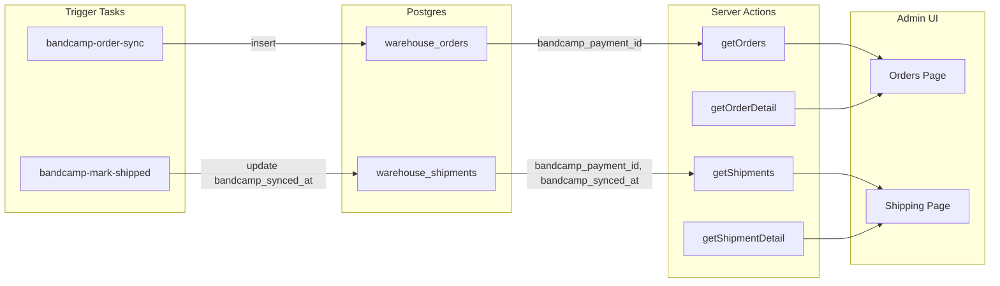

# Bandcamp Frontend Display Plan

## 1. Scope Summary

**In scope**

- Orders page: show Bandcamp payment ID for Bandcamp orders (list + expanded detail)
- Order detail: add "Bandcamp" section with copyable payment ID when `source === 'bandcamp'`
- Shipping table: add Bandcamp badge on rows when `bandcamp_payment_id` or `bandcamp_synced_at` is set

**Out of scope**

- Client detail Shipments tab (low priority; can follow up)
- Auto-copying `bandcamp_payment_id` from order to shipment on creation (backend; separate task)
- New API routes or Server Action changes (existing `getOrders`, `getOrderDetail`, `getShipments` already return the data via `select("*")` or explicit columns)

---

## 2. Evidence Sources

| File                                                                                                                                   | Purpose                                                                                              |
| -------------------------------------------------------------------------------------------------------------------------------------- | ---------------------------------------------------------------------------------------------------- |
| [src/app/admin/orders/page.tsx](src/app/admin/orders/page.tsx)                                                                         | Orders list, OrderDetailExpanded, SOURCE_COLORS, Badge patterns                                      |
| [src/app/admin/shipping/page.tsx](src/app/admin/shipping/page.tsx)                                                                     | ShipmentTableRow, ShipmentExpandedDetail, Bandcamp Sync section                                      |
| [src/actions/orders.ts](src/actions/orders.ts)                                                                                         | getOrders (`select("*")`), getOrderDetail (`select("*")` for order)                                  |
| [src/actions/shipping.ts](src/actions/shipping.ts)                                                                                     | getShipments (explicit `bandcamp_payment_id, bandcamp_synced_at`), getShipmentDetail (`select("*")`) |
| [supabase/migrations/20260320000008_bandcamp_shipment_tracking.sql](supabase/migrations/20260320000008_bandcamp_shipment_tracking.sql) | Schema: `bandcamp_payment_id` on orders + shipments                                                  |
| [src/trigger/tasks/bandcamp-order-sync.ts](src/trigger/tasks/bandcamp-order-sync.ts)                                                   | Creates orders with `bandcamp_payment_id`, `order_number: BC-{id}`, `source: bandcamp`               |

---

## 3. API Boundaries Impacted

From [docs/system_map/API_CATALOG.md](docs/system_map/API_CATALOG.md):

- `**src/actions/orders.ts`**: `getOrders`, `getOrderDetail` — no changes. Both use `select("*")`; `warehouse_orders` has `bandcamp_payment_id` (migration applied). Data is already returned.
- `**src/actions/shipping.ts**`: `getShipments`, `getShipmentDetail` — no changes. `getShipments` already selects `bandcamp_payment_id`, `bandcamp_synced_at`; `getShipmentDetail` uses `*` on `warehouse_shipments`.

**Conclusion**: No Server Action or API route modifications required.

---

## 4. Trigger Touchpoint Check

| Task ID                      | File                                         | Role                                                                      |
| ---------------------------- | -------------------------------------------- | ------------------------------------------------------------------------- |
| `bandcamp-order-sync`        | `src/trigger/tasks/bandcamp-order-sync.ts`   | Creates `warehouse_orders` with `bandcamp_payment_id`, `source: bandcamp` |
| `bandcamp-order-sync-cron`   | same                                         | Scheduled trigger (every 6h)                                              |
| `bandcamp-mark-shipped`      | `src/trigger/tasks/bandcamp-mark-shipped.ts` | Updates Bandcamp; sets `bandcamp_synced_at` on shipments                  |
| `bandcamp-mark-shipped-cron` | same                                         | Scheduled trigger (every 15 min)                                          |

**Invokers**: `bandcamp-mark-shipped` from `triggerBandcampMarkShipped` in [src/actions/bandcamp-shipping.ts](src/actions/bandcamp-shipping.ts).

**Impact**: This plan is display-only. No Trigger task changes. TRIGGER_TASK_CATALOG.md should be updated to include these tasks (see Doc Sync).

---

## 5. Proposed Implementation Steps

### Task A: Orders page — Bandcamp payment ID in list (Bandcamp orders only)

**File**: [src/app/admin/orders/page.tsx](src/app/admin/orders/page.tsx)

- In the Order column cell (around line 126), after `order_number`, add a Bandcamp payment ID chip when `order.source === 'bandcamp'` and `(order as OrderRow & { bandcamp_payment_id?: number }).bandcamp_payment_id` is set.
- Pattern: mirror the Pre-Order badge. Use `Badge variant="outline"` with `BC-{id}` or `Payment #{id}`.
- Example: `{order.source === 'bandcamp' && (order as any).bandcamp_payment_id != null && <Badge variant="outline" className="text-xs">BC {(order as any).bandcamp_payment_id}</Badge>}`

### Task B: Orders page — Bandcamp section in OrderDetailExpanded

**File**: [src/app/admin/orders/page.tsx](src/app/admin/orders/page.tsx)

- In `OrderDetailExpanded`, add a third column/section when `detail.order.source === 'bandcamp'` and `detail.order.bandcamp_payment_id` is set.
- Content: "Bandcamp Payment ID: {id}" with a copy-to-clipboard button (or monospace text staff can select).
- Layout: add a small "Bandcamp" block (e.g. under Line Items or in a new row) with `font-mono` payment ID. Use `navigator.clipboard.writeText()` for copy; optional toast/feedback.
- Reuse existing grid: `grid-cols-2` can become `grid-cols-3` for this section, or add a full-width row below the two columns.

### Task C: Shipping table — Bandcamp badge on rows

**File**: [src/app/admin/shipping/page.tsx](src/app/admin/shipping/page.tsx)

- In `ShipmentTableRow`, add a Bandcamp indicator in the Status column (or a new compact column) when `(shipment as ShipmentRow & { bandcamp_payment_id?: number; bandcamp_synced_at?: string }).bandcamp_payment_id != null`.
- Options: (1) Add badge next to StatusBadge, e.g. `{bandcamp_payment_id && <Badge variant="secondary" className="text-xs">BC</Badge>}`; (2) Show checkmark when `bandcamp_synced_at` is set.
- Recommendation: single badge "BC" when `bandcamp_payment_id` is set; optionally "BC ✓" when `bandcamp_synced_at` is set. Match existing Badge styling (e.g. `variant="secondary"`).

### Task D: Type safety for Bandcamp fields

**File**: [src/lib/shared/types.ts](src/lib/shared/types.ts) or inline

- Avoid `(order as any)`. Add minimal type extensions or use optional chaining: `(order as OrderRow & { bandcamp_payment_id?: number | null }).bandcamp_payment_id`.
- If `warehouse_orders` / `warehouse_shipments` types are generated from Supabase, ensure migration columns are reflected (or use type assertions only in these components).

---

## 6. Risk + Rollback Notes

| Risk                               | Mitigation                                     | Rollback                           |
| ---------------------------------- | ---------------------------------------------- | ---------------------------------- |
| Supabase types out of sync         | Use optional chaining; types may lag migration | Remove UI blocks; no DB impact     |
| Copy button fails in some browsers | Wrap in try/catch; fallback to selectable text | Remove copy button                 |
| Layout shift on Orders page        | Keep grid structure; add section conditionally | Revert OrderDetailExpanded changes |
| Badge overflow on narrow viewports | Use `truncate` or `max-w`; test mobile         | Simplify or remove badge           |

---

## 7. Verification Steps

- `pnpm check` (Biome lint + format)
- `pnpm typecheck`
- Manual: Orders page with Bandcamp filter; expand Bandcamp order; verify payment ID visible and copyable
- Manual: Shipping page; expand shipment with Bandcamp link; verify badge in table row
- Optional: `pnpm test` for any touched action files (none modified)

---

## 8. Doc Sync Contract Updates

| Doc                                                                                | Update                                                                                                                                                                                           |
| ---------------------------------------------------------------------------------- | ------------------------------------------------------------------------------------------------------------------------------------------------------------------------------------------------ |
| [docs/system_map/TRIGGER_TASK_CATALOG.md](docs/system_map/TRIGGER_TASK_CATALOG.md) | Add `bandcamp-order-sync`, `bandcamp-order-sync-cron`, `bandcamp-mark-shipped`, `bandcamp-mark-shipped-cron` to Scheduled/Event tables; add "Orders/shipments" domain touchpoint for these tasks |
| [docs/system_map/API_CATALOG.md](docs/system_map/API_CATALOG.md)                   | No changes (actions unchanged)                                                                                                                                                                   |

---

## Data Flow (Reference)

