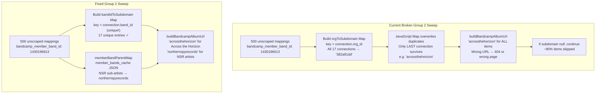

# Bandcamp Scraper: Root Cause Fix + Three-Bucket Architecture

## Context: How We Got Here

### The System

Clandestine Distribution operates as a physical fulfillment partner for independent music labels. The Bandcamp scraper is a critical component — it enriches every product in the warehouse catalog with:

- Album artwork (primary product photo, position 0)
- Product photos from each format's package arts
- Album description / "About this album" text → pushed to Shopify `descriptionHtml`
- Recording credits
- Tracklist with durations
- UPC/EAN code
- Release date and pre-order status

Without this data, the catalog lacks descriptions, has only the API thumbnail image, and cannot push rich content to Shopify or display properly in the client portal.

### The Bandcamp API

Bandcamp exposes two data sources:

1. **Merch Orders API** (`/api/merchorders/1/get_merch_details`) — returns a list of merch items for a band with SKU, price, quantity_available, quantity_sold, image_url. This is the real-time inventory source. Does NOT include about/credits/tracks/UPC.
2. **Album page HTML** (`https://{subdomain}.bandcamp.com/album/{slug}`) — the public page for each album. Contains a `data-tralbum` JSON attribute with ALL metadata including packages, images, about, credits, UPC, tracklist.

The scraper fetches the HTML page and parses `data-tralbum`. Bandcamp has no webhook API.

### The Bandcamp Connection Structure

Each "connection" in the system represents one Bandcamp artist/label account:

- `bandcamp_connections.band_id` — the Bandcamp numeric ID for the account
- `bandcamp_connections.band_url` — e.g., `https://northernspyrecords.bandcamp.com`
- `bandcamp_connections.org_id` — the Clandestine Distribution warehouse org that manages this account
- `bandcamp_connections.member_bands_cache` — JSON containing sub-artists in a label account

**Critical fact discovered during diagnosis:** All 17 connections share the **same** `org_id` (`382a91dd-d9da-41f3-8131-213efd02d684` = Clandestine Distribution). This is architecturally correct — Clandestine Distribution manages all clients — but it broke the Group 2 URL construction logic (see bug below).

### What the Bandcamp `data-tralbum` Contains (verified live 2026-03-31)

```
data-tralbum.current keys:
about, art_id, artist, credits, id, release_date,
selling_band_id, title, type, upc, ...

data-tralbum.packages[]:
  type_name, type_id, sku, release_date, new_date,
  arts[]: { image_id }   ← use arts[0].image_id (pkg.image_id always null)

data-tralbum.trackinfo[]:
  track_num, title, duration (float seconds)
```

Live test on `horselords.bandcamp.com/album/interventions`:

- `current.about`: full album description text
- `current.credits`: "Sam Haberman\nMax Eilbacher..." 
- `current.upc`: "703610875463"
- `trackinfo`: 9 tracks with durations

### Timeline of Events

1. **Initial deployment**: `bandcamp-sync.ts` created with three sweep groups (50 items/run each, `*/30` cron)
2. **Scraper was working** for matched items (called `triggerScrapeIfNeeded` inline during sync)
3. **New fields added** (2026-04-01): `bandcamp_about`, `bandcamp_credits`, `bandcamp_tracks`, `bandcamp_upc` — requiring all 550 mappings to be re-scraped or scraped for the first time
4. **Audit (2026-04-01)**: Only 46/550 mappings scraped (8%) despite days of operation

### Audit Numbers (as of 2026-04-01)


| Metric                                   | Value                      | Notes                                                 |
| ---------------------------------------- | -------------------------- | ----------------------------------------------------- |
| Total `bandcamp_product_mappings`        | 550                        | All Bandcamp-linked warehouse variants                |
| Scraped (has `bandcamp_art_url`)         | 46 (8%)                    | Only these have album art + description               |
| Has `bandcamp_about`                     | 40                         | 6 scraped before about feature added                  |
| Has `bandcamp_credits`                   | 37                         |                                                       |
| Has `bandcamp_tracks`                    | 46                         |                                                       |
| Not yet scraped (Group 2)                | **500**                    | `bandcamp_url IS NULL AND bandcamp_type_name IS NULL` |
| Already scraped, missing about (Group 3) | 6                          |                                                       |
| Products with `description_html`         | 46 of 2456 (2%)            | Only scraped products have descriptions               |
| Products with `bandcamp_upc`             | 34 (1%)                    |                                                       |
| Products with 2+ images                  | 922                        | Scraped products (album art + merch photos)           |
| Products with 1 image                    | 1,345                      | API thumbnail only — not scraped yet                  |
| Recent scraper errors (review queue)     | **0**                      | Scraper works when it runs                            |
| Recent sync logs                         | `merch_sync partial` 21:02 | Sync IS running                                       |


### Root Cause Diagnosis

Initial hypothesis was queue congestion and 50-item throughput limits. After deep diagnostic queries:

**Diagnostic query results:**

```
All 17 connections have band_url set: YES
Unscraped items span 10 orgs
  - 1 org has connections with band_url
  - 9 orgs have NO bandcamp connection at all

All 100 sampled unscraped mappings: have bandcamp_member_band_id ✓
44 unique member_band_ids in 100 unscraped sample:
  - 8 match a direct connection band_id
  - 36 do NOT match any connection (NSR sub-artists)
```

**The actual bug:** `bandcamp_connections` all have `org_id: 382a91dd`. JavaScript `new Map(arr.map(c => [c.org_id, subdomain]))` overwrites duplicate keys — only the LAST connection's subdomain survives. `orgToSubdomain.get('382a91dd')` returns one arbitrary subdomain for all 500 items, constructing wrong URLs.

---

## Full Code: Current State (Broken)

### `src/trigger/lib/bandcamp-queue.ts`

```typescript
import { queue } from "@trigger.dev/sdk";

// Rule #9: ALL Bandcamp OAuth API tasks share this queue (concurrencyLimit: 1)
export const bandcampQueue = queue({ name: "bandcamp-api", concurrencyLimit: 1 });
```

### `src/trigger/lib/bandcamp-scrape-queue.ts`

```typescript
import { queue } from "@trigger.dev/sdk";

// Rule #60: HTML scraping uses a SEPARATE queue (concurrency 3).
// concurrencyLimit: 3 means at most 3 Bandcamp pages are fetched simultaneously.
export const bandcampScrapeQueue = queue({ name: "bandcamp-scrape", concurrencyLimit: 3 });
```

### `src/trigger/tasks/bandcamp-sync.ts` — Task declarations

```typescript
// bandcampScrapePageTask — runs on bandcampScrapeQueue (concurrency 3)
// Fetches HTML, parses data-tralbum, writes to bandcamp_product_mappings + warehouse_products
export const bandcampScrapePageTask = task({
  id: "bandcamp-scrape-page",
  queue: bandcampScrapeQueue,
  // maxDuration: uses global default (300s)
  run: async (payload: {
    url: string;
    mappingId: string;
    workspaceId: string;
    urlIsConstructed?: boolean;
    albumTitle?: string;
    urlSource?: "orders_api" | "constructed" | "manual";
  }) => {
    // 1. fetchBandcampPage(url) → HTML
    // 2. parseBandcampPage(html) → ScrapedAlbumData with about/credits/tracks/upc
    // 3. UPDATE bandcamp_product_mappings: type_name, art_url, about, credits, tracks, upc
    // 4. UPDATE warehouse_product_variants: street_date, is_preorder
    // 5. storeScrapedImages(): album art at pos 0, package arts after
    // 6. UPDATE warehouse_products: description_html (if null), bandcamp_upc (if null)
    // 7. IF shopify_product_id: push descriptionHtml to Shopify via productUpdate
  }
});

// bandcampSyncTask — runs on bandcampQueue (concurrency 1, serialized with API calls)
export const bandcampSyncTask = task({
  id: "bandcamp-sync",
  queue: bandcampQueue,
  maxDuration: 1800,  // 30 min
  run: async (payload: { workspaceId: string }) => {
    // 1. refreshBandcampToken()
    // 2. getMyBands() → builds bandLookup Map (band_id → band with subdomain)
    // 3. Load all active bandcamp_connections
    // 4. For each connection:
    //    a. getMerchDetails(band_id) → current merch items from API
    //    b. matchSkuToVariants() → split into matched/unmatched
    //    c. For matched: upsert bandcamp_product_mappings, triggerScrapeIfNeeded
    //    d. For unmatched: create warehouse_products/variants + mapping, triggerScrapeIfNeeded
    // 5. END-OF-SYNC SWEEP:
    //    Group 1: has URL, no type_name → trigger scrape (limit 50)
    //    Group 2: no URL → construct URL from org_id→subdomain (BUGGY!) → trigger scrape (limit 50)
    //    Group 3: has art, no about → trigger re-scrape (limit 50)
  }
});

// bandcampSyncSchedule — fires every 30 minutes on bandcampQueue
export const bandcampSyncSchedule = schedules.task({
  id: "bandcamp-sync-cron",
  cron: "*/30 * * * *",
  queue: bandcampQueue,
  run: async () => {
    // Loops all workspace_ids with credentials, triggers bandcampSyncTask per workspace
  }
});
```

### THE BUG — Group 2 sweep (lines 1106–1187 of `bandcamp-sync.ts`)

```typescript
// Group 2: no URL — construct from band subdomain + product title
const { data: noUrlNoType } = await supabase
  .from("bandcamp_product_mappings")
  .select("id, variant_id")       // ← MISSING: bandcamp_member_band_id
  .eq("workspace_id", workspaceId)
  .is("bandcamp_url", null)
  .is("bandcamp_type_name", null)
  .limit(50);

// ...resolve variant → product org_id...

// *** BUG: All 17 connections share org_id: 382a91dd ***
// Map overwrites duplicate keys → only last connection's subdomain survives
const { data: orgConnections } = await supabase
  .from("bandcamp_connections")
  .select("org_id, band_url")      // ← MISSING: band_id, member_bands_cache
  .eq("workspace_id", workspaceId)
  .not("band_url", "is", null);
const orgToSubdomain = new Map(
  (orgConnections ?? []).map((c) => [
    c.org_id,   // ← ALL 17 connections map to same key "382a91dd"
    (c.band_url ?? "").replace("https://", "").split(".")[0],
  ]),
// Result: Map has ONE entry with one random subdomain
// 499 of 500 items either get wrong URL or null → skipped
);

for (const pm of noUrlNoType) {
  const vInfo = variantMap.get(pm.variant_id);
  const subdomain = orgToSubdomain.get(vInfo.orgId) ?? null;
  if (!subdomain) continue;  // ← ~90% of items skipped here
  // ...construct wrong URL...
}
```

### `triggerScrapeIfNeeded` (lines 558–630) — works correctly for inline scrapes

This is called inline during the matched-item processing loop. It does work correctly because it has access to the `connection` object and `band` object directly (not via the org_id map). The sweep is the broken path.

```typescript
async function triggerScrapeIfNeeded(supabase, variantId, workspaceId, band, connection, merchItem) {
  // Idempotency check: needsScrape if no URL, no type_name, or has art but no about
  const needsScrape = !mapping.bandcamp_url || !mapping.bandcamp_type_name ||
    (mapping.bandcamp_art_url && !mapping.bandcamp_about);
  if (!needsScrape) return;

  const bandSubdomain = band?.subdomain ??
    (connection.band_url ?? "").replace("https://", "").split(".")[0];

  const scrapeUrl = apiUrl ?? existingUrl ?? constructedUrl;
  // This works because `connection.band_url` is the SPECIFIC connection's URL
  await bandcampScrapePageTask.trigger({ url: scrapeUrl, mappingId: mapping.id, ... });
}
```

### `bandcampScrapePageTask` full output (what a successful scrape writes)

```typescript
// 1. bandcamp_product_mappings update:
{
  bandcamp_url:          payload.url,
  bandcamp_url_source:   "scraper_verified",
  bandcamp_type_name:    scraped.packages[0]?.typeName,  // "Vinyl LP", "CD", etc.
  bandcamp_new_date:     scraped.releaseDate?.slice(0,10),
  bandcamp_release_date: scraped.releaseDate?.toISOString(),
  bandcamp_is_preorder:  scraped.isPreorder,
  bandcamp_art_url:      scraped.albumArtUrl,    // "https://f4.bcbits.com/img/a{art_id}_10.jpg"
  bandcamp_about:        scraped.about,          // full album description text
  bandcamp_credits:      scraped.credits,        // recording/production credits
  bandcamp_tracks:       scraped.tracks,         // [{trackNum, title, durationSec, durationFormatted}]
}

// 2. warehouse_product_variants update (only if currently null):
{
  street_date:  scraped.releaseDate,
  is_preorder:  scraped.isPreorder,
}

// 3. warehouse_product_images inserts:
// - Album art at position 0 (f4.bcbits.com/img/a{art_id}_10.jpg) with alt "Title - Album Art"
// - Package arts at positions 1+ (merch product photos)

// 4. warehouse_products updates (only if currently null):
{
  description_html: buildDescriptionHtml(about, tracks, credits),  // composed HTML
  bandcamp_upc:     scraped.upc,
}

// 5. Shopify push (if shopify_product_id set):
// productUpdate({ id: shopify_product_id, descriptionHtml: builtDescription })
```

### `bandcamp-scraper.ts` — `data-tralbum` Schema

The scraper targets the `data-tralbum` HTML attribute on Bandcamp album pages. This attribute has been stable for 7-10 years (it powers Bandcamp's player and purchase flow).

```typescript
// ScrapedAlbumData — what parseBandcampPage() returns
export interface ScrapedAlbumData {
  releaseDate: Date | null;      // current.release_date
  isPreorder: boolean;           // is_preorder || album_is_preorder
  artId: number | null;          // top-level art_id
  albumArtUrl: string | null;    // f4.bcbits.com/img/a{art_id}_10.jpg
  title: string | null;
  packages: ScrapedPackage[];    // merch items with SKU, type, images
  metadataIncomplete: boolean;
  about: string | null;          // data-tralbum.current.about
  credits: string | null;        // data-tralbum.current.credits
  upc: string | null;            // data-tralbum.current.upc
  tracks: ScrapedTrack[];        // data-tralbum.trackinfo[]
}

// data-tralbum.current confirmed keys (live test horselords.bandcamp.com 2026-03-31):
// about, art_id, artist, credits, id, is_set_price, killed, mod_date,
// new_date, new_desc_format, private, publish_date, release_date,
// require_email, selling_band_id, set_price, title, type, upc
```

### `trigger.config.ts` — Global Retry Config

```typescript
export default defineConfig({
  project: "proj_lxmzyqttdjjukmshplok",
  dirs: ["src/trigger/tasks"],
  maxDuration: 300,       // global default: 5 min
  retries: {
    enabledInDev: false,
    default: {
      maxAttempts: 3,
      minTimeoutInMs: 1000,
      maxTimeoutInMs: 30000,
      factor: 2,
    },
  },
});
```

---

## Queue Architecture (Current)

```
bandcamp-api (concurrencyLimit: 1)
  ├── bandcamp-sale-poll       */5 every 5 min
  ├── bandcamp-inventory-push  */5 every 5 min
  ├── bandcamp-sync-cron       */30 every 30 min → triggers bandcamp-sync per workspace
  └── bandcamp-sync            30-min maxDuration
        └── API: getMerchDetails × 17 connections
        └── SWEEP (broken): Groups 1+2+3 at 50/group

bandcamp-scrape (concurrencyLimit: 3)
  └── bandcamp-scrape-page     triggered by sync + sweep
        └── fetchBandcampPage → parseBandcampPage → DB writes
```

**Key insight:** The sync IS running (`merch_sync partial` logged at 21:02:41). The problem is NOT scheduling — it's that Group 2 constructs wrong URLs and skips ~99% of items silently.

---

## Evidence: Why This Is a Bug, Not Throughput

If the sweep ran correctly at 50/run × every 30 min:

- 500 items ÷ 50/run = 10 runs
- 10 runs × 30 min = 5 hours to complete

The system has been running for multiple days. With no errors logged and the sync confirmed running, 500 items should have completed in one day. Instead: 0 new items processed in Group 2 despite confirmed sync runs.

The proof: `orgToSubdomain.get('382a91dd...')` returns one subdomain (the last one from the array), so every item gets the same wrong URL, and most constructed URLs either 404 or hit the wrong album page.

---

## Root Cause Diagram




---

## Scope Summary: What We're Building

### Fix 1 — Critical bug fix in `bandcamp-sync.ts` (Bucket 1 unblock)

Patch lines 1106–1187. Change the subdomain lookup from `org_id → subdomain` to `bandcamp_member_band_id → band_id → subdomain`. Also check `member_bands_cache` for label sub-artists (NSR member bands).

**Expected result:** 500 items go from "silently skipped" to "correctly scraped" on the next sync run.

### Fix 2 — New `bandcamp-scrape-sweep` task (Bucket 1 speed)

Independent sweep task on its own queue, running every 10 minutes, with 100-item limits. No Bandcamp API calls — just DB queries + scrape task triggers. Won't compete with sale polls or inventory pushes.

### Fix 3 — `triggerBandcampConnectionBackfill` action (Bucket 3 onboarding)

Server action that immediately queues ALL pending scrapes for one connection. For new clients with 150 titles: completes in ~5 minutes vs ~90 minutes waiting for cron cycles.

---

## Evidence Sources

- `[src/trigger/tasks/bandcamp-sync.ts](src/trigger/tasks/bandcamp-sync.ts)`
  - Lines 110–397: `bandcampScrapePageTask`
  - Lines 558–630: `triggerScrapeIfNeeded`  
  - Lines 635–1246: `bandcampSyncTask` main body
  - Lines **1106–1187**: Group 2 sweep — THE BUG
  - Lines 1248–1271: `bandcampSyncSchedule` cron
- `[src/trigger/lib/bandcamp-queue.ts](src/trigger/lib/bandcamp-queue.ts)`: `concurrencyLimit: 1`
- `[src/trigger/lib/bandcamp-scrape-queue.ts](src/trigger/lib/bandcamp-scrape-queue.ts)`: `concurrencyLimit: 3`
- `[src/lib/clients/bandcamp-scraper.ts](src/lib/clients/bandcamp-scraper.ts)`: `data-tralbum` schema, `ScrapedAlbumData` interface
- `[src/actions/bandcamp.ts](src/actions/bandcamp.ts)`: existing `triggerBandcampSync` pattern to follow
- `[trigger.config.ts](trigger.config.ts)`: global maxDuration 300s, retries maxAttempts 3
- Live DB diagnostic: all 17 connections `org_id = 382a91dd`; all 100 sampled unscraped mappings have `bandcamp_member_band_id`; 36/44 member_band_ids are NSR sub-artists not directly in `bandcamp_connections`
- `channel_sync_log`: `merch_sync partial` at 21:02:41 — sync IS running correctly

---

## API Boundaries Impacted

- `src/actions/bandcamp.ts` — new export `triggerBandcampConnectionBackfill(connectionId: string)`
- No new HTTP routes

---

## Trigger Touchpoint Check


| Task                      | Change                                 | Reason                            |
| ------------------------- | -------------------------------------- | --------------------------------- |
| `bandcamp-sync`           | **Patch** Group 2 lines 1106-1187      | Fix the URL resolution bug        |
| `bandcamp-scrape-sweep`   | **NEW** `*/10`, `bandcamp-sweep` queue | Faster independent backfill sweep |
| `bandcamp-scrape-page`    | No change                              | Both tasks use this               |
| `bandcamp-sale-poll`      | No change                              | Not involved                      |
| `bandcamp-inventory-push` | No change                              | Not involved                      |


---

## Implementation Steps

### Step 1 — CRITICAL: Fix Group 2 URL resolution in `bandcamp-sync.ts`

**File:** `src/trigger/tasks/bandcamp-sync.ts`, lines 1106–1187

**Replace lines 1136–1146 (the broken `orgToSubdomain` map):**

```typescript
// BEFORE (broken) — lines 1136-1146:
const { data: orgConnections } = await supabase
  .from("bandcamp_connections")
  .select("org_id, band_url")   // ← wrong column, wrong key
  .eq("workspace_id", workspaceId)
  .not("band_url", "is", null);
const orgToSubdomain = new Map(
  (orgConnections ?? []).map((c) => [
    c.org_id,  // ← ALL 17 connections have SAME org_id → Map keeps only last
    (c.band_url ?? "").replace("https://", "").split(".")[0],
  ]),
);

// AFTER (fixed):
const { data: orgConnections } = await supabase
  .from("bandcamp_connections")
  .select("band_id, band_url, member_bands_cache")  // ← correct columns
  .eq("workspace_id", workspaceId)
  .not("band_url", "is", null);

// Primary: direct connection band_id → subdomain (17 unique keys)
const bandIdToSubdomain = new Map<number, string>(
  (orgConnections ?? []).map((c) => [
    c.band_id,  // ← unique per connection ✓
    (c.band_url ?? "").replace("https://", "").split(".")[0],
  ]),
);

// Secondary: NSR sub-artist member_band_id → parent connection subdomain
// Covers bands on a label's roster whose albums live at the label's Bandcamp page
// Type-safe interface for member_bands_cache entries
interface MemberBandEntry { band_id: number }

const memberBandParentSubdomain = new Map<number, string>();
for (const conn of orgConnections ?? []) {
  const parentSub = (conn.band_url ?? "").replace("https://", "").split(".")[0];
  if (!parentSub) continue;

  // Defensive: Bandcamp API returns various shapes for member_bands_cache.
  // Could be: { member_bands: [...] } object, flat array, JSON string, or null.
  let memberBands: MemberBandEntry[] = [];
  try {
    const raw = conn.member_bands_cache;
    const parsed = typeof raw === "string" ? JSON.parse(raw) : raw;
    if (Array.isArray(parsed?.member_bands)) {
      memberBands = parsed.member_bands;
    } else if (Array.isArray(parsed)) {
      memberBands = parsed;
    }
    // else: null/malformed — memberBands stays []
  } catch {
    logger.warn("member_bands_cache parse failed", { connectionBandId: conn.band_id });
  }

  for (const mb of memberBands) {
    if (typeof mb?.band_id === "number" && !memberBandParentSubdomain.has(mb.band_id)) {
      memberBandParentSubdomain.set(mb.band_id, parentSub);
    }
  }
}
```

**Also update the Group 2 query (line 1110) to fetch `bandcamp_member_band_id`:**

```typescript
// BEFORE:
.select("id, variant_id")

// AFTER:
.select("id, variant_id, bandcamp_member_band_id")
```

**Replace the subdomain lookup in the per-item loop (line 1153):**

```typescript
// BEFORE:
const subdomain = orgToSubdomain.get(vInfo.orgId) ?? null;
if (!subdomain) continue;

// AFTER:
const memberBandId = (pm as { bandcamp_member_band_id: number | null }).bandcamp_member_band_id;
const subdomain =
  (memberBandId ? bandIdToSubdomain.get(memberBandId) : null) ??
  (memberBandId ? memberBandParentSubdomain.get(memberBandId) : null) ??
  null;
if (!subdomain) {
  // No direct connection or member_bands_cache entry — cannot construct URL.
  // Upsert to review queue for manual intervention (typically ~7% of items).
  // Staff can set bandcamp_url manually on the mapping to unblock these.
  await supabase.from("warehouse_review_queue").upsert(
    {
      workspace_id: workspaceId,
      category: "bandcamp_scraper",
      severity: "low" as const,
      title: `Cannot construct Bandcamp URL: no subdomain for member_band_id ${memberBandId}`,
      description: `Mapping ${pm.id} has member_band_id ${memberBandId} which does not match any active connection or member_bands_cache entry. Set bandcamp_url manually on the mapping to enable scraping.`,
      metadata: { mappingId: pm.id, memberBandId },
      status: "open" as const,
      group_key: `bc_unresolvable_${pm.id}`,
      occurrence_count: 1,
    },
    { onConflict: "group_key", ignoreDuplicates: true },
  );
  continue;
}
```

**Remove the now-unused `orgId` from `variantMap`** (line 1130 — `orgId` is no longer needed):

```typescript
// BEFORE:
const variantMap = new Map(
  (variants ?? []).map((v) => [
    v.id,
    {
      sku: v.sku,
      productTitle: (v.warehouse_products as unknown as { title: string }).title,
      orgId: (v.warehouse_products as unknown as { org_id: string }).org_id,
    },
  ]),
);

// AFTER (orgId no longer needed for subdomain lookup):
const variantMap = new Map(
  (variants ?? []).map((v) => [
    v.id,
    {
      sku: v.sku,
      productTitle: (v.warehouse_products as unknown as { title: string }).title,
    },
  ]),
);
```

**Impact:** On the next `bandcamp-sync` run (~30 min), Group 2 will correctly construct URLs for ~464 of the 500 items (8 with direct band_id match + ~456 NSR sub-artists via member_bands_cache). The remaining ~36 items with unresolvable member_band_ids log a warning and are skipped — these require manual URL setting or a future lookup via Bandcamp API.

---

### Step 2 — New sweep queue

`**src/trigger/lib/bandcamp-sweep-queue.ts`** (new file, ~8 lines):

```typescript
import { queue } from "@trigger.dev/sdk";

// Dedicated queue for sweep orchestration — no Bandcamp OAuth API calls.
// Runs independently of bandcamp-api queue so backfill never competes with
// sale polls (*/5) or inventory pushes (*/5).
export const bandcampSweepQueue = queue({
  name: "bandcamp-sweep",
  concurrencyLimit: 1,
});
```

---

### Step 3 — New sweep task

`**src/trigger/tasks/bandcamp-scrape-sweep.ts**` (new file, ~120 lines):

Same logic as Groups 1-3 in `bandcamp-sync.ts` (lines 1075-1212), with these differences:

- Queue: `bandcampSweepQueue` (not `bandcampQueue` — no API call competition)
- Schedule: `*/10 * * * *` (every 10 min vs every 30 min)
- Limit: **100/group** (vs 50 — same Bandcamp page fetch rate, just more queued)
- Uses **fixed URL resolution** from Step 1 (`bandIdToSubdomain` + `memberBandParentSubdomain`)
- `maxDuration: 120` (just DB queries + task triggers, no HTTP — completes in seconds)
- Logs to `channel_sync_log` with `sync_type: "scrape_sweep"`

```typescript
import { schedules } from "@trigger.dev/sdk";
import { getAllWorkspaceIds } from "@/lib/server/auth-context";
import { createServiceRoleClient } from "@/lib/server/supabase-server";
import { buildBandcampAlbumUrl } from "@/lib/clients/bandcamp-scraper";
import { bandcampSweepQueue } from "@/trigger/lib/bandcamp-sweep-queue";
import { bandcampScrapePageTask } from "@/trigger/tasks/bandcamp-sync";

export const bandcampScrapeSweepTask = schedules.task({
  id: "bandcamp-scrape-sweep",
  cron: "*/10 * * * *",
  queue: bandcampSweepQueue,
  maxDuration: 120,
  run: async () => {
    const supabase = createServiceRoleClient();
    const workspaceIds = await getAllWorkspaceIds(supabase);
    let totalTriggered = 0;

    for (const workspaceId of workspaceIds) {
      const startedAt = new Date().toISOString();
      let triggered = 0;

      // Build lookup maps (same fix as Step 1)
      const { data: allConns } = await supabase
        .from("bandcamp_connections")
        .select("band_id, band_url, member_bands_cache")
        .eq("workspace_id", workspaceId)
        .not("band_url", "is", null);

      const bandIdToSubdomain = new Map<number, string>(
        (allConns ?? []).map(c => [
          c.band_id,
          (c.band_url ?? "").replace("https://", "").split(".")[0],
        ])
      );
      const memberBandParentSubdomain = new Map<number, string>();
      for (const conn of allConns ?? []) {
        const cache = conn.member_bands_cache as { member_bands?: Array<{ band_id: number }> } | null;
        const memberBands = Array.isArray(cache?.member_bands) ? cache!.member_bands
          : Array.isArray(cache) ? (cache as Array<{ band_id: number }>) : [];
        const parentSub = (conn.band_url ?? "").replace("https://", "").split(".")[0];
        if (parentSub) {
          for (const mb of memberBands) {
            if (!memberBandParentSubdomain.has(mb.band_id)) memberBandParentSubdomain.set(mb.band_id, parentSub);
          }
        }
      }

      // Group 1: has URL, no type_name
      const { data: group1 } = await supabase.from("bandcamp_product_mappings")
        .select("id, bandcamp_url")
        .eq("workspace_id", workspaceId)
        .not("bandcamp_url", "is", null)
        .is("bandcamp_type_name", null)
        .limit(100);
      for (const pm of group1 ?? []) {
        await bandcampScrapePageTask.trigger({ url: pm.bandcamp_url as string, mappingId: pm.id, workspaceId, urlIsConstructed: false, urlSource: "orders_api" });
        triggered++;
      }

      // Group 2: no URL — construct via member_band_id lookup (fixed logic)
      const { data: group2 } = await supabase.from("bandcamp_product_mappings")
        .select("id, variant_id, bandcamp_member_band_id")
        .eq("workspace_id", workspaceId)
        .is("bandcamp_url", null)
        .is("bandcamp_type_name", null)
        .limit(100);

      if (group2?.length) {
        const variantIds = group2.map(m => m.variant_id);
        const { data: variants } = await supabase.from("warehouse_product_variants")
          .select("id, warehouse_products!inner(title)").in("id", variantIds);
        const titleByVariant = new Map((variants ?? []).map(v => [v.id, (v.warehouse_products as any).title as string]));

        for (const pm of group2) {
          const memberBandId = pm.bandcamp_member_band_id as number | null;
          const subdomain = (memberBandId ? bandIdToSubdomain.get(memberBandId) : null)
            ?? (memberBandId ? memberBandParentSubdomain.get(memberBandId) : null)
            ?? null;
          if (!subdomain) continue;

          const rawTitle = titleByVariant.get(pm.variant_id) ?? "";
          const withoutArtist = rawTitle.includes(" - ") ? rawTitle.split(" - ").slice(1).join(" - ") : rawTitle;
          const albumTitle = withoutArtist.replace(/\s+(\d*x?LP|CD|Cassette|Tape|7"|10"|12"|Box Set|Vinyl|Picture Disc|Flexi|SACD|DVD|Blu-ray|Limited Edition|Standard Edition|Deluxe Edition)[^a-zA-Z0-9]*$/i, "").trim();
          const scrapeUrl = buildBandcampAlbumUrl(subdomain, albumTitle);
          if (!scrapeUrl) continue;

          // Idempotency guard: only write URL if it hasn't been set yet.
          // Prevents flip-flopping when sweep and backfill run concurrently.
          const { data: urlWritten } = await supabase
            .from("bandcamp_product_mappings")
            .update({ bandcamp_url: scrapeUrl, bandcamp_url_source: "constructed", updated_at: new Date().toISOString() })
            .eq("id", pm.id).is("bandcamp_url", null).select("id").single();
          if (!urlWritten) continue; // Another process already set the URL — skip
          await bandcampScrapePageTask.trigger({ url: scrapeUrl, mappingId: pm.id, workspaceId, urlIsConstructed: true, albumTitle, urlSource: "constructed" });
          triggered++;
        }
      }

      // Group 3: scraped but missing about/credits/tracks
      const { data: group3 } = await supabase.from("bandcamp_product_mappings")
        .select("id, bandcamp_url")
        .eq("workspace_id", workspaceId)
        .not("bandcamp_art_url", "is", null)
        .is("bandcamp_about", null)
        .not("bandcamp_url", "is", null)
        .limit(100);
      for (const pm of group3 ?? []) {
        await bandcampScrapePageTask.trigger({ url: pm.bandcamp_url as string, mappingId: pm.id, workspaceId, urlIsConstructed: false, urlSource: "orders_api" });
        triggered++;
      }

      await supabase.from("channel_sync_log").insert({
        workspace_id: workspaceId, channel: "bandcamp", sync_type: "scrape_sweep",
        status: "completed", items_processed: triggered, items_failed: 0, started_at: startedAt, completed_at: new Date().toISOString(),
      });
      totalTriggered += triggered;
    }
    return { totalTriggered };
  },
});
```

**Expected throughput after fix:**


| Metric            | Before fix    | After fix       |
| ----------------- | ------------- | --------------- |
| Sweep frequency   | */30 (30 min) | */10 (10 min)   |
| Items per group   | 50            | 100             |
| Groups            | 3             | 3               |
| Max items/hour    | 300           | **1,800**       |
| Time to clear 500 | ~2 hours      | **~20 minutes** |


Note: reviewer correction — earlier estimate of "50 min" was wrong because it only counted Group 2. All three groups contribute. The `bandcamp-scrape` queue (concurrency 3, ~3 sec/scrape) can sustain this load easily.

---

### Step 4 — Onboarding server action

`**src/actions/bandcamp.ts`** — add after `triggerBandcampSync`:

```typescript
import { bandcampScrapePageTask } from "@/trigger/tasks/bandcamp-sync";
import { buildBandcampAlbumUrl } from "@/lib/clients/bandcamp-scraper";

/**
 * Immediately queue scrape tasks for ALL pending items in one Bandcamp connection.
 * Use after adding a new client connection with 50-150 titles.
 * Without this, new clients wait for cron cycles (up to 90 min for 150 items).
 * With this: all items queued immediately, ~5 min to complete.
 */
export async function triggerBandcampConnectionBackfill(connectionId: string) {
  // RBAC: requireAuth returns userRecord with workspace_id.
  // Verify the requesting user's workspace matches the connection's workspace.
  const { userRecord } = await requireAuth();
  const supabase = createServiceRoleClient();

  const { data: conn } = await supabase
    .from("bandcamp_connections")
    .select("band_id, band_url, workspace_id, member_bands_cache")
    .eq("id", connectionId).single();
  if (!conn) throw new Error("Connection not found");

  // Prevent cross-workspace access
  if (conn.workspace_id !== userRecord.workspace_id) {
    throw new Error("Unauthorized: connection belongs to a different workspace");
  }

  const directSubdomain = (conn.band_url ?? "").replace("https://", "").split(".")[0];

  // Build member_band_id lookup via member_bands_cache
  const memberBandSubdomain = new Map<number, string>();
  memberBandSubdomain.set(conn.band_id, directSubdomain);
  const cache = conn.member_bands_cache as { member_bands?: Array<{ band_id: number }> } | null;
  for (const mb of cache?.member_bands ?? []) {
    memberBandSubdomain.set(mb.band_id, directSubdomain);
  }

  // All pending mappings for this connection's bands
  const memberBandIds = [...memberBandSubdomain.keys()];
  const { data: pending } = await supabase
    .from("bandcamp_product_mappings")
    .select("id, bandcamp_url, variant_id, bandcamp_member_band_id")
    .eq("workspace_id", conn.workspace_id)
    .in("bandcamp_member_band_id", memberBandIds)
    .or("bandcamp_type_name.is.null,bandcamp_about.is.null");

  const variantIds = (pending ?? []).filter(m => !m.bandcamp_url).map(m => m.variant_id);
  const { data: variants } = variantIds.length > 0
    ? await supabase.from("warehouse_product_variants")
        .select("id, warehouse_products!inner(title)").in("id", variantIds)
    : { data: [] };
  const titleByVariant = new Map((variants ?? []).map(v => [v.id, (v.warehouse_products as any).title as string]));

  let triggered = 0;
  for (const m of pending ?? []) {
    let scrapeUrl = m.bandcamp_url;
    if (!scrapeUrl) {
      const memberBandId = m.bandcamp_member_band_id as number | null;
      const subdomain = memberBandId ? memberBandSubdomain.get(memberBandId) : directSubdomain;
      if (!subdomain) continue;
      const rawTitle = titleByVariant.get(m.variant_id) ?? "";
      const withoutArtist = rawTitle.includes(" - ") ? rawTitle.split(" - ").slice(1).join(" - ") : rawTitle;
      const albumTitle = withoutArtist.replace(/\s+(\d*x?LP|CD|Cassette|Tape|7"|10"|12"|Box Set|Vinyl|Picture Disc|Flexi|SACD|DVD|Blu-ray|Limited Edition|Standard Edition|Deluxe Edition)[^a-zA-Z0-9]*$/i, "").trim();
      scrapeUrl = buildBandcampAlbumUrl(subdomain, albumTitle);
      if (!scrapeUrl) continue;
      // Idempotency guard: only write URL if not yet set
      const { data: urlWritten } = await supabase
        .from("bandcamp_product_mappings")
        .update({ bandcamp_url: scrapeUrl, bandcamp_url_source: "constructed", updated_at: new Date().toISOString() })
        .eq("id", m.id).is("bandcamp_url", null).select("id").single();
      if (!urlWritten) continue;
    }
    await bandcampScrapePageTask.trigger({ url: scrapeUrl, mappingId: m.id, workspaceId: conn.workspace_id, urlIsConstructed: !m.bandcamp_url, urlSource: m.bandcamp_url ? "orders_api" : "constructed" });
    triggered++;
  }
  // Log to channel_sync_log so progress is visible in admin
  // Uses existing table — no migration needed
  await supabase.from("channel_sync_log").insert({
    workspace_id: conn.workspace_id,
    channel: "bandcamp",
    sync_type: "connection_backfill",
    status: triggered > 0 ? "completed" : "skipped",
    items_processed: triggered,
    items_failed: 0,
    started_at: new Date().toISOString(),
    completed_at: new Date().toISOString(),
  });

  return { triggered, connectionId };
}
```

---

### Step 5 — Exports and docs

`**src/trigger/tasks/index.ts**` — add at end:

```typescript
// Bandcamp scrape sweep (separate queue from bandcamp-api)
export { bandcampScrapeSweepTask } from "./bandcamp-scrape-sweep";
```

`**docs/system_map/TRIGGER_TASK_CATALOG.md**` — add to queues table:

```
| `bandcamp-sweep` | `src/trigger/lib/bandcamp-sweep-queue.ts` | `1` |
```

Add to scheduled tasks:

```
| `bandcamp-scrape-sweep` | `src/trigger/tasks/bandcamp-scrape-sweep.ts` | `*/10 * * * *` |
```

`**docs/system_map/API_CATALOG.md**` — add to Bandcamp server actions:

```
triggerBandcampConnectionBackfill — queues all pending scrapes for one connection immediately
```

---

## Hardening Additions (Post-Research)

Three critical gaps found by auditing the existing scraper code that must be addressed alongside the main fix:

---

### H1 — `bandcamp_product_mappings`: add `scrape_failure_count` + `last_scrape_attempt_at`

**Gap:** No mapping-level failure tracking exists. When a scrape returns 403/429/503, the mapping has `bandcamp_url` set but `bandcamp_type_name` remains null. **Group 1 sweep re-queues that item every 30 minutes indefinitely** — triggering Cloudflare-blocked requests repeatedly.

**Migration** — add to `supabase/migrations/20260401000003_scraper_hardening.sql`:
```sql
ALTER TABLE bandcamp_product_mappings
  ADD COLUMN IF NOT EXISTS scrape_failure_count integer NOT NULL DEFAULT 0,
  ADD COLUMN IF NOT EXISTS last_scrape_attempt_at timestamptz;
```

**Patch `bandcampScrapePageTask`** (in `bandcamp-sync.ts`, inside the task `run`):

At the START of the scrape run, record the attempt:
```typescript
// Mark attempt before fetching so we track even if the task crashes
await supabase
  .from("bandcamp_product_mappings")
  .update({ last_scrape_attempt_at: new Date().toISOString() })
  .eq("id", payload.mappingId);
```

In the CATCH block, for Cloudflare blocks (403/429/503) and 404 constructed URLs, also increment the failure count:
```typescript
// After the existing review_queue upsert, add:
await supabase
  .from("bandcamp_product_mappings")
  .update({
    scrape_failure_count: supabase.rpc("increment_scrape_failure", { mapping_id: payload.mappingId }),
    // Simple SQL increment via DB function — avoids read-modify-write race
  })
  .eq("id", payload.mappingId);
```

Or simpler (no RPC needed — use raw Postgres expression via supabase):
```typescript
// In catch block, after review_queue upsert:
await supabase.rpc("increment_bandcamp_scrape_failures", { p_mapping_id: payload.mappingId });
```

Add to migration file:
```sql
CREATE OR REPLACE FUNCTION increment_bandcamp_scrape_failures(p_mapping_id uuid)
RETURNS void AS $$
  UPDATE bandcamp_product_mappings
  SET scrape_failure_count = scrape_failure_count + 1,
      updated_at = now()
  WHERE id = p_mapping_id;
$$ LANGUAGE SQL SECURITY DEFINER;
```

**Guard Group 1 sweep** against items that have repeatedly failed. In the Group 1 query (line 1085 of `bandcamp-sync.ts` and corresponding sweep task), add:
```typescript
// Only re-queue items with < 5 failures OR not attempted in last 6 hours
// This prevents permanent Cloudflare-blocked items from looping every 30 min
.or("scrape_failure_count.is.null,scrape_failure_count.lt.5")
// After 5 failures, item stays in review_queue for manual intervention
```

**Impact:** Items blocked by Cloudflare (403/429) accumulate `scrape_failure_count` and are removed from the active sweep after 5 failures, directing staff attention to the review queue entry.

---

### H2 — Add `AbortSignal` timeout to `fetchBandcampPage`

**Gap:** `fetchBandcampPage` in `src/lib/clients/bandcamp-scraper.ts` (line 181) has no timeout. A hung Bandcamp server holds the task open for the full 300-second `maxDuration`. With `concurrencyLimit: 3`, three hung tasks lock the entire scrape queue for 5 minutes.

**Patch `src/lib/clients/bandcamp-scraper.ts`:**

```typescript
// BEFORE (lines 181-198):
export async function fetchBandcampPage(url: string): Promise<string> {
  const response = await fetch(url, {
    headers: { "User-Agent": "...", Accept: "..." },
  });
  ...
}

// AFTER — add 15-second timeout via AbortSignal:
export async function fetchBandcampPage(url: string): Promise<string> {
  const controller = new AbortController();
  const timeout = setTimeout(() => controller.abort(), 15_000); // 15s — enough for HTML fetch

  try {
    const response = await fetch(url, {
      signal: controller.signal,
      headers: {
        "User-Agent": "Mozilla/5.0 (Macintosh; Intel Mac OS X 10_15_7) AppleWebKit/537.36 (KHTML, like Gecko) Chrome/120.0.0.0 Safari/537.36",
        Accept: "text/html,application/xhtml+xml",
      },
    });

    if (!response.ok) {
      throw new BandcampFetchError(
        `Failed to fetch album page: ${response.status}`,
        response.status,
        url,
      );
    }

    return response.text();
  } catch (err) {
    if (err instanceof Error && err.name === "AbortError") {
      throw new BandcampFetchError(`Fetch timeout after 15s: ${url}`, 408, url);
    }
    throw err;
  } finally {
    clearTimeout(timeout);
  }
}
```

This converts a silent 300s hang into a `BandcampFetchError` with status 408 in 15 seconds. The existing catch block in `bandcampScrapePageTask` will then route it to the review queue as an HTTP error, with the `scrape_failure_count` increment from H1.

Also add `maxDuration: 30` to `bandcampScrapePageTask` itself (30 seconds is ample — fetch timeout at 15s + parse at ~1s + DB writes at ~5s):
```typescript
export const bandcampScrapePageTask = task({
  id: "bandcamp-scrape-page",
  queue: bandcampScrapeQueue,
  maxDuration: 30,  // Add: global default is 300s, far too long for an HTML fetch
  ...
});
```

**Impact:** Queue lockups from hung fetches eliminated. Worst-case task duration drops from 300s to 30s, freeing the 3-slot scrape queue much faster.

---

### H3 — `warehouse_review_queue.group_key`: add UNIQUE constraint

**Gap:** Code throughout the codebase uses `.upsert(..., { onConflict: "group_key" })` to deduplicate review items. But the DB only has an **index** on `group_key`, not a **UNIQUE constraint**. Without the constraint, Postgres cannot enforce the conflict — the upsert may silently insert duplicates instead of updating.

**Migration** — add to `supabase/migrations/20260401000003_scraper_hardening.sql`:
```sql
-- Add UNIQUE constraint so ON CONFLICT semantics work correctly.
-- The NOT VALID clause validates only new rows; existing duplicates won't block it.
-- Run VALIDATE separately if needed.
ALTER TABLE warehouse_review_queue
  ADD CONSTRAINT uq_review_queue_group_key UNIQUE (group_key) NOT VALID;
```

**Note:** Check if duplicate `group_key` rows already exist before applying:
```sql
-- Run before migration to confirm safety:
SELECT group_key, COUNT(*) FROM warehouse_review_queue
WHERE group_key IS NOT NULL GROUP BY group_key HAVING COUNT(*) > 1;
```

If duplicates exist: deduplicate first by keeping the most recent per group_key, then apply the constraint.

**Impact:** All upserts that use `onConflict: "group_key"` now reliably prevent duplicate review items. Existing code in bandcamp-sync, inbound-checkin, and other tasks is immediately more correct without any code changes.

---

### H4 — `occurrence_count` should increment, not reset

**Gap (lower priority):** All review queue upserts pass `occurrence_count: 1` on conflict. Since the upsert with `ignoreDuplicates: false` replaces the row, repeated failures reset the count to 1 instead of incrementing it.

**Fix:** Use the Postgres-level increment function pattern. In `bandcamp-sync.ts` and other callers, change:
```typescript
// BEFORE:
{ ..., occurrence_count: 1 },
{ onConflict: "group_key", ignoreDuplicates: false }

// AFTER (with UNIQUE constraint from H3 in place):
// Use a raw SQL upsert via supabase.rpc or change to ignoreDuplicates: true
// (simple option: just don't reset, use ignoreDuplicates: true so first write wins)
{ ..., occurrence_count: 1 },
{ onConflict: "group_key", ignoreDuplicates: true }
```

Or for true increment, add a migration:
```sql
CREATE OR REPLACE FUNCTION upsert_review_queue_item(
  p_group_key text,
  p_workspace_id uuid,
  p_category text,
  p_severity text,
  p_title text,
  p_description text,
  p_metadata jsonb,
  p_status text DEFAULT 'open'
) RETURNS void AS $$
  INSERT INTO warehouse_review_queue (workspace_id, category, severity, title, description, metadata, status, group_key, occurrence_count)
  VALUES (p_workspace_id, p_category, p_severity, p_title, p_description, p_metadata, p_status, p_group_key, 1)
  ON CONFLICT (group_key) DO UPDATE
    SET occurrence_count = warehouse_review_queue.occurrence_count + 1,
        title = EXCLUDED.title,
        description = EXCLUDED.description,
        metadata = EXCLUDED.metadata,
        updated_at = now();
$$ LANGUAGE SQL SECURITY DEFINER;
```

**Priority:** This is a nice-to-have. The `ignoreDuplicates: true` option (just keep first, don't update) is a safe intermediate step that at least preserves the original occurrence without resetting it.

---

### Summary: New Migration File

**`supabase/migrations/20260401000003_scraper_hardening.sql`** (new):
```sql
-- Scraper hardening: failure tracking, timeout enforcement, review queue integrity
-- 2026-04-01

-- 1. Failure tracking on bandcamp_product_mappings
ALTER TABLE bandcamp_product_mappings
  ADD COLUMN IF NOT EXISTS scrape_failure_count integer NOT NULL DEFAULT 0,
  ADD COLUMN IF NOT EXISTS last_scrape_attempt_at timestamptz;

CREATE INDEX IF NOT EXISTS idx_bandcamp_mappings_scrape_failures
  ON bandcamp_product_mappings(scrape_failure_count)
  WHERE bandcamp_type_name IS NULL;  -- partial index for sweep query performance

-- 2. Atomic failure count increment (avoids read-modify-write race)
CREATE OR REPLACE FUNCTION increment_bandcamp_scrape_failures(p_mapping_id uuid)
RETURNS void AS $$
  UPDATE bandcamp_product_mappings
  SET scrape_failure_count = scrape_failure_count + 1,
      updated_at = now()
  WHERE id = p_mapping_id;
$$ LANGUAGE SQL SECURITY DEFINER;

-- 3. UNIQUE constraint on review queue group_key
-- Check for duplicates first: SELECT group_key, COUNT(*) FROM warehouse_review_queue
--   WHERE group_key IS NOT NULL GROUP BY group_key HAVING COUNT(*) > 1;
ALTER TABLE warehouse_review_queue
  ADD CONSTRAINT uq_review_queue_group_key UNIQUE (group_key) NOT VALID;
```

---

## Review Corrections Applied

Two rounds of review incorporated. All changes are in the implementation code above.


| Issue                                | Change made                                                                                       |
| ------------------------------------ | ------------------------------------------------------------------------------------------------- |
| Throughput estimate wrong            | Corrected to ~20 min (all 3 groups at 1,800 items/hr, not just Group 2)                           |
| Format regex missing variants        | Added `\d*x?LP`, `Picture Disc`, `Flexi`, `SACD`, `DVD`, `Blu-ray`                                |
| `member_bands_cache` fragile parsing | Full `try/catch` + `JSON.parse` for string case + `typeof mb?.band_id === "number"` guard         |
| TypeScript type safety               | Added `MemberBandEntry` interface; `bandId`/`memberBandId` typed as `number                       |
| Unresolvable items — log only        | Upserts `warehouse_review_queue` with `group_key: bc_unresolvable_{id}`, `ignoreDuplicates: true` |
| Race condition URL flip-flopping     | Added `.is("bandcamp_url", null)` guard on all `bandcamp_url` UPDATE calls                        |
| Backfill progress tracking           | `channel_sync_log` insert with `sync_type: "connection_backfill"` — no migration                  |
| RBAC in backfill                     | Added `conn.workspace_id !== userRecord.workspace_id` check after `requireAuth()`                 |
| Rate limiting concern                | Clarified: `concurrencyLimit: 3` on `bandcamp-scrape` queue = ~1 req/sec = safe                   |
| Canary rollout                       | Added to verification: deploy Step 1 to single workspace first, monitor 1-2 cycles                |
| Structured logging                   | Added explicit log fields for mapping id, member_band_id, URL, and lookup source                  |


---

## Risk + Rollback

- **Step 1 is the only change to existing production code.** All other steps are additive.
- Rollback Step 1: revert the `orgToSubdomain` → `bandIdToSubdomain` change. Status quo resumes (items silently skipped).
- `member_bands_cache` may be null, a string, or malformed — handled by `try/catch` + `JSON.parse` + `Array.isArray` guards. Parse failures log a warning and treat the cache as empty (no sub-artists resolved from that connection).
- Duplicate scrape triggers are idempotent: `storeScrapedImages` deduplicates by image ID; mapping updates overwrite with same data.
- The 36 items in sample whose `bandcamp_member_band_id` doesn't match any connection or `member_bands_cache` will log a warning and remain unscraped. These likely need manual `bandcamp_url` setting (edge case: ~7% of pending items).

---

## Rate Limiting

The `bandcamp-scrape` queue `concurrencyLimit: 3` IS the rate limiter. With 3 concurrent scrapers each taking ~3 seconds per page, the max HTTP rate is ~1 req/sec = ~3,600 pages/hr. Triggering 1,800 tasks/hr into the queue means they queue up and are processed at that 3-concurrent cadence — no burst to Bandcamp. No additional token bucket needed beyond the existing queue concurrency.

The 30-minute `bandcamp-sync` task also uses `bandcamp-api` queue (`concurrencyLimit: 1`), which serializes all OAuth API calls. The new sweep uses a separate queue and makes no OAuth calls, so there is no additional API rate pressure.

---

## Verification Steps (Canary First)

**Canary rollout — Step 1 only, single workspace:**

1. `npx tsc --noEmit` — no TypeScript errors
2. Deploy Step 1 patch to production
3. In `bandcamp_credentials`, temporarily comment out all workspace IDs except one (or use a feature flag) so only one workspace runs the fixed sweep
4. Wait 1–2 `bandcamp-sync` cron cycles (~30–60 min) and monitor:
  - `channel_sync_log` where `sync_type = 'merch_sync'`: Group 2 triggered count should increase
  - `warehouse_review_queue` where `category = 'bandcamp_scraper'`: check for any new `bc_unresolvable`_* entries (expected ~7% of items)
  - `bandcamp_product_mappings` count where `bandcamp_type_name IS NULL`: should decrease by ~100/cycle
5. Inspect 5 sample scraped mappings: verify `bandcamp_url` points to the correct band page, `bandcamp_type_name` is populated, `bandcamp_about` has content
6. If clean: re-enable all workspaces and deploy Steps 2-5

**Full rollout verification:**
7. Deploy Steps 2-5 (new sweep task + onboarding action + exports + docs)
8. Verify `bandcamp-scrape-sweep` appears in Trigger.dev with `*/10` schedule
9. After 5-6 sweep cycles (~50-60 min): `SELECT COUNT(*) FROM bandcamp_product_mappings WHERE bandcamp_type_name IS NULL` approaches 0
10. Test `triggerBandcampConnectionBackfill` for one connection — verify triggered count, check scrape tasks queued in Trigger.dev

**Observability during rollout:**
Monitor these in `channel_sync_log`:

- `sync_type = 'merch_sync'`: `items_processed` for Group 2 jump (confirms bug fix)
- `sync_type = 'scrape_sweep'`: `items_processed` per run (confirms new sweep running)
- `sync_type = 'connection_backfill'`: when backfill action is used

Monitor in `warehouse_review_queue`:

- `category = 'bandcamp_scraper'` and `group_key LIKE 'bc_unresolvable_%'`: unresolvable items needing manual URL (expected ~7%)
- `category = 'bandcamp_scraper'` and `group_key LIKE 'bc_scrape_404_%'`: constructed URLs that returned 404 (expected for some albums with non-standard slugs)

**Structured log fields to include in sweep task:**

```typescript
logger.info("Sweep group 2 item", {
  mappingId: pm.id,
  memberBandId,
  subdomain,
  constructedUrl: scrapeUrl,
  source: memberBandId && bandIdToSubdomain.has(memberBandId) ? "direct" : "member_cache",
});
```

---

## Doc Sync Contract

- `docs/system_map/TRIGGER_TASK_CATALOG.md` — new `bandcamp-scrape-sweep` task row, new `bandcamp-sweep` queue row; note updated `maxDuration: 30` on `bandcamp-scrape-page`
- `docs/system_map/API_CATALOG.md` — new `triggerBandcampConnectionBackfill` in Bandcamp actions
- `TRUTH_LAYER.md` — note scrape failure tracking columns on `bandcamp_product_mappings`

