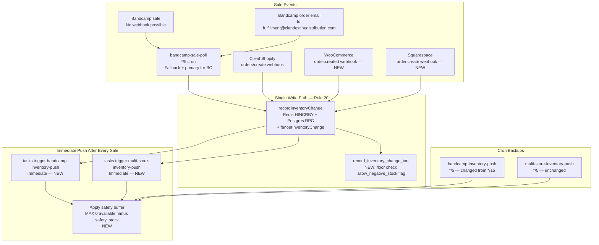

# Inventory System: Real-Time Hardening, Safety Buffer & Bundle Tracking
## Comprehensive Technical Plan — All Files Verified

---

## CRITICAL FINDINGS FROM AUDIT

Before any code, the verified issues:

| ID | File | Line | Issue | Severity |
|---|---|---|---|---|
| C1 | `warehouse_inventory_levels` migration | — | No `CHECK (available >= 0)`, can go negative | Critical |
| C2 | `inbound-checkin-complete.ts` | 45 | Direct RPC, no Redis, no fanout — stock arrives silently | Critical |
| C3 | `bandcamp-sync.ts` | ~965 | Direct `.upsert()` on inventory, no Redis | High |
| C4 | `bandcamp-inventory-push.ts` | — | Cron `*/15`, no buffer logic | High |
| C5 | `process-client-store-webhook.ts` | 120–176 | `handleOrderCreated` creates order but **never decrements inventory** | High |
| C6 | `sensor-check.ts` | 39–62 | Detects Redis/Postgres drift but NEVER fixes it | High |
| C7 | `client-store-order-detect.ts` | 33 | No concurrency limit, can double-poll | Medium |
| C8 | `shopify/route.ts` | 52 | `webhook_events` insert missing `workspace_id` | Medium |

---

## Platform Sync Frequency — Verified

| Platform | Direction | Current | After Plan |
|---|---|---|---|
| Bandcamp → Warehouse | Sale detection poll | 0–5 min (`*/5`) | 0–5 min (unchanged — no Bandcamp webhooks) + Email webhook: **~10-30 sec** |
| Warehouse → Bandcamp | Inventory push | **0–15 min** (`*/15`) | **<10 sec** (immediate trigger) + 5 min cron backup |
| Client Shopify → Warehouse | Order detection | <5 sec (webhook) + 0–10 min (poll) | Already fast; add immediate inventory decrement |
| Client WooCommerce → Warehouse | Order detection | **0–10 min** (poll only) | Add `order.created` webhook: **<5 sec** |
| Client Squarespace → Warehouse | Order detection | **0–10 min** (poll only) | Add `order.create` webhook: **<5 sec** |
| Warehouse → All client stores | Inventory push | 0–5 min (cron) | **<10 sec** (immediate trigger) + 5 min backup |
| Inbound stock → All platforms | New stock push | **NEVER** (C2 — no fanout) | **<15 sec** after fix |

---

## Safety Buffer Logic

**Default: 3 units workspace-wide**

Applied at PUSH TIME — not stored as separate quantity:
```
pushed_quantity = MAX(0, available - effective_safety_stock)
effective_safety_stock = COALESCE(per_sku.safety_stock, workspace.default_safety_stock, 3)
```

For bundles, safety stock applies after the component minimum:
```
bundle_pushed = MAX(0, MIN(bundle.available, MIN(floor(comp.available/qty))) - effective_safety)
```

---

## Architecture Diagram



---

## PART 1 — REAL-TIME SYNC & SAFETY BUFFER

---

### P1-1: Migration — safety_stock columns + floor enforcement

**New file:** `supabase/migrations/20260401000001_inventory_hardening.sql`

```sql
-- Add safety buffer columns
ALTER TABLE warehouse_inventory_levels
  ADD COLUMN IF NOT EXISTS safety_stock integer CHECK (safety_stock >= 0),       -- NULL = use workspace default
  ADD COLUMN IF NOT EXISTS allow_negative_stock boolean NOT NULL DEFAULT false;   -- per-SKU override

ALTER TABLE workspaces
  ADD COLUMN IF NOT EXISTS default_safety_stock integer NOT NULL DEFAULT 3
    CHECK (default_safety_stock >= 0);

-- Replace record_inventory_change_txn with floor-enforcing version
-- ERRCODE P0001 = inventory_floor_violation (catchable in application code)
CREATE OR REPLACE FUNCTION record_inventory_change_txn(
  p_workspace_id uuid,
  p_sku text,
  p_delta integer,
  p_source text,
  p_correlation_id text,
  p_metadata jsonb DEFAULT '{}'
) RETURNS jsonb AS $$
DECLARE
  v_previous integer;
  v_new integer;
  v_allow_neg boolean;
BEGIN
  SELECT allow_negative_stock INTO v_allow_neg
  FROM warehouse_inventory_levels
  WHERE workspace_id = p_workspace_id AND sku = p_sku;

  UPDATE warehouse_inventory_levels
  SET available = available + p_delta,
      updated_at = now(),
      last_redis_write_at = now()
  WHERE workspace_id = p_workspace_id
    AND sku = p_sku
    AND (v_allow_neg = true OR (available + p_delta) >= 0)
  RETURNING available - p_delta, available INTO v_previous, v_new;

  IF NOT FOUND THEN
    RAISE EXCEPTION 'inventory_floor_violation: workspace=% sku=% delta=%',
      p_workspace_id, p_sku, p_delta
      USING ERRCODE = 'P0001';
  END IF;

  INSERT INTO warehouse_inventory_activity (
    id, workspace_id, sku, delta, source, correlation_id,
    previous_quantity, new_quantity, metadata
  ) VALUES (
    gen_random_uuid(), p_workspace_id, p_sku, p_delta, p_source,
    p_correlation_id, v_previous, v_new, p_metadata
  ) ON CONFLICT (sku, correlation_id) DO NOTHING;

  RETURN jsonb_build_object('previous', v_previous, 'new', v_new);
END;
$$ LANGUAGE plpgsql SECURITY DEFINER;
```

**IMPORTANT:** `record-inventory-change.ts` must also handle the new `P0001` error code:

```typescript
// In record-inventory-change.ts, replace the current error handling at line 57:
if (error) {
  const isFloorViolation = error.code === "P0001" ||
    error.message?.includes("inventory_floor_violation");
  if (isFloorViolation) {
    // Floor enforcement — this is expected, not a system error
    console.warn(`[recordInventoryChange] Floor violation for SKU=${sku} delta=${delta}`);
    return { success: false, newQuantity: redisResult, alreadyProcessed: false,
             reason: "floor_violation" as const };
  }
  // ... existing error handling
}
```

**Affected files:**
- `supabase/migrations/20260401000001_inventory_hardening.sql` (NEW)
- `src/lib/server/record-inventory-change.ts` (add floor_violation handling)

---

### P1-2: Patch `bandcamp-inventory-push.ts` — buffer + cron speed

**Current file:** `src/trigger/tasks/bandcamp-inventory-push.ts` (122 lines)

**Changes:**
1. Line 18: `cron: "*/15 * * * *"` → `cron: "*/5 * * * *"`
2. Add buffer loading before building `pushItems`

**Full patch context (lines 55–95):**

```typescript
// CURRENT lines 55-95 (read from file):
      const accessToken = await refreshBandcampToken(workspaceId);
      for (const connection of connections) {
        try {
          const { data: mappings } = await supabase
            .from("bandcamp_product_mappings")
            .select("id, variant_id, bandcamp_item_id, bandcamp_item_type, last_quantity_sold")
            .eq("workspace_id", workspaceId)
            .not("bandcamp_item_id", "is", null);
          if (!mappings || mappings.length === 0) continue;

          const variantIds = mappings.map((m) => m.variant_id);
          const { data: inventoryLevels } = await supabase
            .from("warehouse_inventory_levels")
            .select("variant_id, available")
            .in("variant_id", variantIds);

          const inventoryByVariant = new Map(
            (inventoryLevels ?? []).map((l) => [l.variant_id, l.available]),
          );
          const pushItems = [];
          for (const mapping of mappings) {
            if (!mapping.bandcamp_item_id || !mapping.bandcamp_item_type) continue;
            const available = inventoryByVariant.get(mapping.variant_id) ?? 0;
            pushItems.push({
              item_id: mapping.bandcamp_item_id,
              item_type: mapping.bandcamp_item_type,
              quantity_available: available,           // <-- NO BUFFER TODAY
              quantity_sold: mapping.last_quantity_sold ?? 0,
            });
          }

// NEW replacement (lines 55-100 after patch):
      const accessToken = await refreshBandcampToken(workspaceId);

      // Load workspace default safety stock (once per workspace)
      const { data: ws } = await supabase
        .from("workspaces")
        .select("default_safety_stock")
        .eq("id", workspaceId)
        .single();
      const workspaceSafetyStock = ws?.default_safety_stock ?? 3;

      for (const connection of connections) {
        try {
          const { data: mappings } = await supabase
            .from("bandcamp_product_mappings")
            .select("id, variant_id, bandcamp_item_id, bandcamp_item_type, last_quantity_sold")
            .eq("workspace_id", workspaceId)
            .not("bandcamp_item_id", "is", null);
          if (!mappings || mappings.length === 0) continue;

          const variantIds = mappings.map((m) => m.variant_id);
          // Load inventory + per-SKU safety stock overrides in one query
          const { data: inventoryLevels } = await supabase
            .from("warehouse_inventory_levels")
            .select("variant_id, available, safety_stock")
            .in("variant_id", variantIds);

          const inventoryByVariant = new Map(
            (inventoryLevels ?? []).map((l) => [l.variant_id, {
              available: l.available,
              safetyStock: l.safety_stock,
            }]),
          );

          const pushItems = [];
          for (const mapping of mappings) {
            if (!mapping.bandcamp_item_id || !mapping.bandcamp_item_type) continue;
            const inv = inventoryByVariant.get(mapping.variant_id);
            const rawAvailable = inv?.available ?? 0;
            const effectiveSafety = inv?.safetyStock ?? workspaceSafetyStock;
            const pushedQuantity = Math.max(0, rawAvailable - effectiveSafety);
            pushItems.push({
              item_id: mapping.bandcamp_item_id,
              item_type: mapping.bandcamp_item_type,
              quantity_available: pushedQuantity,      // <-- BUFFER APPLIED
              quantity_sold: mapping.last_quantity_sold ?? 0,
            });
          }
```

**Affected files:**
- `src/trigger/tasks/bandcamp-inventory-push.ts` — cron string change (line 18) + buffer logic (lines 55–95)

---

### P1-3: Patch `multi-store-inventory-push.ts` — buffer

**Current file:** `src/trigger/tasks/multi-store-inventory-push.ts` (219 lines)

Buffer is applied in `pushConnectionInventory` function (lines 80–145). Specifically at line 99 where `available` is used:

```typescript
// CURRENT line 88-121 (pushConnectionInventory):
  const variantIds = mappings.map((m) => m.variant_id);
  const { data: levels } = await supabase
    .from("warehouse_inventory_levels")
    .select("variant_id, available")              // <-- no safety_stock today
    .in("variant_id", variantIds);

  const inventoryByVariant = new Map((levels ?? []).map((l) => [l.variant_id, l.available]));
  // ...
  for (const mapping of mappings) {
    const available = inventoryByVariant.get(mapping.variant_id) ?? 0;
    if (mapping.last_pushed_quantity === available) continue;    // skip if unchanged
    // ...
    await client.pushInventory(mapping.remote_sku ?? "", available, idempotencyKey);

// NEW (add workspace default load before the loop at line ~45, and change pushConnectionInventory signature):
// In the main task run(), before the connection loop:
      const { data: ws } = await supabase
        .from("workspaces").select("default_safety_stock").eq("id", workspaceId).single();
      const workspaceSafetyStock = ws?.default_safety_stock ?? 3;

// In pushConnectionInventory, change the levels select to include safety_stock:
  const { data: levels } = await supabase
    .from("warehouse_inventory_levels")
    .select("variant_id, available, safety_stock")  // <-- add safety_stock
    .in("variant_id", variantIds);
  const inventoryByVariant = new Map(
    (levels ?? []).map((l) => [l.variant_id, { available: l.available, safetyStock: l.safety_stock }]),
  );

// In the push loop, apply buffer:
  for (const mapping of mappings) {
    const inv = inventoryByVariant.get(mapping.variant_id);
    const rawAvailable = inv?.available ?? 0;
    const effectiveSafety = inv?.safetyStock ?? workspaceSafetyStock;
    const pushedQuantity = Math.max(0, rawAvailable - effectiveSafety);

    if (mapping.last_pushed_quantity === pushedQuantity) continue;  // skip if effective qty unchanged

    await client.pushInventory(mapping.remote_sku ?? "", pushedQuantity, idempotencyKey);
```

**Note on `last_pushed_quantity` comparison:** Changing the comparison from `available` to `pushedQuantity` means the `last_pushed_quantity` in `client_store_sku_mappings` now tracks the buffered quantity, not raw. This is correct behavior — we want to avoid redundant pushes of the same buffered value.

**Affected files:**
- `src/trigger/tasks/multi-store-inventory-push.ts` — `pushConnectionInventory` function, lines 88–130; also thread `workspaceSafetyStock` as parameter

---

### P1-4: Immediate push after Bandcamp sale

**Current:** `bandcamp-sale-poll.ts` calls `recordInventoryChange` (line 71), which calls `fanoutInventoryChange` (via `record-inventory-change.ts` line 79), which triggers the push tasks IF the SKU has mappings. But this is async/non-blocking and the fanout itself has the query overhead.

**Problem found during audit:** `fanoutInventoryChange` in `inventory-fanout.ts` line 51–57 queries `bandcamp_product_mappings` for ALL mappings then checks if variant matches — this is O(n) for all mappings. For large catalogs this adds latency.

**Fix:** Add direct immediate trigger in `bandcamp-sale-poll.ts` after the `recordInventoryChange` call:

```typescript
// In bandcamp-sale-poll.ts, after line 80 (recordInventoryChange call):
if (variant) {
  const correlationId = `bandcamp-sale:${connection.band_id}:${item.package_id}:${newSold}`;
  const result = await recordInventoryChange({ ... });  // existing

  // NEW: Trigger immediate push to all channels (don't wait for next cron cycle)
  // The push tasks are idempotent — triggering multiple times is safe
  if (result.success && !result.alreadyProcessed) {
    try {
      await Promise.allSettled([
        tasks.trigger("bandcamp-inventory-push", {}),
        tasks.trigger("multi-store-inventory-push", {}),
      ]);
    } catch { /* non-critical — cron picks it up */ }
  }

  salesDetected++;
}
```

**Affected files:**
- `src/trigger/tasks/bandcamp-sale-poll.ts` — after line 80, inside the `if (variant)` block
- Change line 9 import from `import { schedules } from "@trigger.dev/sdk"` to `import { schedules, tasks } from "@trigger.dev/sdk"` — static import, not dynamic

---

### P1-5: Fix `handleOrderCreated` — add inventory decrement

**Current `process-client-store-webhook.ts` lines 120–176 (complete `handleOrderCreated`):**

```typescript
async function handleOrderCreated(supabase, event, data, connectionId) {
  // ... creates warehouse_orders and warehouse_order_items
  // MISSING: NO inventory decrement, NO immediate push
  return { processed: true, orderId: newOrder?.id };
}
```

**This is gap C5 — when a Shopify/WooCommerce/Squarespace sale happens via webhook, inventory is NEVER decremented in the warehouse.**

**Fix — add after order items insert:**

```typescript
// After line ~170 (warehouse_order_items insert), add:

  // Decrement warehouse inventory for each line item.
  // IMPORTANT: This loop is NOT atomic — if line 1 succeeds and line 2 hits a floor
  // violation, the order has partial inventory applied. We record this explicitly
  // in warehouse_review_queue so staff can reconcile, rather than silently ignoring it.
  if (newOrder && lineItems.length > 0) {
    const decrementResults: { sku: string; delta: number; status: "ok" | "floor_violation" | "not_mapped" | "error"; reason?: string }[] = [];

    for (let index = 0; index < lineItems.length; index++) {
      const li = lineItems[index];
      const remoteSku = (li.sku as string) ?? "";
      if (!remoteSku) continue;

      // Resolve warehouse SKU via mapping (remote SKU may differ from warehouse SKU)
      const { data: mapping } = await supabase
        .from("client_store_sku_mappings")
        .select("variant_id, warehouse_product_variants!inner(sku)")
        .eq("connection_id", connectionId ?? "")
        .eq("remote_sku", remoteSku)
        .single();

      const warehouseSku = (mapping?.warehouse_product_variants as { sku: string } | null)?.sku;
      if (!warehouseSku) {
        decrementResults.push({ sku: remoteSku, delta: 0, status: "not_mapped" });
        continue;
      }

      const qty = (li.quantity as number) ?? 1;
      // Correlation ID includes line item index to prevent collision when the same
      // warehouse SKU appears in multiple line items of the same order (e.g. two separate
      // add-to-cart events for the same product, or platform quirks). Without the index,
      // the second line item would hit UNIQUE(sku, correlation_id) and return alreadyProcessed
      // — silently skipping the second decrement. Using the remote line item ID if available
      // is more stable than index in case of retries with reordered line items.
      const lineItemId = (li.id as string | undefined) ?? String(index);
      const result = await recordInventoryChange({
        workspaceId,
        sku: warehouseSku,
        delta: -qty,
        source: platform === "woocommerce" ? "woocommerce" : "shopify",
        correlationId: `store-order:${event.id}:${warehouseSku}:${lineItemId}`,
        metadata: { order_id: newOrder.id, remote_sku: remoteSku, connection_id: connectionId,
                     line_item_id: lineItemId },
      });

      // Classify the result — floor_violation is an expected inventory-short condition,
      // not a system fault. Both are recorded for visibility.
      if (result.success || result.alreadyProcessed) {
        decrementResults.push({ sku: warehouseSku, delta: -qty, status: "ok" });
      } else if ((result as { reason?: string }).reason === "floor_violation") {
        decrementResults.push({ sku: warehouseSku, delta: -qty, status: "floor_violation",
                                 reason: "insufficient_stock" });
      } else {
        decrementResults.push({ sku: warehouseSku, delta: -qty, status: "error",
                                 reason: "system_fault" });
      }
    }

    // If any line had a floor violation or system error, emit a review queue item
    // so staff can reconcile. Do NOT block order creation.
    const failures = decrementResults.filter(r => r.status !== "ok" && r.status !== "not_mapped");
    if (failures.length > 0) {
      const hasSystemFault = failures.some(r => r.status === "error");
      await supabase.from("warehouse_review_queue").upsert({
        workspace_id: workspaceId,
        org_id: orgId,
        category: "inventory_partial_apply",
        severity: hasSystemFault ? "high" : "medium",
        title: hasSystemFault
          ? `Order ${newOrder.id}: inventory write failed (system error)`
          : `Order ${newOrder.id}: inventory short on ${failures.length} SKU(s)`,
        description: failures.map(f =>
          `${f.sku}: ${f.status}${f.reason ? ` (${f.reason})` : ""}`
        ).join("; "),
        metadata: { order_id: newOrder.id, decrement_results: decrementResults },
        status: "open",
        group_key: `inv_partial:${newOrder.id}`,
        occurrence_count: 1,
      }, { onConflict: "group_key", ignoreDuplicates: false });
    }

    // Trigger immediate push to all channels (only if at least one decrement succeeded)
    if (decrementResults.some(r => r.status === "ok")) {
      await Promise.allSettled([
        tasks.trigger("bandcamp-inventory-push", {}),
        tasks.trigger("multi-store-inventory-push", {}),
      ]).catch(() => {/* non-critical */});
    }
  }
```

**Affected files:**
- `src/trigger/tasks/process-client-store-webhook.ts` — `handleOrderCreated` function, after warehouse_order_items insert (~line 170)
- Change line 9 import from `import { task } from "@trigger.dev/sdk"` to `import { task, tasks } from "@trigger.dev/sdk"` — static import
- Add static import: `import { recordInventoryChange } from "@/lib/server/record-inventory-change"`
- Need to add `client_store_sku_mappings` join to resolve warehouse SKU from remote SKU

---

### P1-6: Add Squarespace HMAC + ensure WooCommerce webhook path

**Current `client-store/route.ts` lines 49–63:**
```typescript
  if (connection.platform === "shopify") {
    signature = request.headers.get("X-Shopify-Hmac-SHA256");
  } else if (connection.platform === "woocommerce") {
    signature = request.headers.get("X-WC-Webhook-Signature");
  }
  // NO Squarespace branch
```

**Fix:**
```typescript
  if (connection.platform === "shopify") {
    signature = request.headers.get("X-Shopify-Hmac-SHA256");
  } else if (connection.platform === "woocommerce") {
    signature = request.headers.get("X-WC-Webhook-Signature");
  } else if (connection.platform === "squarespace") {
    // Squarespace uses "Squarespace-Signature" header (confirmed in official docs)
    signature = request.headers.get("Squarespace-Signature");
  }
```

**IMPORTANT — Squarespace HMAC requires hex-decoded secret:**
Squarespace stores the webhook secret as a hex-encoded string. The `verifyHmacSignature` helper in `webhook-body.ts` uses `encoder.encode(secret)` (UTF-8 bytes) which is WRONG for Squarespace. A separate verification path is needed:

```typescript
// In client-store/route.ts, after the signature is extracted:
if (connection.platform === "squarespace" && signature && connection.webhook_secret) {
  // Squarespace: secret is hex-encoded, must decode to bytes before HMAC
  const secretBytes = Buffer.from(connection.webhook_secret, "hex");
  const expectedSig = crypto
    .createHmac("sha256", secretBytes)
    .update(rawBody)
    .digest("hex");
  const valid = crypto.timingSafeEqual(
    Buffer.from(expectedSig),
    Buffer.from(signature),
  );
  if (!valid) return NextResponse.json({ error: "invalid signature" }, { status: 401 });
  // Skip the generic verifyHmacSignature call below for Squarespace
}
```

Add `import crypto from "node:crypto";` at top of the file.

**Affected files:**
- `src/app/api/webhooks/client-store/route.ts` — lines 49–63, add Squarespace branch with hex-decoded HMAC

---

### P1-7: Bandcamp Email Webhook (near-real-time Bandcamp detection)

**Key finding from audit:** `/api/webhooks/resend-inbound/route.ts` ALREADY EXISTS and is fully wired for Svix-signed inbound emails. It currently handles support conversation routing.

**The email webhook approach for Bandcamp:**
- Bandcamp sends order notification emails to `fulfillment@clandestinedistribution.com`
- Resend must be configured to accept inbound email for this address and forward via webhook
- The existing `/api/webhooks/resend-inbound` route receives the parsed email
- We add a detection branch: if the email is from Bandcamp, trigger an immediate `bandcamp-sale-poll`

**Addition to existing `resend-inbound/route.ts` after line 87 (after dedup check, before email parsing):**

```typescript
// After the dedup check (line 87), before Strategy 1:
// Strategy 0: Bandcamp order notification — trigger immediate inventory poll
const fromAddress = extractEmailAddress(emailPayload.from ?? "");
const subjectLower = (emailPayload.subject ?? "").toLowerCase();
// Tighter pattern — avoids triggering on Bandcamp newsletters, support emails, etc.
// Bandcamp order emails come from noreply@bandcamp.com with subject matching "new order"
const isBandcampOrder =
  /^noreply@bandcamp\.com$/i.test(fromAddress) ||
  (/bandcamp/i.test(fromAddress) && /new (merch )?order/i.test(subjectLower));

if (isBandcampOrder) {
  // Trigger immediate Bandcamp sale poll — this will detect and apply the inventory change
  try {
    const { tasks } = await import("@trigger.dev/sdk");
    await tasks.trigger("bandcamp-sale-poll", {});
    await supabase.from("webhook_events").update({ status: "processed" }).eq("id", dedupRow.id);
  } catch { /* non-critical */ }
  return NextResponse.json({ ok: true, status: "bandcamp_poll_triggered" });
}
// ... existing Strategy 1, 2, 3 below
```

**Resend setup required:**
1. In Resend dashboard → Inbound → Add inbound address: `fulfillment@clandestinedistribution.com`
2. Set webhook URL to: `https://cpanel.clandestinedistro.com/api/webhooks/resend-inbound`
3. Resend sends inbound emails via Svix webhooks (already handled by existing signature verification)

**Important note:** `bandcamp-sale-poll` uses `bandcampQueue` which has `concurrencyLimit: 1`. Triggering it from the email will queue behind any currently running Bandcamp task. In practice this means the poll may run within 1-30 seconds of the email arriving (almost always immediate since Bandcamp tasks are short). The existing `maxAttempts: 3` retry policy from `trigger.config.ts` handles delivery failures.

**Affected files:**
- `src/app/api/webhooks/resend-inbound/route.ts` — add Bandcamp detection branch after dedup check (~line 88)

---

### P1-8: Admin UI — safety buffer column

**Current `src/app/admin/inventory/page.tsx` table headers (lines 152–163):**
```tsx
<TableHead>Product / SKU</TableHead>
<TableHead className="hidden sm:table-cell">Label</TableHead>
<TableHead className="text-right">Avail</TableHead>
<TableHead className="hidden md:table-cell text-right">Committed</TableHead>
<TableHead className="hidden md:table-cell text-right">Incoming</TableHead>
<TableHead className="hidden lg:table-cell">Format</TableHead>
<TableHead className="w-20" />
```

**New columns to add (after "Avail"):**
```tsx
<TableHead className="hidden lg:table-cell text-right">Listed As</TableHead>
<TableHead className="hidden xl:table-cell text-right">Buffer</TableHead>
```

**Data required:** `getInventoryLevels` in `src/actions/inventory.ts` must return `safety_stock` per row. The query uses `*` on variants so this comes automatically once the column exists. The return type `InventoryRow` needs `safetyStock: number | null`.

**New page header element (after filters, before table):**
```tsx
<div className="flex items-center gap-2 text-sm text-muted-foreground">
  <span>Default buffer: {workspaceDefault ?? 3} units</span>
  <Button variant="ghost" size="sm" onClick={() => setBufferDialog(true)}>Edit</Button>
</div>
```

**Inline editable buffer cell:**
```tsx
<EditableNumberCell
  value={row.safetyStock ?? workspaceDefault ?? 3}
  prefix=""
  placeholder="3"
  precision={0}
  className="hidden xl:table-cell text-right font-mono text-muted-foreground"
  onSave={async (newValue) => {
    await updateInventoryBuffer(row.sku, newValue === (workspaceDefault ?? 3) ? null : newValue);
    invalidateInventory();
  }}
/>
```

**New server actions in `src/actions/inventory.ts`:**
```typescript
export async function updateInventoryBuffer(
  sku: string,
  safetyStock: number | null,  // null = use workspace default
): Promise<{ success: boolean }> {
  await requireAuth();
  const serviceClient = createServiceRoleClient();
  const { error } = await serviceClient
    .from("warehouse_inventory_levels")
    .update({ safety_stock: safetyStock, updated_at: new Date().toISOString() })
    .eq("sku", sku);
  if (error) throw new Error(error.message);
  return { success: true };
}

export async function updateWorkspaceDefaultBuffer(
  workspaceId: string,
  defaultSafetyStock: number,
): Promise<{ success: boolean }> {
  await requireAuth();
  const serviceClient = createServiceRoleClient();
  const { error } = await serviceClient
    .from("workspaces")
    .update({ default_safety_stock: defaultSafetyStock })
    .eq("id", workspaceId);
  if (error) throw new Error(error.message);
  return { success: true };
}
```

**Admin tooltips (same language as portal):** The distinction between "Avail" (raw warehouse stock) and "Listed As" (what channels see) must be clear in the admin view too — not just the portal. Add a `title` attribute or Radix Tooltip to both columns:
- "Avail" → tooltip: "Actual units in warehouse. Full truth."
- "Listed As" → tooltip: "Units shown on Bandcamp and connected stores. Reduced by the safety buffer to prevent overselling."
- "Buffer" → tooltip: "Units held back from all sales channels. Default is 3 to cover the Bandcamp 5-minute sync window."

**Affected files:**
- `src/app/admin/inventory/page.tsx` — new columns, workspace default display, column tooltips
- `src/actions/inventory.ts` — new server actions, add `safetyStock` to `InventoryRow` type

---

### P1-9: Client portal — buffer display + control

**Portal inventory pages found:** `/portal/inventory/page.tsx` (primary), `/portal/catalog/page.tsx`, `/portal/catalog/[id]/page.tsx`

**Target: `/portal/inventory/page.tsx`** — add two things:
1. "Listed As" column: `Math.max(0, available - (safetyStock ?? workspaceDefault ?? 3))`
2. Small `+`/`-` control to adjust buffer (capped 0–20)

The portal inventory page uses `getClientInventoryLevels` from `src/actions/inventory.ts`. This action needs to also return `safety_stock` per row.

**Client-facing explanation text:**
```
"Listed As" = units shown as available on Bandcamp and your stores.
The 3-unit buffer protects against overselling during the ~5-minute sync window.
You can adjust per product — set to 0 to list full stock, or increase for high-demand items.
```

**Affected files:**
- `src/app/portal/inventory/page.tsx` — new columns + buffer adjustment UI
- `src/actions/inventory.ts` — `getClientInventoryLevels` must select `safety_stock`

---

## PART 2 — RULE #20 COMPLIANCE FIXES

---

### P2-1: Fix `inbound-checkin-complete.ts` — add Redis + fanout

**Current violation at lines 44–57:**
```typescript
// Rule #20 comment says canonical path — but actually bypasses it:
const { error: inventoryError } = await supabase.rpc("record_inventory_change_txn", {
  p_sku: item.sku,
  p_delta: item.received_quantity,
  p_source: "inbound",
  p_correlation_id: `inbound:${shipmentId}:${item.id}`,
  p_workspace_id: shipment.workspace_id,
  p_metadata: JSON.stringify({ ... }),  // NOTE: JSON.stringify used here, not object
});
```

**Fix — replace lines 44–57:**
```typescript
import { recordInventoryChange } from "@/lib/server/record-inventory-change";

// Replace the RPC call with the canonical path:
const result = await recordInventoryChange({
  workspaceId: shipment.workspace_id,
  sku: item.sku,
  delta: item.received_quantity,
  source: "inbound",
  correlationId: `inbound:${shipmentId}:${item.id}`,
  metadata: {  // NOTE: object, not JSON.stringify — recordInventoryChange handles serialization
    inbound_shipment_id: shipmentId,
    inbound_item_id: item.id,
    expected_quantity: item.expected_quantity,
    received_quantity: item.received_quantity,
  },
});

if (!result.success && !result.alreadyProcessed) {
  // ... same review queue insert as before
}
```

This adds:
- Redis `HINCRBY` (via `adjustInventory`) so Redis reflects new stock immediately
- `fanoutInventoryChange` which triggers `bandcamp-inventory-push` and `multi-store-inventory-push`
- **Result: when stock arrives, Bandcamp and stores are updated within 15 seconds**

**Affected files:**
- `src/trigger/tasks/inbound-checkin-complete.ts` — add import, replace lines 44–57

---

### P2-2: Fix `bandcamp-sync.ts` inventory seed — add Redis

**Current violation at lines ~960–975:**
```typescript
// Direct upsert — no Redis, no fanout:
await supabase.from("warehouse_inventory_levels").upsert(
  {
    variant_id: newVariant.id,
    workspace_id: workspaceId,
    sku: merchItem.sku,
    available: merchItem.quantity_available ?? 0,
    committed: 0, incoming: 0,
    last_redis_write_at: new Date().toISOString(),
    updated_at: new Date().toISOString(),
  },
  { onConflict: "variant_id", ignoreDuplicates: true },
);
```

**Fix:**
```typescript
// Step 1: Seed row at zero (safe baseline)
await supabase.from("warehouse_inventory_levels").upsert(
  {
    variant_id: newVariant.id,
    workspace_id: workspaceId,
    sku: merchItem.sku,
    available: 0,
    committed: 0, incoming: 0,
  },
  { onConflict: "variant_id", ignoreDuplicates: true },
);

// Step 2: Apply actual quantity via canonical path (Redis + Postgres + fanout)
const initialQty = merchItem.quantity_available ?? 0;
if (initialQty > 0) {
  await recordInventoryChange({
    workspaceId,
    sku: merchItem.sku,
    delta: initialQty,
    source: "backfill",
    correlationId: `bandcamp-seed:${connection.band_id}:${merchItem.package_id}`,
    metadata: { band_id: connection.band_id, package_id: merchItem.package_id },
  });
}
```

**Note on `source: "backfill"`:** This is already in the `InventorySource` type (`types.ts` line 6–14). No type change needed.

**Affected files:**
- `src/trigger/tasks/bandcamp-sync.ts` — lines ~960–975, add `recordInventoryChange` import

---

### P2-3: `sensor-check.ts` — auto-heal Redis drift

**Current lines 39–62 (drift detection only):**
```typescript
let mismatches = 0;
for (const row of sample ?? []) {
  const redis = await getInventory(row.sku);
  if (redis.available !== row.available) mismatches++;
}
readings.push({ sensorName: "inv.redis_postgres_drift", ... });
```

**Fix — add healing after the loop:**
```typescript
import { getInventory, setInventory } from "@/lib/clients/redis-inventory";

let mismatches = 0;
let healed = 0;

// Change the select to include all three inventory fields for accurate healing
// (previous select only had "sku, available" — needs committed + incoming too)
const { data: sampleFull } = await supabase
  .from("warehouse_inventory_levels")
  .select("sku, available, committed, incoming")   // full row for accurate Redis heal
  .eq("workspace_id", workspaceId)
  .limit(100);

for (const row of sampleFull ?? []) {
  const redis = await getInventory(row.sku);
  if (redis.available !== row.available) {
    mismatches++;
    if (healed < 50) {
      // Auto-heal: set ALL three fields from Postgres truth.
      // Healing only the drifted field avoids creating false zeros for
      // committed/incoming that downstream consumers might treat as authoritative.
      await setInventory(row.sku, {
        available: row.available,
        committed: row.committed ?? 0,
        incoming: row.incoming ?? 0,
      });
      healed++;
    }
  }
}
readings.push({
  sensorName: "inv.redis_postgres_drift",
  status: driftStatus(mismatches),
  value: { sample_size: sample?.length ?? 0, mismatches, auto_healed: healed },
  message: mismatches === 0
    ? "No drift detected"
    : `${mismatches} mismatches — ${healed} auto-healed`,
});
```

**Note:** `setInventory` is already exported from `redis-inventory.ts` (line 40). Just needs import in sensor-check.

**Affected files:**
- `src/trigger/tasks/sensor-check.ts` — lines 39–62, add `setInventory` import, add healing loop

---

### P2-4: `client-store-order-detect.ts` — add concurrency limit

**New file: `src/trigger/lib/client-store-order-queue.ts`**
```typescript
import { queue } from "@trigger.dev/sdk";

// Prevents overlapping client store order polls that could double-insert orders
export const clientStoreOrderQueue = queue({
  name: "client-store-order",
  concurrencyLimit: 1,
});
```

**Patch `client-store-order-detect.ts` line 34:**
```typescript
// Add import:
import { clientStoreOrderQueue } from "@/trigger/lib/client-store-order-queue";

// Add to task definition:
export const clientStoreOrderDetectTask = schedules.task({
  id: "client-store-order-detect",
  cron: "*/10 * * * *",
  maxDuration: 180,
  queue: clientStoreOrderQueue,  // NEW
  run: async () => { ... }
```

**Affected files:**
- `src/trigger/lib/client-store-order-queue.ts` (NEW)
- `src/trigger/tasks/client-store-order-detect.ts` — line 34, add `queue: clientStoreOrderQueue`

---

### P2-5: Fix `shopify/route.ts` — set workspace_id

**Current lines 51–58 (webhook_events insert):**
```typescript
const { data: inserted } = await supabase
  .from("webhook_events")
  .insert({
    platform: "shopify",
    external_webhook_id: shopifyWebhookId,
    topic, status: "pending",
    metadata: { topic, payload },
    // MISSING: workspace_id
  })
```

**Fix — resolve workspace from shop domain:**
```typescript
// Add before the insert (after HMAC verification):
// Resolve workspace via client_store_connections.store_url instead of slug matching
// (slug matching is brittle — custom names or edits could break the lookup).
// store_url contains the full URL like "https://northernspy.myshopify.com" so we
// match with ILIKE against the X-Shopify-Shop-Domain header value.
const shopDomain = req.headers.get("X-Shopify-Shop-Domain");
let resolvedWorkspaceId: string | null = null;
if (shopDomain) {
  const { data: conn } = await supabase
    .from("client_store_connections")
    .select("workspace_id")
    .eq("platform", "shopify")
    .ilike("store_url", `%${shopDomain}%`)
    .limit(1)
    .maybeSingle();
  resolvedWorkspaceId = conn?.workspace_id ?? null;
}

// Then in the insert:
const { data: inserted } = await supabase.from("webhook_events").insert({
  platform: "shopify",
  external_webhook_id: shopifyWebhookId,
  topic, status: "pending",
  workspace_id: resolvedWorkspaceId,  // NEW
  metadata: { topic, payload },
})
```

**Affected files:**
- `src/app/api/webhooks/shopify/route.ts` — add shop domain resolution, ~5 lines before insert

---

## PART 3 — BUNDLE COMPONENT TRACKING

---

### P3-0: Feature flag for bundle tracking

Bundle tracking should ship behind a feature flag to ensure base inventory correctness (Parts 1+2) is stable before enabling bundle logic. Add a `bundles_enabled` flag to `workspaces`:

```sql
-- Included in migration 20260401000002
ALTER TABLE workspaces
  ADD COLUMN IF NOT EXISTS bundles_enabled boolean NOT NULL DEFAULT false;
```

In `bandcamp-sale-poll.ts` bundle check and push task bundle MIN logic, gate on this flag:
```typescript
const { data: ws } = await supabase.from("workspaces").select("bundles_enabled").eq("id", workspaceId).single();
if (!ws?.bundles_enabled) { /* skip bundle logic */ }
```

Staff enable per-workspace via admin settings. This prevents bundle MIN from accidentally zeroing availability for workspaces that haven't configured components yet.

---

### P3-1: Migration — `bundle_components` table

**Append to `supabase/migrations/20260401000002_bundle_components.sql`:**

```sql
CREATE TABLE bundle_components (
  id uuid PRIMARY KEY DEFAULT gen_random_uuid(),
  workspace_id uuid NOT NULL REFERENCES workspaces(id) ON DELETE CASCADE,
  bundle_variant_id uuid NOT NULL REFERENCES warehouse_product_variants(id) ON DELETE CASCADE,
  component_variant_id uuid NOT NULL REFERENCES warehouse_product_variants(id) ON DELETE CASCADE,
  quantity integer NOT NULL DEFAULT 1 CHECK (quantity > 0),
  created_at timestamptz NOT NULL DEFAULT now(),
  updated_at timestamptz NOT NULL DEFAULT now(),
  UNIQUE(bundle_variant_id, component_variant_id),
  CHECK (bundle_variant_id != component_variant_id)  -- prevent self-reference
);
CREATE INDEX idx_bundle_components_bundle    ON bundle_components(bundle_variant_id);
CREATE INDEX idx_bundle_components_component ON bundle_components(component_variant_id);
CREATE INDEX idx_bundle_components_workspace ON bundle_components(workspace_id);

ALTER TABLE bundle_components ENABLE ROW LEVEL SECURITY;
CREATE POLICY bundle_components_workspace ON bundle_components
  USING (workspace_id = (
    SELECT workspace_id FROM users WHERE auth_user_id = auth.uid() LIMIT 1
  ));
```

---

### P3-2: New task `bundle-component-fanout`

**New file: `src/trigger/tasks/bundle-component-fanout.ts`**

```typescript
/**
 * Bundle component fanout — triggered by bandcamp-sale-poll when a bundle variant sells.
 * Decrements each component's inventory via the canonical recordInventoryChange path.
 *
 * Rule #20: Uses recordInventoryChange for all inventory writes.
 * Idempotency: correlationId includes bundle + package + sold_count + component variant ID.
 */

import { task } from "@trigger.dev/sdk";
import { recordInventoryChange } from "@/lib/server/record-inventory-change";
import { createServiceRoleClient } from "@/lib/server/supabase-server";

export const bundleComponentFanoutTask = task({
  id: "bundle-component-fanout",
  maxDuration: 60,
  run: async (payload: {
    bundleVariantId: string;
    soldQuantity: number;
    workspaceId: string;
    correlationBase: string; // e.g. "bandcamp-sale:band_id:package_id:newSold"
  }) => {
    const { bundleVariantId, soldQuantity, workspaceId, correlationBase } = payload;
    const supabase = createServiceRoleClient();

    const { data: components } = await supabase
      .from("bundle_components")
      .select(`
        id,
        component_variant_id,
        quantity,
        warehouse_product_variants!component_variant_id (sku)
      `)
      .eq("bundle_variant_id", bundleVariantId);

    if (!components?.length) {
      return { skipped: true, reason: "no_components" };
    }

    let decremented = 0;
    for (const comp of components) {
      const variant = comp.warehouse_product_variants as { sku: string } | null;
      if (!variant?.sku) continue;

      const delta = -(soldQuantity * comp.quantity);
      const correlationId = `${correlationBase}:component:${comp.component_variant_id}`;

      const result = await recordInventoryChange({
        workspaceId,
        sku: variant.sku,
        delta,
        source: "bandcamp",
        correlationId,
        metadata: {
          bundle_variant_id: bundleVariantId,
          component_variant_id: comp.component_variant_id,
          quantity_per_bundle: comp.quantity,
          sold_quantity: soldQuantity,
        },
      });

      if (result.success) decremented++;
    }

    return { componentsDecremented: decremented, totalComponents: components.length };
  },
});
```

---

### P3-3: Patch `bandcamp-sale-poll.ts` — bundle check

**After the immediate push trigger added in P1-4, add:**

```typescript
// Bundle check — trigger component decrement if this variant is a bundle
if (result.success && !result.alreadyProcessed) {
  const { data: bundleCheck } = await supabase
    .from("bundle_components")
    .select("id")
    .eq("bundle_variant_id", mapping.variant_id)
    .limit(1);

  if (bundleCheck?.length) {
    await bundleComponentFanoutTask.trigger({
      bundleVariantId: mapping.variant_id,
      soldQuantity: Math.abs(delta),
      workspaceId,
      correlationBase: correlationId,
    });
  }
}
```

**Add import:**
```typescript
import { bundleComponentFanoutTask } from "@/trigger/tasks/bundle-component-fanout";
```

---

### P3-4: Patch `bandcamp-inventory-push.ts` — bundle MIN + buffer

**After P1-2 changes (buffer applied), extend to load bundle components:**

```typescript
// After loading inventoryByVariant map, add bundle loading:
const { data: allBundleComponents } = await supabase
  .from("bundle_components")
  .select("bundle_variant_id, component_variant_id, quantity")
  .eq("workspace_id", workspaceId);

const bundleMap = new Map();
for (const bc of allBundleComponents ?? []) {
  const arr = bundleMap.get(bc.bundle_variant_id) ?? [];
  arr.push({ componentVariantId: bc.component_variant_id, quantity: bc.quantity });
  bundleMap.set(bc.bundle_variant_id, arr);
}

// Add all component variant IDs to the inventory fetch
const allVariantIds = [...new Set([
  ...variantIds,
  ...(allBundleComponents ?? []).map(c => c.component_variant_id),
])];
// Re-fetch inventoryLevels with allVariantIds (replace the existing variantIds fetch)

// In the pushItems loop, compute bundle minimum before applying buffer:
const inv = inventoryByVariant.get(mapping.variant_id);
const rawAvailable = inv?.available ?? 0;
const effectiveSafety = inv?.safetyStock ?? workspaceSafetyStock;

const components = bundleMap.get(mapping.variant_id);
let effectiveAvailable = rawAvailable;
if (components?.length) {
  const componentMin = Math.min(
    ...components.map((c: { componentVariantId: string; quantity: number }) => {
      const compInv = inventoryByVariant.get(c.componentVariantId);
      return Math.floor((compInv?.available ?? 0) / c.quantity);
    })
  );
  effectiveAvailable = Math.min(rawAvailable, Math.max(0, componentMin));
}
// Apply buffer last
const pushedQuantity = Math.max(0, effectiveAvailable - effectiveSafety);
```

---

### P3-5: Patch `multi-store-inventory-push.ts` — same bundle MIN

Identical to P3-4 pattern. Load `bundle_components` once per workspace. Apply MIN before buffer in `pushConnectionInventory`.

---

### P3-6: Patch `inventory-fanout.ts` — parent bundle awareness

**Current file ends at line 85. Add after existing fanout logic (~line 82):**

```typescript
// Check if changed SKU is a component in any bundle → trigger re-evaluation
if (variant) {
  const { data: parentBundles } = await supabase
    .from("bundle_components")
    .select("bundle_variant_id")
    .eq("workspace_id", workspaceId)
    .eq("component_variant_id", variant.id)
    .limit(1);

  if (parentBundles?.length) {
    // Parent bundle exists — ensure push tasks run to recompute bundle availability
    // (push tasks already compute effective MIN for bundles)
    if (!targets.pushToBandcamp) {
      try { await tasks.trigger("bandcamp-inventory-push", {}); } catch { /* non-critical */ }
    }
    if (!targets.pushToStores) {
      try { await tasks.trigger("multi-store-inventory-push", {}); } catch { /* non-critical */ }
    }
  }
}
```

---

### P3-7: Daily `bundle-availability-sweep` task

**New file: `src/trigger/tasks/bundle-availability-sweep.ts`**

```typescript
import { schedules } from "@trigger.dev/sdk";
import { tasks } from "@trigger.dev/sdk";
import { getAllWorkspaceIds } from "@/lib/server/auth-context";
import { createServiceRoleClient } from "@/lib/server/supabase-server";

export const bundleAvailabilitySweepTask = schedules.task({
  id: "bundle-availability-sweep",
  cron: "0 6 * * *",  // 6am UTC daily
  run: async () => {
    const supabase = createServiceRoleClient();
    const workspaceIds = await getAllWorkspaceIds(supabase);
    let workspacesWithBundles = 0;

    for (const workspaceId of workspaceIds) {
      const { count } = await supabase
        .from("bundle_components")
        .select("id", { count: "exact", head: true })
        .eq("workspace_id", workspaceId);

      if (count && count > 0) {
        workspacesWithBundles++;
        // Trigger both push tasks to recompute bundle availability
        await Promise.allSettled([
          tasks.trigger("bandcamp-inventory-push", {}),
          tasks.trigger("multi-store-inventory-push", {}),
        ]);
      }
    }
    return { workspacesWithBundles };
  },
});
```

---

### P3-8: Server actions — `src/actions/bundle-components.ts`

```typescript
"use server";

import { z } from "zod/v4";
import { requireAuth } from "@/lib/server/auth-context";
import { createServiceRoleClient } from "@/lib/server/supabase-server";

const componentSchema = z.object({
  componentVariantId: z.string().uuid(),
  quantity: z.number().int().min(1).max(99),
});

export async function getBundleComponents(bundleVariantId: string) {
  await requireAuth();
  const supabase = createServiceRoleClient();
  const { data, error } = await supabase
    .from("bundle_components")
    .select(`
      id, quantity, component_variant_id,
      warehouse_product_variants!component_variant_id (
        id, sku, title,
        warehouse_inventory_levels (available, safety_stock),
        warehouse_products!inner (title, vendor)
      )
    `)
    .eq("bundle_variant_id", bundleVariantId)
    .order("created_at");
  if (error) throw new Error(error.message);
  return data ?? [];
}

export async function setBundleComponents(
  bundleVariantId: string,
  components: { componentVariantId: string; quantity: number }[],
) {
  await requireAuth();
  const parsed = components.map(c => componentSchema.parse(c));
  const supabase = createServiceRoleClient();

  // Resolve workspace_id from the bundle variant
  const { data: variant } = await supabase
    .from("warehouse_product_variants")
    .select("workspace_id")
    .eq("id", bundleVariantId)
    .single();
  if (!variant) throw new Error("Bundle variant not found");

  // Full graph walk for cycle detection (DFS from each proposed component).
  // The DB CHECK prevents direct self-reference (A=A), and this catches all deeper
  // cycles: A→B→A, A→B→C→A, etc. Without this, bundle-of-bundle expansion can
  // create impossible availability math or infinite recursion in the MIN formula.
  const { data: allExistingComponents } = await supabase
    .from("bundle_components")
    .select("bundle_variant_id, component_variant_id")
    .eq("workspace_id", variant.workspace_id);

  // Build adjacency map of existing bundle graph (bundle → [components])
  const graph = new Map<string, string[]>();
  for (const bc of allExistingComponents ?? []) {
    const children = graph.get(bc.bundle_variant_id) ?? [];
    children.push(bc.component_variant_id);
    graph.set(bc.bundle_variant_id, children);
  }

  // DFS: starting from each proposed component, check if we can reach bundleVariantId
  function wouldCreateCycle(componentId: string): boolean {
    const visited = new Set<string>();
    const stack = [componentId];
    while (stack.length > 0) {
      const node = stack.pop()!;
      if (node === bundleVariantId) return true; // cycle detected
      if (visited.has(node)) continue;
      visited.add(node);
      for (const child of graph.get(node) ?? []) stack.push(child);
    }
    return false;
  }

  // DFS runs once per proposed component — O(n × graph_size).
  // Acceptable for typical catalog sizes (<1000 bundles per workspace).
  // If workspaces grow to 10,000+ bundles, replace with union-find or
  // precomputed transitive closure. Not blocking for current scale.
  for (const c of parsed) {
    if (wouldCreateCycle(c.componentVariantId)) {
      throw new Error(
        `Circular reference detected: adding ${c.componentVariantId} as a component of ` +
        `${bundleVariantId} would create a cycle in the bundle graph.`
      );
    }
  }

  // Atomic replace: delete existing, insert new
  await supabase.from("bundle_components").delete().eq("bundle_variant_id", bundleVariantId);
  if (parsed.length > 0) {
    const rows = parsed.map(c => ({
      workspace_id: variant.workspace_id,
      bundle_variant_id: bundleVariantId,
      component_variant_id: c.componentVariantId,
      quantity: c.quantity,
    }));
    const { error } = await supabase.from("bundle_components").insert(rows);
    if (error) throw new Error(error.message);
  }
}

export async function removeBundleComponent(bundleComponentId: string) {
  await requireAuth();
  const supabase = createServiceRoleClient();
  const { error } = await supabase
    .from("bundle_components").delete().eq("id", bundleComponentId);
  if (error) throw new Error(error.message);
}

export async function computeBundleAvailability(bundleVariantId: string, workspaceId: string) {
  await requireAuth();
  const supabase = createServiceRoleClient();
  const [{ data: bundleInv }, { data: ws }, { data: components }] = await Promise.all([
    supabase.from("warehouse_inventory_levels").select("available, safety_stock")
      .eq("variant_id", bundleVariantId).single(),
    supabase.from("workspaces").select("default_safety_stock").eq("id", workspaceId).single(),
    supabase.from("bundle_components")
      .select(`component_variant_id, quantity, warehouse_product_variants!component_variant_id (
        sku, title, warehouse_inventory_levels (available, safety_stock)
      )`)
      .eq("bundle_variant_id", bundleVariantId),
  ]);

  const defaultSafety = ws?.default_safety_stock ?? 3;
  const bundleRaw = bundleInv?.available ?? 0;
  const bundleSafety = bundleInv?.safety_stock ?? defaultSafety;

  const componentDetails = (components ?? []).map(c => {
    const v = c.warehouse_product_variants as { sku: string; title: string; warehouse_inventory_levels: { available: number }[] };
    const compAvail = v?.warehouse_inventory_levels?.[0]?.available ?? 0;
    const contribution = Math.floor(compAvail / c.quantity);
    return { componentVariantId: c.component_variant_id, sku: v?.sku, title: v?.title,
             available: compAvail, quantityPerBundle: c.quantity, contributes: contribution };
  });

  const componentMin = componentDetails.length > 0
    ? Math.min(...componentDetails.map(c => c.contributes))
    : Infinity;
  const effectiveBeforeBuffer = Math.min(bundleRaw, componentMin === Infinity ? bundleRaw : componentMin);
  const effectiveAvailable = Math.max(0, effectiveBeforeBuffer - bundleSafety);
  const constrainedBy = componentDetails.find(c => c.contributes === componentMin) ?? null;

  return { rawAvailable: bundleRaw, effectiveAvailable, constrainedBy, components: componentDetails };
}
```

---

### P3-9: Admin UI — Bundle Components editor

**In `src/app/admin/catalog/[id]/page.tsx`:**

The file already has `PRODUCT_TYPES = [..., "Bundle", ...]` (line 47). When `product.product_type === "Bundle"` OR when a variant has bundle components, show a "Bundle Components" card.

```tsx
{/* Add after Variants section */}
{(product.product_type === "Bundle" || bundleComponents.length > 0) && (
  <Card>
    <CardHeader>
      <CardTitle className="text-sm">Bundle Components</CardTitle>
      <p className="text-xs text-muted-foreground">
        When this bundle sells, each component&apos;s inventory is decremented.
        Bandcamp shows 0 available when any component runs out.
      </p>
    </CardHeader>
    <CardContent>
      {/* Component list with SKU, qty-per-bundle, current available, contribution */}
      {/* "Add Component" typeahead search */}
      {/* Effective available display with constraint indicator */}
    </CardContent>
  </Card>
)}
```

---

### P3-10: Update `src/trigger/tasks/index.ts`

**Add exports after existing bundle-related additions:**

```typescript
// Bundle component tracking (inventory hardening)
export { bundleComponentFanoutTask } from "./bundle-component-fanout";
export { bundleAvailabilitySweepTask } from "./bundle-availability-sweep";
```

---

## COMPLETE FILE IMPACT MATRIX

| File | Change | Part |
|---|---|---|
| `supabase/migrations/20260401000001_inventory_hardening.sql` | NEW: safety_stock, allow_negative_stock, default_safety_stock, updated RPC | P1 |
| `supabase/migrations/20260401000002_bundle_components.sql` | NEW: bundle_components table | P3 |
| `src/trigger/tasks/bandcamp-inventory-push.ts` | cron change, buffer load, bundle MIN | P1 + P3 |
| `src/trigger/tasks/multi-store-inventory-push.ts` | buffer load, bundle MIN | P1 + P3 |
| `src/trigger/tasks/bandcamp-sale-poll.ts` | immediate push trigger, bundle fanout trigger | P1 + P3 |
| `src/trigger/tasks/process-client-store-webhook.ts` | handleOrderCreated: add inventory decrement + immediate push | P1 |
| `src/app/api/webhooks/client-store/route.ts` | Squarespace HMAC branch | P1 |
| `src/app/api/webhooks/resend-inbound/route.ts` | Bandcamp email detection → trigger sale poll | P1 |
| `src/app/api/webhooks/shopify/route.ts` | workspace_id resolution on insert | P2 |
| `src/trigger/tasks/inbound-checkin-complete.ts` | replace RPC with recordInventoryChange | P2 |
| `src/trigger/tasks/bandcamp-sync.ts` | fix inventory seed at ~line 965 | P2 |
| `src/trigger/tasks/sensor-check.ts` | add auto-heal setInventory calls | P2 |
| `src/trigger/tasks/client-store-order-detect.ts` | add queue: for concurrency | P2 |
| `src/trigger/lib/client-store-order-queue.ts` | NEW: queue definition | P2 |
| `src/lib/server/record-inventory-change.ts` | handle P0001 floor_violation SQLSTATE | P1 |
| `src/lib/server/inventory-fanout.ts` | parent bundle awareness | P3 |
| `src/trigger/tasks/bundle-component-fanout.ts` | NEW: task | P3 |
| `src/trigger/tasks/bundle-availability-sweep.ts` | NEW: daily cron | P3 |
| `src/trigger/tasks/index.ts` | export new bundle tasks | P3 |
| `src/actions/inventory.ts` | updateInventoryBuffer, updateWorkspaceDefaultBuffer, safety_stock in queries | P1 |
| `src/actions/bundle-components.ts` | NEW: CRUD + computeAvailability | P3 |
| `src/app/admin/inventory/page.tsx` | Buffer column, Listed As column, workspace default | P1 |
| `src/app/portal/inventory/page.tsx` | Listed As column, buffer adjust control | P1 |
| `src/app/admin/catalog/[id]/page.tsx` | Bundle Components card | P3 |

---

## TECHNICAL REVIEW CORRECTIONS (applied 2026-04-01)

| Item | Status | Resolution |
|---|---|---|
| Squarespace header name | **Fixed** | Changed to `Squarespace-Signature` (confirmed in Squarespace official docs) |
| Squarespace HMAC hex decode | **Fixed** | Added `Buffer.from(secret, "hex")` path; `verifyHmacSignature` is UTF-8 only |
| Dynamic imports in tasks | **Fixed** | Static `import { schedules, tasks }` in both task files |
| Bandcamp email detection | **Fixed** | Tightened to `noreply@bandcamp.com` exact match OR domain + subject regex |
| Non-atomic multi-line order decrements | **Fixed** | Partial-application recorded in `warehouse_review_queue` with `group_key`; severity distinguishes `floor_violation` (medium) from `system_fault` (high) |
| Floor violation incident classification | **Fixed** | `recordInventoryChange` returns `reason: "floor_violation"` for P0001 vs `reason: "system_fault"` for unexpected errors; callers route accordingly |
| Shopify workspace resolution brittleness | **Fixed** | Resolve via `client_store_connections.store_url ILIKE '%{shopDomain}%'` instead of slug matching |
| Redis auto-heal zeroing auxiliary fields | **Fixed** | Heal loads full row (`sku, available, committed, incoming`) from Postgres before `setInventory`; no false zeros |
| Bundle deep cycle detection | **Fixed** | Full DFS graph walk in `setBundleComponents` detects all multi-hop cycles (A→B→C→A), not just direct pairs |
| Bundle push performance at scale | **Documented** | Noted as known limitation; bundle map built once per task run; future optimization: SKU-targeted pushes |
| Bundle feature flag | **Added** | `workspaces.bundles_enabled` flag; bundle MIN logic gated per-workspace |
| Admin UI label ambiguity | **Fixed** | Radix Tooltip added to Avail / Listed As / Buffer columns in both admin and portal |
| Order correlation ID collision (same SKU in 2 line items) | **Fixed** | Correlation ID now `store-order:${event.id}:${warehouseSku}:${lineItemId}` — remote line item ID preferred, array index as fallback |
| `warehouse_review_queue` table | **Confirmed exists** | Migration `20260316000008_monitoring.sql` line 6 |
| Empty `{}` payload in push tasks | **Confirmed correct** | Both tasks call `getAllWorkspaceIds()` internally |

---

## RISK ANALYSIS

**Floor enforcement (P0001):** `bandcamp-sale-poll`, `process-client-store-webhook`, and `bundle-component-fanout` all call `recordInventoryChange`. Any of these can now receive a `floor_violation` error. All callers log warnings and continue (non-fatal). The inventory activity log records the attempted decrement. Staff will see the attempted negative delta in `warehouse_inventory_activity`.

**Safety stock comparison change in multi-store-inventory-push:** `last_pushed_quantity` comparison changes from raw `available` to buffered `pushedQuantity`. This means after deployment, the first run will push buffered quantities to ALL client stores for ALL SKUs that had `last_pushed_quantity` = raw available (which is most). This is a one-time "reset to buffered" push. Expected and correct.

**Bandcamp email parsing:** Detection uses a tightened regex — `noreply@bandcamp.com` exact match OR bandcamp domain + `/new (merch )?order/i` subject. This avoids newsletters and support emails. Worst case a false positive triggers a harmless no-op poll.

**`handleOrderCreated` SKU resolution:** If a client store line item's `remote_sku` has no matching entry in `client_store_sku_mappings`, the inventory decrement is SKIPPED (logged). This is correct — we only manage inventory for SKUs that are mapped. Un-mapped SKUs from client orders are not warehouse-managed.

**Bundle component fanout correlation IDs:** The format `${correlationBase}:component:${component_variant_id}` creates unique idempotency per component per sale event. Retried tasks will correctly skip already-processed components.

---

## VERIFICATION CHECKLIST

**Part 1:**
1. `npx tsc --noEmit` — zero errors
2. Sell 1 unit on client Shopify → verify in `warehouse_inventory_activity` within 10 seconds
3. Set workspace buffer=3, available=5 → verify Bandcamp shows 2
4. Set SKU buffer=0 → verify Bandcamp shows 5
5. Receive inbound stock → verify Bandcamp/stores update within 15 seconds
6. Check Bandcamp email webhook: send test email from bandcamp.com domain → verify `bandcamp-sale-poll` triggered

**Part 2:**
7. Force Redis mismatch → verify sensor-check heals it within 5 minutes
8. Duplicate client store poll trigger → verify only 1 run executes (queue limit)
9. Check `webhook_events.workspace_id` populated after Shopify webhook

**Part 3:**
10. Bundle with 2-LP + 1-CD: LP=4, CD=3, buffer=1 → Bandcamp shows `MIN(2,3)-1 = 1`
11. Sell 1 LP individually → bundle immediately shows 0
12. Sell 1 bundle → LP -2, CD -1 in `warehouse_inventory_activity`
13. Floor test: available=1, sell bundle needing 2-LP → `warehouse_review_queue` item created

---

## DOC SYNC

- `docs/system_map/TRIGGER_TASK_CATALOG.md` — update `bandcamp-inventory-push` cron; add `bundle-component-fanout`, `bundle-availability-sweep`
- `docs/system_map/API_CATALOG.md` — add `updateInventoryBuffer`, `updateWorkspaceDefaultBuffer`, bundle-components actions
- `TRUTH_LAYER.md` — document effective-available formula; update Rule #20 compliance list
- `CLAUDE.md` — update Rule #20 exceptions (remove `inbound-checkin-complete` as exception after fix)
