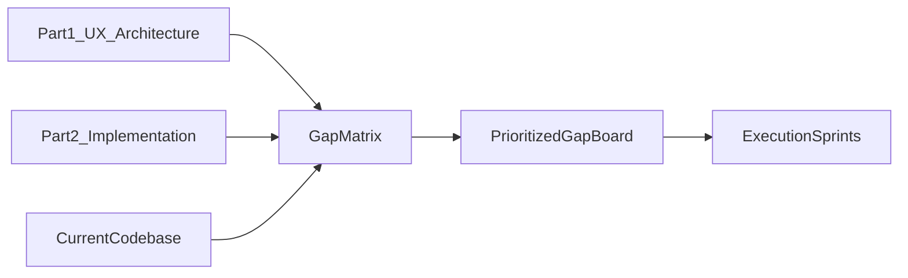

# Plan vs Current-State Gap Assessment

## Assessment Snapshot

Based on the original plan docs and current repository, the project is in a strong but incomplete state:

- **Implemented well:** broad app surface area (admin + portal), core integrations, webhook handlers, Trigger task ecosystem, multi-store primitives, support/billing/inbound modules.
- **Improved beyond original plan in places:** richer client/admin settings, alias/hierarchy/merge tools, expanded docs/audits, practical operational controls.
- **Partially realized or inconsistent:** webhook registration workflow, some auth/RLS write-path behavior in production environments, Trigger cloud/runtime validation, and completion hardening.
- **Still missing for “plan-complete” confidence:** stable E2E/CI gates, explicit production migration parity checks, and a clean operational runbook proving all critical journeys are green continuously.

## Plan-vs-Code Trace Map

## What To Compare (Concrete Sources)

- Original planning intent:
  - [/Users/tomabbs/Downloads/files 26/CLANDESTINE_FULFILLMENT_PART1_FINAL.md](/Users/tomabbs/Downloads/files%2026/CLANDESTINE_FULFILLMENT_PART1_FINAL.md)
  - [/Users/tomabbs/Downloads/files 26/CLANDESTINE_FULFILLMENT_PART2_FINAL.md](/Users/tomabbs/Downloads/files%2026/CLANDESTINE_FULFILLMENT_PART2_FINAL.md)
- Current implementation reality:
  - [src/app/admin](src/app/admin)
  - [src/app/portal](src/app/portal)
  - [src/actions](src/actions)
  - [src/trigger/tasks](src/trigger/tasks)
  - [src/app/api/webhooks](src/app/api/webhooks)
  - [supabase/migrations](supabase/migrations)
- Existing audit context:
  - [TECHNICAL_HANDOFF_REPORT_2026-03-18.md](TECHNICAL_HANDOFF_REPORT_2026-03-18.md)
  - [docs/CLAUDE_CODE_AUDIT_REPORT.md](docs/CLAUDE_CODE_AUDIT_REPORT.md)

## Gap-Fix Planning Workstreams

- **Workstream 1 — Feature parity matrix**
  - Build a plan-to-code matrix by domain: auth, inventory, inbound, support, billing, channels, preorders, client portal, scanning, integrations.
  - Mark each item as `Complete`, `Improved`, `Partial`, `Missing`, or `Drifted`.
- **Workstream 2 — Reliability and data-path parity**
  - Validate server-action write paths against production RLS/policy reality and migration state.
  - Identify places where code assumes policies/migrations that may not be deployed.
- **Workstream 3 — Integration completeness**
  - Separate “handler exists” from “provider registration + secrets + health checks configured.”
  - Explicitly call out manual-vs-automated registration gaps (Shopify/ShipStation/AfterShip/Resend/Stripe/client-store webhooks).
- **Workstream 4 — Operational readiness**
  - Audit Trigger runtime readiness, sensor coverage, and production runbook completeness.
  - Confirm whether all critical cron/event tasks are actively wired and observable.
- **Workstream 5 — Quality gates**
  - Compare planned QA bar (unit + contract + E2E + CI) vs current actual.
  - Define minimal release gate and “done” criteria for each high-risk gap.

## Deliverables

- **Deliverable A:** current-state assessment report with plan deltas and evidence links.
- **Deliverable B:** prioritized gap board (P0/P1/P2) with effort and dependency ordering.
- **Deliverable C:** sprint-ready implementation sequence that preserves improvements already made while closing missing planned capabilities.

## Initial Priority Recommendations (Before Major Upgrades)

- **P0:** production migration/policy parity verification and critical write-path hardening.
- **P0:** webhook/integration registration checklist with observable health signals.
- **P1:** E2E stabilization + CI enforcement for regression protection.
- **P1:** Trigger operational validation (env/auth/run smoke).
- **P2:** performance/maintainability debt cleanup once reliability gates are green.

