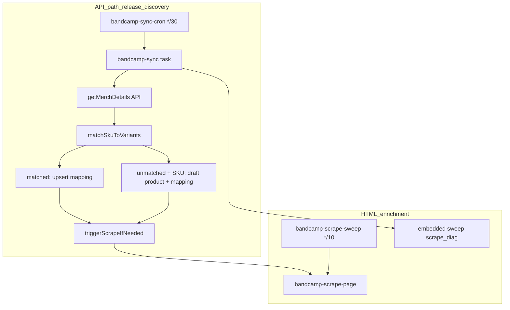

# Bandcamp scraper + release pipeline: enterprise observability, bounded self-heal, staff UI

## 1. Scope summary

Deliver **high operational confidence** for Bandcamp-driven catalog updates without **babysitting**, by:

- Making the **true critical path** for “new release showed up on Bandcamp” **visible and alertable** (API merch sync, not only HTML scrape).
- Adding **industry-standard** layers: **metrics**, **thresholds**, **bounded auto-remediation**, **audit trail**, optional **managed fetch**, optional **search + AI** for URL resolution—**without** promising impossible guarantees (IP blocks, ToS, unbounded spend).
- Extending the **existing** `sensor_check` / `sensor_readings` pipeline and `channel_sync_log` rather than inventing a parallel monitoring system.
- Staff **settings UI**: scraper health, progress, errors, **field write toggles**, and the **catalog completeness readouts** below (this was implied before; now **explicit**).

**Out of scope for v1:** Full autonomous “retry until success forever”; replacing `data-tralbum` parsing with a black-box third-party Bandcamp scraper.

**Official Bandcamp developer surface (supports API-first framing):** Bandcamp documents **OAuth 2.0** access and supported API families (**Account**, **Sales Report**, **Merch Orders**). That aligns with treating **merch API sync** as the supported discovery path and **public HTML + `data-tralbum`** as enrichment — not a documented public “search/discover” contract.

---

## 1b. Admin settings — scraper activity + catalog completeness readouts (your checklist)

**Placement:** Same Bandcamp admin area as today (`[src/app/admin/settings/bandcamp/page.tsx](Project/clandestine-fulfillment/src/app/admin/settings/bandcamp/page.tsx)`) — e.g. tabs: **Accounts | Scraper & catalog health**.

### A. Scraper **activity** (operational) — **near-real-time / log-backed**

- Latest `channel_sync_log` rows for `merch_sync`, `scrape_diag`, `scrape_sweep`, `connection_backfill` (timestamps, `items_processed`, `metadata` JSON).
- Optional: link to Trigger.dev run for last manual sync (when `taskRunId` is available).
- Slice of open `warehouse_review_queue` where `category = 'bandcamp_scraper'` (title, severity, `group_key`).
- **UI copy:** Present this block as **live or near-real-time** (driven by logs and recent task runs), **not** the same refresh contract as catalog completeness below.

### B. **Have vs missing** counts (Bandcamp-mapped catalog only)

Scope: **`bandcamp_product_mappings` for the workspace** joined to `warehouse_product_variants` and `warehouse_products` as needed — so counts reflect **your** catalog tied to Bandcamp, not every row in the warehouse.


| Readout                             | “Have” definition (implement + confirm in BUILD)                                                                                                                                                                                                                                                                                                         | Primary columns                      |
| ----------------------------------- | -------------------------------------------------------------------------------------------------------------------------------------------------------------------------------------------------------------------------------------------------------------------------------------------------------------------------------------------------------- | ------------------------------------ |
| Album cover                         | `bandcamp_product_mappings.bandcamp_art_url` IS NOT NULL. CDN: `f4.bcbits.com/img/a{art_id}_*.jpg`; `_0.jpg` = original when variants exist; surface fetch/CDN failures to ops.                                                                                                                                                                          | mapping                              |
| Secondary merch photos (1 / 2 / 3+) | **Derived / heuristic (not a Bandcamp contract):** same counting rule as above (CDN regex + first-image assumption). **Label in UI/internal docs** as **derived** counts; **validate against a representative sample** before treating as canonical business truth. Bucket 0 / 1 / 2 / 3+. SQL must match `storeScrapedImages` behavior for consistency. | `warehouse_product_images` + mapping |
| About                               | `bandcamp_about` IS NOT NULL AND not empty                                                                                                                                                                                                                                                                                                               | mapping                              |
| Credits                             | `bandcamp_credits` IS NOT NULL AND not empty                                                                                                                                                                                                                                                                                                             | mapping                              |
| Track list                          | `bandcamp_tracks` IS NOT NULL (and length > 0 if JSON array)                                                                                                                                                                                                                                                                                             | mapping                              |
| UPC                                 | `warehouse_products.bandcamp_upc` IS NOT NULL **or** `warehouse_product_variants.barcode` (document which is canonical for display)                                                                                                                                                                                                                      | product / variant                    |


Present as **two columns per row**: “Have” count vs “Missing” count (or percentage), for the scoped set.

### C. **Error deep links** (manual triage)

- Paginated list from `warehouse_review_queue` (`bandcamp_scraper`) joined through `metadata.mappingId` (or parse from `group_key` fallback) → `bandcamp_product_mappings` → `variant_id` → `warehouse_products.id`.
- Each row: **product title**, **error title**, **link** to in-app catalog: `/admin/catalog/{product.id}` (see [src/app/admin/catalog/page.tsx](Project/clandestine-fulfillment/src/app/admin/catalog/page.tsx) navigation pattern).

### D. **Draft vs live Shopify** + **SKU stats**

- **Draft products:** `warehouse_products.status = 'draft'` (workspace scope); optional filter “has Bandcamp mapping” if you only care about Bandcamp-originated drafts.
- **Live Shopify:** `shopify_product_id IS NOT NULL` **and** product status indicates published/active per your existing semantics (confirm field: `status` vs Shopify API — align with catalog UI).
- **Unique SKUs:** `COUNT(DISTINCT sku)` on `warehouse_product_variants` for workspace.
- **Duplicate SKU:** variants sharing the same `sku` more than once (`GROUP BY sku HAVING COUNT(*) > 1`) — list count + optional drill-down table with catalog links.

### E. Performance — **snapshot-first for catalog completeness only**

- Joins across mappings, variants, products, and images can be **slow** at ~50k+ products. **Avoid** “live SQL only → discover slowness in prod → retrofit snapshot.”
- **Default approach:** add `workspace_catalog_stats` (or equivalent) — one row per workspace: `stats jsonb`, `computed_at timestamptz`; refresh via **scheduled Trigger task** + **on-demand staff “Refresh stats”** (always).
- **Target cadence (default):** **`nightly`** full recompute per workspace (or single global job batching workspaces) — balances **fresh-enough completeness** with **predictable load** on large catalogs. **Not hourly by default** (expensive joins at scale).
- **Optional faster cadence:** **`hourly`** (or “every N hours”) only behind **workspace flag / env** if ops explicitly need fresher aggregate numbers during intensive catalog work; still **not** a substitute for §1b.A log-backed health.
- **Fallback:** bounded on-demand recompute when snapshot missing/stale beyond threshold or after staff refresh (guard with timeout / row limits).
- **Do not conflate with §1b.A:** Completeness / SKU aggregate numbers are **snapshot-backed**; scraper **health / activity** stays **log-backed** so triage during active incidents is not misleading.

### F. Staff actions (v1 self-heal companion)

- **Manual retry hooks:** e.g. “requeue mapping”, “trigger sweep for workspace”, “refresh catalog stats” — bounded, audited, `requireStaff`; complements automated rules without putting AI or vendors on the critical path.
- **Review queue at scale:** If a **global parse/HTML failure** floods `warehouse_review_queue` (`bandcamp_scraper`), staff need **bulk dismiss / bulk snooze** (with audit + optional reason) so thousands of duplicate tickets do not block triage. Plan as part of scraper admin surface or shared review-queue tooling.

**Answer to your question:** The written plan **now explicitly includes** this readout; previously it only said “metrics / scraper tab” without your field-level breakdown — that gap is closed in section **1b** and the `ui-catalog-aggregates` todo.

---

## 2. Pushback — complexity control (per your request)


| Your ask                    | Adjustment                                                                                                                                                                                                                                                                                                                                                                       |
| --------------------------- | -------------------------------------------------------------------------------------------------------------------------------------------------------------------------------------------------------------------------------------------------------------------------------------------------------------------------------------------------------------------------------- |
| “Retry until jobs are done” | **Not safe** as stated. Replace with **bounded retries**, **SLO-based alerts**, **escalation to `warehouse_review_queue`**, and **explicit completion criteria** per job class. Infinite retry hides systemic failure and burns money on AI/proxy.                                                                                                                               |
| “Never miss a new release”  | **Primary signal is `bandcamp-sync` + Bandcamp API (`getMerchDetails`) + SKU match**, not HTML scrape. If sync fails or SKU does not match warehouse, **scraper self-heal cannot invent the product**. Plan: **monitor `merch_sync` success/freshness** in `channel_sync_log` and surface **unmatched merch** counts when we add instrumentation—don’t over-invest only in HTML. |
| “Agent monitor/fixer”       | Valuable as **bounded orchestration** (rules + optional LLM), not a second untested brain running production. **Reuse `sensor-check` patterns** (auto-heal with **cap**, e.g. heal N items per run).                                                                                                                                                                             |
| Enterprise features         | Implement **incrementally**: sensors + UI first (fast confidence), then search/AI, then **optional** external fetch—each behind flags.                                                                                                                                                                                                                                           |


---

## 3. Evidence sources (exact files read)

- [TRUTH_LAYER.md](Project/clandestine-fulfillment/TRUTH_LAYER.md)
- [docs/system_map/INDEX.md](Project/clandestine-fulfillment/docs/system_map/INDEX.md)
- [docs/system_map/API_CATALOG.md](Project/clandestine-fulfillment/docs/system_map/API_CATALOG.md) — `src/actions/bandcamp.ts`
- [docs/system_map/TRIGGER_TASK_CATALOG.md](Project/clandestine-fulfillment/docs/system_map/TRIGGER_TASK_CATALOG.md)
- [project_state/engineering_map.yaml](Project/clandestine-fulfillment/project_state/engineering_map.yaml)
- [project_state/journeys.yaml](Project/clandestine-fulfillment/project_state/journeys.yaml)
- [docs/RELEASE_GATE_CRITERIA.md](Project/clandestine-fulfillment/docs/RELEASE_GATE_CRITERIA.md)
- [src/trigger/tasks/bandcamp-sync.ts](Project/clandestine-fulfillment/src/trigger/tasks/bandcamp-sync.ts) — matched/unmatched merch, `triggerScrapeIfNeeded`, `channel_sync_log` (`merch_sync`, `scrape_diag`)
- [src/trigger/tasks/sensor-check.ts](Project/clandestine-fulfillment/src/trigger/tasks/sensor-check.ts) — existing `sync.bandcamp_stale`
- [src/trigger/lib/sensors.ts](Project/clandestine-fulfillment/src/trigger/lib/sensors.ts) — `syncStalenessStatus`, etc.
- [src/actions/bandcamp.ts](Project/clandestine-fulfillment/src/actions/bandcamp.ts) — `getBandcampSyncStatus`, `triggerBandcampSync`
- [src/actions/admin-dashboard.ts](Project/clandestine-fulfillment/src/actions/admin-dashboard.ts) — reads `sensor_readings`
- Sibling plan (root-cause + three-bucket sweep architecture): [bandcamp_scraper_three_buckets_9dbeb9b5.plan.md](file:///Users/tomabbs/.cursor/plans/bandcamp_scraper_three_buckets_9dbeb9b5.plan.md) — Map/`org_id` overwrite bug, `band_id`→subdomain + `member_bands_cache` fix, sweep/backfill tasks (BUILD may already be merged; §4c lists **remaining hardening**).

`docs/RUNBOOK.md` — listed in TRUTH_LAYER preflight; **skim for ops alignment** when implementing alerts (not blocking for this plan draft).

---

## 4. Critical path — “new release on Bandcamp” (code-verified)




- **New packages** appear via **API** on each successful `bandcamp-sync` loop ([bandcamp-sync.ts](Project/clandestine-fulfillment/src/trigger/tasks/bandcamp-sync.ts) ~726–1043).
- **HTML scrape** improves metadata (`data-tralbum`) and backfills items **not** returned by current merch API (sweep Groups 1–3).

**Implication:** “Never miss releases” requires **(A)** `bandcamp-sync` running and succeeding, **(B)** SKUs aligned for matching, **(C)** scrape/sweep for enrichment and backfill—not (C) alone.

---

## 4b. External technical review — integrated verdict (assumptions)

**Verdict:** Architecture is sound: API-first discovery, bounded automation, sensor-based monitoring, single fetch seam, `warehouse_review_queue` as DLQ-style escalation align with common production scraper practice.

**Assumptions validated (research-backed):**

- **`data-tralbum` / embedded Tralbum payload:** Not an official compatibility contract, but common in Bandcamp tooling. **Parse-failure sensors + canary** are **strongly recommended / required before trusting parse path in production** (§4d, §4e, §4f, §7, §8 Phase B)—not optional polish. **Current Zod schema is strict** (`z.object()` without `.passthrough()`) — §4f confirms this is a production risk to fix in BUILD.
- **Bounded retry + DLQ:** Infinite re-queue on bad URLs is an anti-pattern; `warehouse_review_queue` + caps matches “retry with backoff then human/system queue.”
- **Managed fetch at `fetchBandcampPage`:** Matches “orchestration vs fetch vs parse” separation; Zyte / Bright Data / Apify docs align with **swap fetch layer only**; add **metrics before** vendor lock-in; **defer** vendor integration until sensors expose real failure modes (§4d).
- **`/api/discover` (search):** **No confirmed official stable public search API** for this use case — Phase C must stay **strictly non-critical**: **opportunistic resolution only**; **must not** become a hidden dependency for correctness (§8 Phase C, §19).

Items from the first review are folded into §7–§9, §8, §14, §17–§18. **Second review (Bandcamp docs + execution discipline):** §4d.

---

## 4c. Correctness lineage, hardening, and rollout (three-buckets + ops notes)

**Ordering vs observability:** Subdomain / `member_bands_cache` **correctness hardening is not “part of the dashboard work.”** If the resolver is wrong, a perfect dashboard only reports broken state faster. **Ship §4c fixes and tests before** most new catalog completeness UI (see §8a).

**Relationship to the three-buckets plan:** [bandcamp_scraper_three_buckets_9dbeb9b5.plan.md](file:///Users/tomabbs/.cursor/plans/bandcamp_scraper_three_buckets_9dbeb9b5.plan.md) documents the **actual bug**: `bandcamp_connections` shared one `org_id`, so `new Map(connections.map(c => [c.org_id, subdomain]))` **overwrote** duplicate keys and only the **last** connection’s subdomain survived. The fix is **keying subdomain lookup by `band_id` (and/or stable connection id)** plus **`member_bands_cache` fallback** — not `org_id`. That work may already be **merged** (that plan’s todos are marked completed); **this section is the “don’t stop there” checklist**: parsing safety, concurrency, politeness, metrics, tests, and canary rollout.

**Priority 1 — Correctness (verify in code):**

- **Lookup precedence (unit tests required):** (1) direct `band_id` / connection row → subdomain, (2) `member_bands_cache` parent/child resolution, (3) unresolvable → **no throw** in sweep loop; enqueue or increment `warehouse_review_queue` / skip with counted reason.
- **`buildBandcampAlbumUrl`:** unit tests for slug edge cases (aligned with sweep URL construction).

**Priority 2 — Defensive parsing (§4f: already partially implemented):**

- `member_bands_cache` parsing is **already hardened** in the embedded sweep (`bandcamp-sync.ts` lines 1193–1203): `try/catch`, handles string vs object, handles `{ member_bands: [...] }` and flat arrays, **does not throw** in sweep loop, logs structured warning. **Verify** standalone sweep file (`bandcamp-scrape-sweep.ts` lines 64–85) has **parity** with this logic — it does as of last audit.
- **Remaining gap:** optionally persist **truncated raw payload** to `channel_sync_log.metadata` / `scrape_diag` for triage (watch PII/retention).

**Priority 3 — Idempotency and concurrency:**

- Mapping updates that set **constructed album URL** or scrape pointers must be **idempotent**.
- Add a **lightweight guard** when sweep and **connection backfill** can overlap: e.g. `UPDATE ... WHERE id = $1 AND processing_lock IS NULL ... RETURNING id`, or compare `bandcamp_url_source` + `updated_at` / version column so duplicate writers do not fight.

**Priority 4 — Rate limiting and politeness:**

- Bandcamp blocks aggressive crawlers — add **token-bucket** or **per-queue pacing** on `bandcamp-scrape` (global or per-workspace cap in settings).
- **429 backoff:** When Bandcamp returns **429**, honor **`Retry-After`** (header or implied seconds) in addition to internal bucket refill — do **not** rely on a **static timer alone** if the server specifies wait time.
- Record **403/429** counts in `channel_sync_log.metadata` (already in §7/§8); **back off** effective concurrency or pause sweep when **block rate** crosses threshold.
- **Merch API:** use **OAuth** per Bandcamp’s documented flows for authenticated API paths; do not treat public HTML fetch as a substitute for API auth.

**Priority 5 — Fetch seam and cost (unchanged):**

- Single seam: `fetchBandcampPage`; vendor flag for Zyte/Apify/etc.; **cost per valid parse** when vendor mode on (§7, §8 Phase C).

**Structured metrics (emit into sweep/scrape `channel_sync_log` metadata; surface in admin + sensors):**

Sweep **already emits** per-group breakdowns (`g1`/`g2`/`g3` with selected, triggered, skip counts — §4f verified). **Keep existing keys**; add scrape-outcome metrics at task level:

- **Existing:** `g1.triggered`, `g2.triggered`, `g2.skip_no_subdomain`, `g2.skip_empty_title`, `g2.skip_bad_slug`, `g2.skip_url_already_set`, `g3.triggered` (via `channel_sync_log.metadata`)
- **Add in `bandcampScrapePageTask`:** `scrape.http_status`, `scrape.retryAfterSeconds` (on 429), rolled up by sensors into success/404/429 counts
- **Derive:** `fetch.block_rate` from recent scrape metadata (ratio or rolling window)

**Tests and staging acceptance:**

- **Unit:** `buildBandcampAlbumUrl`, `member_bands_cache` parsing shapes, **subdomain precedence** (direct vs cache vs DLQ path).
- **Integration (staging):** seed representative data (e.g. **17 connections**, **~500 mappings**); assert **>90%** get resolvable `bandcamp` URL / successful scrape path where merch exists (tune threshold with team).

**Canary and rollout (actionable sequence):**

1. Ship **Priority 1–4** together with tests where feasible.
2. **Deploy with sweep queue disabled or throttled**; run **Step 1** (subdomain + parsing + pacing) on **one workspace** for **two full sweep cycles** during a **low-traffic window**; watch **`channel_sync_log`**, DB load, **`warehouse_review_queue` spikes**, scrape success rate.
3. After **two successful cycles**, enable sweep for broader rollout; monitor **sensors 24–48h**.
4. Enable **on-demand backfill / onboarding action** for new connections only after sweep is stable (see three-buckets plan for `triggerBandcampConnectionBackfill`).

---

## 4d. Second external review — Bandcamp docs alignment, UI freshness, execution order

**Good as written (confirmed):**

- **API-first / scrape-second** matches Bandcamp’s documented developer access: **OAuth 2.0** and supported API families (**Account**, **Sales Report**, **Merch Orders**). HTML scrape remains enrichment / recovery, not primary discovery.
- **Observability shape:** Reusing `channel_sync_log`, `sensor_check`, and **not** inventing a second monitoring plane is correct.
- **Snapshot-first** for heavy joins (mappings × products × variants × images) is the right default for **latency and predictability**.
- **Bounded self-heal** (caps, review queue, no infinite retry) is technically sound when AI or proxies could otherwise create unbounded spend and mask systemic failure.
- **Managed-fetch seam:** Zyte (browser / anti-ban via API), Bright Data (hosted browser / unblocking), Apify (scheduled Actors) all support **keeping parser + orchestration** and swapping **fetch/runtime only** — consistent with `fetchBandcampPage` behind a flag.

**Must tighten (integrated into plan body):**

- **Discover / search (Phase C):** Stricter than “flagged optional” — treat as **opportunistic only**; **never** allow Phase C to become a **correctness dependency**. No release gate on search/AI resolving URLs.
- **Canary + parse sensors:** Elevated to **recommended for initial rollout** (and **required** to trust `data-tralbum` in production per §4b).
- **Admin UI freshness contract (§1b.F, §1b.A vs E):** **Near-real-time** for scraper **activity/health** from logs; **snapshot-backed** for **catalog completeness** aggregates — label so staff do not assume one refresh model for all numbers.
- **`channel_sync_log` index:** Final index definition must follow **actual sensor predicates** (`sync_type`, `status = 'completed'`, etc.); **`EXPLAIN` on those queries is mandatory before merge** — not a best-effort suggestion.
- **Correctness before dashboards:** `member_bands_cache` / subdomain hardening (§4c) **ahead of** most new completeness UI.
- **Secondary image counts:** Heuristic — **derived** label + sample validation (§1b table).
- **v1 self-heal scope:** Rules-only health task, pacing/concurrency reduction, review-queue escalation, **recommended canary**, **staff manual retry hooks**; **AI URL resolution and managed-fetch vendor work stay off the critical path** until sensors show where failures actually concentrate.

**Defer (post-v1 / spikes only):**

- Optional AI URL resolution, managed-fetch vendor integration, discover/search pipeline — **after** steps 1–5 below are stable.

**Safest execution order (cross-review consensus — follow unless explicitly overridden):**

1. Sweep / subdomain **correctness hardening** (§4c).
2. **`channel_sync_log` index** (predicate-aligned) + **health sensors** (staleness, block rate, parse failure, review depth).
3. **`workspace_catalog_stats` + refresh task** (snapshot pipeline).
4. **Admin health UI** — activity tab live/log-backed; completeness tab snapshot/`computed_at` (§1b).
5. **Bounded self-heal** (`bandcamp-scrape-health` rules + pacing + escalation + canary).
6. **Only then** optional spikes: AI, provider fetch, discover/search.

---

## 4e. Third review — validation recap and edge cases

**Validation (confirms prior sections):** Official Bandcamp API surface remains **Account**, **Sales Report**, **Merch Orders** + OAuth — **no** supported public discovery/search API; **`getMerchDetails` + HTML enrichment** remains the right split. **Embedded tralbum-shaped JSON** (in practice often the **`data-tralbum` HTML attribute**; some pages/tooling reference script-embedded payloads — same drift risk) is the common industry approach; **canary + parse sensors** remain mandatory for unofficial contracts. **Image CDN** `f4.bcbits.com/img/a{art_id}_…` with **`_0.jpg` for original** is correct. **`EXPLAIN` merge gate** for `channel_sync_log` indexes is best practice; prefer **partial indexes** aligned to predicates (e.g. `WHERE status = 'completed'` when queries filter that way) to limit bloat on fast-growing logs. **Managed fetch** at `fetchBandcampPage` + flag preserves orchestration and Zod parse unchanged.

**Edge cases to implement explicitly:**

1. **Zod / `data-tralbum`:** Schemas should **tolerate unknown keys** (e.g. `.passthrough()` or `.strip()` with **loosely required** shapes only). Bandcamp may add tracking fields or drop legacy keys — **over-strict** schemas cause **hard production failures** worse than ignoring extras.
2. **Review queue storms:** Pair DLQ routing with **bulk dismiss/snooze** for `bandcamp_scraper` items (§1b.F) after global incidents.
3. **429 pacing:** Combine token-bucket with **`Retry-After`** respect (§4c Priority 4).

---

## 4f. Final code audit — verified state of all plan-referenced code (five-review reconciliation)

This section was produced by reading **every source file the plan references** and cross-checking against all five rounds of review notes. It documents what **already exists** vs what is **missing** and resolves inconsistencies.

### Verified correct (no change needed)

- **`bandIdToSubdomain` + `memberBandParentSubdomain`** — both `bandcamp-sync.ts` (line 1178) and `bandcamp-scrape-sweep.ts` (line 55) key by `band_id`. The old `orgToSubdomain` / `Map(org_id → subdomain)` bug is **fixed in merged code**. §4c historical description is accurate as context.
- **`member_bands_cache` defensive parsing** — `bandcamp-sync.ts` lines 1193–1203 already: `try/catch`, handles string vs object, accepts `{ member_bands: [...] }` and flat arrays, **does not throw** in sweep loop, logs structured warning. **§4c Priority 2 is already mostly implemented** in the embedded sweep; verify the standalone sweep file mirrors this.
- **`fetchBandcampPage`** — exists (`bandcamp-scraper.ts` lines 181–216), returns `Promise<string>`, throws `BandcampFetchError` with `.status` and `.url`. 15s `AbortSignal` timeout. Non-OK → status, abort → 408.
- **`BandcampFetchError`** already exposes HTTP status code (lines 31–39). **Phase A item 5 is about persisting this status into `channel_sync_log.metadata`**, not about capturing it — the capture already works.
- **`buildBandcampAlbumUrl`** — exported from `bandcamp-scraper.ts`.
- **`parseBandcampPage`** — exists (line 221), extracts `data-tralbum` **attribute** via regex, decodes with `he.decode`, parses with `tralbumDataSchema.parse`.
- **`bandcamp-scrape` queue** — concurrency 5 (`bandcamp-scrape-queue.ts` line 6).
- **`sync.bandcamp_stale` sensor** — exists in `sensor-check.ts` (lines 151–183), reads `bandcamp_connections.last_synced_at`, uses `syncStalenessStatus`. **New** sensors for `channel_sync_log` metrics are additive, not replacing this.
- **`syncStalenessStatus`** — exported from `sensors.ts` (lines 27–36), params: `minutesSinceSync`, `warnThreshold=30`, `criticalThreshold=120`.
- **Sweep metadata** — `bandcamp-scrape-sweep.ts` already logs to `channel_sync_log` (lines 245–270) with `channel: "bandcamp"`, `sync_type: "scrape_sweep"`, metadata `g1`/`g2`/`g3` with per-group selected/triggered/skip counts.
- **Task exports** — `index.ts` exports `bandcampSyncTask`, `bandcampSyncSchedule`, `bandcampScrapePageTask`, `bandcampScrapeSweepTask` plus order/inventory/sale tasks.

### Code gaps — must fix in BUILD

1. **Zod schema is STRICT** — `tralbumDataSchema` at `bandcamp-scraper.ts` line 56 uses `z.object({...})` with **no `.passthrough()`**. Line 228 calls `.parse(...)`, which **will throw on unknown JSON keys**. If Bandcamp adds a new tracking field tomorrow, every scrape fails. **Add `.passthrough()` to the top-level `z.object()` and nested `current` / `packages` / `trackinfo` item objects** (or use `.strip()` if you explicitly want to discard unknowns without throwing).

2. **`Retry-After` header not read** — `fetchBandcampPage` throws on 429 but **does not parse or return** the `Retry-After` response header. Callers have no server-directed wait signal. **Extend `BandcampFetchError`** to carry `retryAfterSeconds?: number` parsed from the header (when present), and let the queue/pacing logic consume it.

3. **HTTP status not persisted to `channel_sync_log`** — `BandcampFetchError` carries `status` at throw time, but neither `bandcampScrapePageTask` nor sweep currently writes it into `metadata`. Phase A item 5 addresses this.

4. **No `workspace_catalog_stats` table** — migration does not exist yet. Plan correctly marks as `<new>`.

5. **No `workspaces.bandcamp_scraper_settings` column** — migration does not exist yet. Plan correctly marks as `<new>`.

6. **No `channel_sync_log` sensor index** — no index exists on this table. Plan correctly marks as `<new>`.

7. **`API_CATALOG.md` already incomplete** — lists only 3 Bandcamp exports (`triggerBandcampSync`, `getBandcampSyncStatus`, `triggerBandcampConnectionBackfill`) but `bandcamp.ts` exports **8 functions** (also: `createBandcampConnection`, `deleteBandcampConnection`, `getOrganizationsForWorkspace`, `getBandcampAccounts`, `getBandcampMappings`). **Doc-sync should fix the existing gap** in addition to adding new exports.

8. **No `journeys.yaml` entry** for Bandcamp admin/scraper — plan correctly marks as needed.

### Index DDL correction — actual schema columns

The `channel_sync_log` table columns (from migration `20260316000008`):

```
workspace_id uuid, channel text, sync_type text, status text
  CHECK (status IN ('started','completed','partial','failed')),
items_processed int, items_failed int, error_message text,
started_at timestamptz, completed_at timestamptz,
created_at timestamptz DEFAULT now()
```

Plus `metadata jsonb` (from migration `20260402180000`).

**Problem with the plan's sample index:** `WHERE status IS NOT NULL` is **useless** — `status` has a NOT NULL CHECK constraint, so every row qualifies. The useful partial index for sensor queries is:

```sql
CREATE INDEX IF NOT EXISTS idx_channel_sync_log_sensor
  ON channel_sync_log (workspace_id, sync_type, created_at DESC)
  WHERE status = 'completed';
```

This covers the typical sensor pattern: "latest **completed** row for workspace + sync_type." Column `channel` is `'bandcamp'` for all Bandcamp rows, but `sync_type` differentiates `'merch_sync'`, `'scrape_sweep'`, `'scrape_diag'`, etc. — so **`sync_type` is the better predicate column**, not `channel`.

**Final decision:** `EXPLAIN` is still the merge gate (§4d, §8), but the starting DDL should use `sync_type` not `channel`, and `WHERE status = 'completed'` not `WHERE status IS NOT NULL`.

### Sweep metadata — mapping plan names to existing keys

The plan §4c proposes `sweep.items_triggered`, `sweep.items_skipped_unresolvable`, etc. The sweep **already emits** these under different keys:

| Plan name | Existing sweep metadata key | Status |
|-----------|---------------------------|--------|
| `sweep.items_triggered` | `g1.triggered + g2.triggered + g3.triggered` | **Already exists** (summed = `items_processed`) |
| `sweep.items_skipped_unresolvable` | `g2.skip_no_subdomain` | **Already exists** |
| `scrape.success / 404 / 429` | Not emitted by sweep | **Gap** — scrape task catch block should persist |
| `fetch.block_rate` | Not computed | **Gap** — derive from scrape result metadata |

**Decision:** Keep existing `g1`/`g2`/`g3` keys (they're more granular). Add **scrape-level** status counts and **block rate** via `bandcampScrapePageTask` catch block → `channel_sync_log` or sensor aggregation. Do not rename existing working metadata.

### Inter-section consistency fixes (all five reviews)

| Item | Conflict | Resolution |
|------|----------|------------|
| **Canary wording** | §4b: "required"; §4d: "recommended... required to trust"; §4e: "mandatory"; §8 Phase B: "recommended for initial rollout... required" | Normalize to: **"strongly recommended for initial rollout; required before trusting parse path in production"** |
| **Index DDL** | Sample uses `(workspace_id, channel, created_at)` + `WHERE status IS NOT NULL` | Correct to `(workspace_id, sync_type, created_at DESC)` + `WHERE status = 'completed'` — see above |
| **§4c Priority 2** | Says "member_bands_cache parsing needs hardening" | **Already hardened** in embedded sweep (bandcamp-sync.ts 1193–1203). **Verify** standalone sweep file mirrors it (it does — sweep.ts lines 64–85). Mark as "verify parity" not "implement from scratch." |
| **Phase A item 5** | Says "extend fetchBandcampPage to record HTTP status" | `BandcampFetchError` already captures status. Clarify: persist status → `channel_sync_log.metadata` in callers, not add status capture to fetch itself. |
| **Sweep metric names** | §4c proposes `sweep.items_triggered` etc. | Existing keys are `g1`/`g2`/`g3`. Keep existing; add scrape-outcome metrics (success/404/429) at task level. |

---

## 5. API boundaries impacted

- [src/actions/bandcamp.ts](Project/clandestine-fulfillment/src/actions/bandcamp.ts) and/or new `src/actions/bandcamp-scraper-admin.ts`: staff reads for scraper metrics, **get/update** `workspaces.bandcamp_scraper_settings` (jsonb), optional “trigger sweep / reset failure” mutations.
- [docs/system_map/API_CATALOG.md](Project/clandestine-fulfillment/docs/system_map/API_CATALOG.md) — new exports.

---

## 6. Trigger touchpoint check


| Task ID                                  | Role                                                                                                                         |
| ---------------------------------------- | ---------------------------------------------------------------------------------------------------------------------------- |
| `bandcamp-sync-cron` / `bandcamp-sync`   | **Release discovery** (API), embedded scrape triggers, `merch_sync` + `scrape_diag` logs                                     |
| `bandcamp-scrape-sweep`                  | Cron HTML queue                                                                                                              |
| `bandcamp-scrape-page`                   | Single-page fetch/parse; **respect field toggles**                                                                           |
| `sensor-check`                           | **Extend** with Bandcamp merch + scrape health sensors                                                                       |
| *New* `bandcamp-scrape-health`           | **v1:** rules + pacing + escalation + **recommended canary**; AI remediation **deferred** / feature-flagged (register in [index.ts](Project/clandestine-fulfillment/src/trigger/tasks/index.ts)) |
| *New optional* `bandcamp-search-resolve` | **Opportunistic** search/discover spike — **not** a correctness dependency                                                                                                                     |


Ingress: existing [triggerBandcampSync](Project/clandestine-fulfillment/src/actions/bandcamp.ts); no new public webhooks required for v1.

---

## 7. Enterprise / industry-standard features (mapped to concrete work)


| Practice                    | Implementation in this repo                                                                                                                                                                                                                                                                                                                                                                                                                                                                                                                                                                                                                                                                                |
| --------------------------- | ---------------------------------------------------------------------------------------------------------------------------------------------------------------------------------------------------------------------------------------------------------------------------------------------------------------------------------------------------------------------------------------------------------------------------------------------------------------------------------------------------------------------------------------------------------------------------------------------------------------------------------------------------------------------------------------------------------- |
| **Layered architecture**    | Keep **fetch** ([fetchBandcampPage](Project/clandestine-fulfillment/src/lib/clients/bandcamp-scraper.ts)), **parse** (`parseBandcampPage`), **orchestration** (Trigger queues)—optional **provider** wraps fetch only.                                                                                                                                                                                                                                                                                                                                                                                                                                                                                     |
| **Monitoring & SLOs**       | **Extend** [sensor-check.ts](Project/clandestine-fulfillment/src/trigger/tasks/sensor-check.ts): e.g. `bandcamp.merch_sync_stale` from latest `channel_sync_log` where `sync_type = 'merch_sync'` and `status` completed; `bandcamp.scrape_backlog` from counts or latest `scrape_diag` metadata; `bandcamp.scraper_review_open` from `warehouse_review_queue`. **Sweep/scrape counters:** read §4c metadata keys (`sweep.items_triggered`, `sweep.items_skipped_unresolvable`, `scrape.success` / `404` / `429`, `fetch.block_rate`) for admin UI and optional dedicated sensors. Reuse `syncStalenessStatus` with **tuned thresholds** (30 min cron → critical if >90–120 min no successful merch_sync). |
| **Parse success / drift**   | **Required for production trust:** rolling parse-failure signal + **canary** (§8 Phase B). **Zod:** use **permissive** object parsing (e.g. `.passthrough()` / avoid rejecting unknown keys) so Bandcamp can add/remove incidental JSON keys without breaking scrapes (§4e).                                                                                                                                                                                                                                                                                                                                                                                                                                |
| **Block / rate-limit rate** | **Phase A:** record **403 / 429** per fetch; **backoff respects `Retry-After`** on 429 when present, plus token-bucket (§4c, §4e). Emit counts into `metadata` / sensors.                                                                                                                                                                                                                                                                                                                                                                                                                                                                                                                                  |
| **Cost per valid record**   | **When managed fetch is on:** log estimated **USD per successful parse** (or per request) into task/metadata; optional sensor threshold later — skip until a vendor is integrated.                                                                                                                                                                                                                                                                                                                                                                                                                                                                                                                         |
| **Raw artifact (replay)**   | **Phase 2+ optional:** store last N failure HTML snippets or hashes in Supabase **only if** retention/policy OK—skip v1 if cost is concern.                                                                                                                                                                                                                                                                                                                                                                                                                                                                                                                                                                |
| **Managed fetch / proxies** | **Spike** Zyte API or Bright Data proxy in **one function** behind `BANDCAMP_FETCH_MODE=proxy`—no rewrite of parse logic.                                                                                                                                                                                                                                                                                                                                                                                                                                                                                                                                                                                  |
| **Bounded auto-heal**       | Same philosophy as Redis drift heal in sensor-check: **cap per run**, log every action, escalate remainder to review queue.                                                                                                                                                                                                                                                                                                                                                                                                                                                                                                                                                                                |
| **AI**                      | Structured output, **daily token/call budget** in workspace settings, **audit row** per suggestion; **rules** gate when AI is allowed to run.                                                                                                                                                                                                                                                                                                                                                                                                                                                                                                                                                              |
| **Search fallback**         | **Opportunistic only — never on critical path:** no release or correctness gate on discover/search/LLM. Phase C **flagged**; unofficial endpoints may break; subdomain allowlist from `bandcamp_connections`.                                                                                                                                                                                                                                                                                                                                                                                                                                                                                                |


---

## 8. Proposed implementation steps (phased — efficient order)

### 8a. Global execution order (normative)

Use **§4d** numbered steps **1 → 6** as the default merge sequence: correctness → index+sensors → snapshot pipeline → admin UI (live vs snapshot per §1b) → bounded self-heal → **only then** optional AI/provider/search spikes. Phase labels below **group** work but **do not override** that order (e.g. do not ship catalog completeness UI before §4c + sensor/index foundations).

### Phase A — Trust foundation (highest ROI, lowest risk)

**Phase A0:** **§4c** hardening + canary rollout **before** most new §1b completeness UI (§4d step 1).

1. **DB precondition — merge gate:** Add index **only after** `EXPLAIN` on the **exact** sensor/admin queries. Use `sync_type` (not `channel` — all Bandcamp rows share `channel='bandcamp'` but differ by `sync_type`). Partial index on `status = 'completed'` (not `IS NOT NULL` — status has a NOT NULL CHECK so that predicate matches **every** row). Starting point (§4f verified against schema):

```sql
CREATE INDEX IF NOT EXISTS idx_channel_sync_log_sensor
  ON channel_sync_log (workspace_id, sync_type, created_at DESC)
  WHERE status = 'completed';
```

2. **Sensors:** Add `bandcamp.merch_sync_log_stale`, optional `bandcamp.scrape_diag_stale`, `bandcamp.scraper_review_open_count`; **parse-failure** signal + **block-rate** and §4c **sweep/scrape counters** from `channel_sync_log.metadata`. Wire into [sensor-check.ts](Project/clandestine-fulfillment/src/trigger/tasks/sensor-check.ts). (§4d step 2.)
3. **Catalog aggregates — snapshot-first:** Migration `workspace_catalog_stats`; refresh task — **default schedule `nightly`** + staff on-demand refresh; optional **hourly** (or N-hour) flag for heavy triage windows (§1b.E). UI shows `computed_at` and **derived** labels (§4d step 3.)
4. **Threshold + warmup pattern (BUILD):** Align to cron cadence — e.g. `bandcamp-sync` */30 → **warning** ~45 min since last **successful** `merch_sync` log, **critical** ~90 min (≈ two missed runs); tune after prod data. **Warmup:** suppress or downgrade new sensors for **first N hours** after deploy / first reading (env or workspace flag) to avoid false criticals during rollout.
5. **Fetch status persistence:** `BandcampFetchError` already captures HTTP status (§4f verified). **What's missing:** callers (`bandcampScrapePageTask`, sweep) do not **persist** the status code into `channel_sync_log.metadata`. Add status code + optional `retryAfterSeconds` (parsed from 429 `Retry-After` header, §4e) to error metadata. Also add optional vendor cost fields when proxy mode on.
6. **Optional:** Log **unmatched merch count** per sync into `channel_sync_log.metadata` on `merch_sync` rows (small patch to `bandcamp-sync`) so “SKU gap” is visible without SQL.
7. **Admin UI (implements §1b):** **After** steps 1–3 stable — **(i)** §1b.A **log-backed** activity + §1b.F manual retries, **(ii)** §1b.B–E **snapshot-backed** completeness + `computed_at`, **(iii)** error list with `/admin/catalog/{id}` links (§4d step 4.)

### Phase B — Control plane

1. **Field toggles:** Migration `workspaces.bandcamp_scraper_settings` jsonb; staff CRUD; [bandcampScrapePageTask](Project/clandestine-fulfillment/src/trigger/tasks/bandcamp-sync.ts) conditional writes.
2. **`bandcamp-scrape-health` (v1):** **Rules-only** — high block rate → reduce concurrency / pause sweep; **capped** remediation; **review-queue escalation**; **never** unbounded loop. (§4d step 5.)
3. **Canary probe — strongly recommended; required before trusting parse path in production (§4b, §4e, §4f):** Scheduled or part of health task; known-good public album URL; assert `data-tralbum` minimal shape; log to `channel_sync_log` / sensor.
4. **AI URL resolution:** **Not v1 critical path** — keep **feature-flagged** and ship **only after** sensors show need; when enabled, hard caps + audit rows as already specified.
5. **Staff manual retry hooks:** Bounded, audited actions (§1b.F) — complement automation without depending on AI.

### Phase C — Intelligence & fetch hardening (non-critical path only)

1. **Search / discover / LLM** — **opportunistic** spikes only; **must not** gate correctness or releases; consider JSON discover before HTML if spiking — still unofficial (§4d step 6).
2. **Managed fetch spike** — `fetchBandcampPage` + cost metadata; **defer** until baseline observability proves egress blocks are the bottleneck.

---

## 9. Risk + rollback

- **False critical alerts** — use **warmup / deploy window** (e.g. suppress or downgrade for first 24h) plus tune thresholds after ~one week of prod data (see §8 Phase A item 4 — threshold + warmup).
- **Malformed `member_bands_cache` / unresolvable subdomain** — DLQ-style path to `warehouse_review_queue`; do not fail entire sweep (§4c).
- **Concurrent sweep + backfill** — duplicate URL writes / double scrape without §4c idempotency guard.
- **IP blocks / 429 storms** — pacing + optional proxy vendor flag + canary before full concurrency (§4c, §8 Phase B).
- **AI / managed fetch cost creep** — hard caps + audit rows (already in §8 Phase B; §4c reinforces).
- **AI wrong URL** — allowlist + confidence + staff queue for auto-apply; **hard caps** in code when AI is enabled (§8 Phase B item 4 — off critical path until flagged).
- **Wrong index shape / seq scans** — **`EXPLAIN` mandatory before merge** (§4d, §4f); `status` column has NOT NULL CHECK, so `WHERE status IS NOT NULL` matches every row (useless partial); use `WHERE status = 'completed'` + `sync_type` column (§4f).
- **UI freshness confusion** — staff assume all numbers are live; mitigated by §1b.A vs §1b.E labeling.
- **Strict Zod on `data-tralbum`** — **currently strict** (`z.object()` no `.passthrough()` — §4f verified); unknown/new keys cause scrape-wide hard failures; **must add `.passthrough()` in BUILD** (§4e, §4f).
- **Review queue flood** — global HTML/parse incident creates thousands of tickets; mitigated by §1b.F bulk dismiss + canary catching drift early.
- **Catalog UI timeouts** — mitigated by **snapshot-first** (§1b.E); avoid shipping live-only aggregates for large workspaces.
- **Rollback:** disable new tasks in Trigger; revert settings jsonb defaults; feature flags off.

---

## 10. Verification

- `pnpm check`, `pnpm typecheck`, `pnpm test`
- `supabase migration list --linked` after any migration; confirm **`idx_channel_sync_log_sensor`** exists; **attach `EXPLAIN` output** proving index scan (not seq scan) on `(workspace_id, sync_type, created_at DESC) WHERE status = 'completed'` queries (§4d, §4f)
- Staging: force failed merch_sync → sensor critical → review queue item; **warmup** behavior does not permanently hide real failures
- Staging: inject 403/429 responses (or test doubles) → block-rate metadata flows → sensor or log visibility; **429 with `Retry-After`** observed in pacing logic
- Unit: extra keys in tralbum JSON do **not** fail Zod parse (passthrough / loose object policy)
- Snapshot task: `workspace_catalog_stats` row updates and UI shows fresh `computed_at`
- Staging (§4c): ~17 connections + ~500 mappings — **>90%** URL resolution / scrape path where applicable
- Canary (§4c + §8 Phase B): one workspace, two successful sweep cycles, low-traffic window — no review-queue spike regression; **parse canary** runs and alerts on `data-tralbum` shape drift
- `docs/TRIGGER_SMOKE_CHECKLIST.md` — add sensor + new task smoke if present (including **canary** + stats refresh)

---

## 11. Doc Sync Contract

- [docs/system_map/API_CATALOG.md](Project/clandestine-fulfillment/docs/system_map/API_CATALOG.md) — **§4f: already missing 5 of 8 existing Bandcamp exports; fix gap before adding new ones**
- [docs/system_map/TRIGGER_TASK_CATALOG.md](Project/clandestine-fulfillment/docs/system_map/TRIGGER_TASK_CATALOG.md)
- [project_state/journeys.yaml](Project/clandestine-fulfillment/project_state/journeys.yaml) — admin scraper journey
- [TRUTH_LAYER.md](Project/clandestine-fulfillment/TRUTH_LAYER.md) — one invariant line: Bandcamp release ingestion is **API-first**; HTML scrape is **enrichment**; automation is **bounded**
- [project_state/engineering_map.yaml](Project/clandestine-fulfillment/project_state/engineering_map.yaml) if new action file

---

## 12. Summary for stakeholders

After this work you should have **high confidence** that the system **detects** Bandcamp pipeline failure (especially **merch sync lag** and **scrape/review backlog**), **surfaces** it in admin + existing sensor infrastructure, and applies **limited, audited** auto-remediation—while **pushing** true structural issues (auth, SKU mismatch, hard blocks) to **visible queues** instead of silent infinite retry.

---

## 13. Handoff package — how to use this document

**Purpose:** Give the next implementer (human or agent) **one place** for scope, rationale, file paths, and how to pull **full source** from git—without duplicating the entire repo inside Markdown (which **goes stale** and breaks on every edit).

**Canonical source of truth:** The git tree at `Project/clandestine-fulfillment/`. This plan is **not** a second copy of the codebase.

**Minimum handoff checklist:**

1. Read §1–§12 for scope and phases; skim **§4b–§4f** (reviews, execution order, edge cases, **code audit**).
2. Read §14 **complete file manifest** (every path this plan touches or creates).
3. Run §15 **export commands** to attach full files to a ticket or archive.
4. Read §18 **decision log** before changing architecture.
5. After implementation: run §10 verification + Doc Sync Contract §11.

---

## 14. Complete file manifest (all paths this plan touches or may create)

Paths are relative to repo root: `Project/clandestine-fulfillment/`.

### Truth / docs (read + update)


| Path                                      | Role                                                           |
| ----------------------------------------- | -------------------------------------------------------------- |
| `TRUTH_LAYER.md`                          | Add invariant: API-first release ingestion; bounded automation |
| `docs/system_map/INDEX.md`                | Reference only unless new surface warrants index tweak         |
| `docs/system_map/API_CATALOG.md`          | New staff actions exports                                      |
| `docs/system_map/TRIGGER_TASK_CATALOG.md` | New tasks, sensors, queues                                     |
| `project_state/engineering_map.yaml`      | New action/task ownership                                      |
| `project_state/journeys.yaml`             | Admin Bandcamp scraper / catalog health journey                |
| `docs/RELEASE_GATE_CRITERIA.md`           | Optional: add admin page to smoke list                         |
| `docs/RUNBOOK.md`                         | Optional: Bandcamp scraper ops / alert response                |
| `docs/TRIGGER_SMOKE_CHECKLIST.md`         | New task smoke steps                                           |


### Database


| Path                                                                 | Role                                                                                                                  |
| -------------------------------------------------------------------- | --------------------------------------------------------------------------------------------------------------------- |
| `supabase/migrations/<new>_workspaces_bandcamp_scraper_settings.sql` | `workspaces.bandcamp_scraper_settings` jsonb (or equivalent)                                                          |
| `supabase/migrations/<new>_workspace_catalog_stats.sql`              | **`workspace_catalog_stats`** table (PK `workspace_id`, `stats jsonb`, `computed_at`) — **default** for §1b dashboard |
| `supabase/migrations/<new>_channel_sync_log_sensor_index.sql`        | **`idx_channel_sync_log_sensor`** — `(workspace_id, sync_type, created_at DESC) WHERE status = 'completed'`; **EXPLAIN merge gate** (§4d, §4f) |
| `supabase/migrations/`*                                              | Schema note: `channel_sync_log` columns are `workspace_id`, `channel`, `sync_type`, `status` (CHECK NOT NULL), `items_processed`, `items_failed`, `error_message`, `started_at`, `completed_at`, `created_at`, `metadata` (jsonb, added later) |


### Server actions / admin API


| Path                                    | Role                                                                |
| --------------------------------------- | ------------------------------------------------------------------- |
| `src/actions/bandcamp.ts`               | Extend or delegate scraper status; `requireStaff` audit             |
| `src/actions/bandcamp-scraper-admin.ts` | **New (optional):** isolate heavy aggregate queries + settings CRUD |
| `src/actions/admin-dashboard.ts`        | Pattern reference for `sensor_readings`                             |


### UI


| Path                                       | Role                                                           |
| ------------------------------------------ | -------------------------------------------------------------- |
| `src/app/admin/settings/bandcamp/page.tsx` | Tabs: Accounts                                                 |
| `src/components/admin/...`                 | **New (optional):** presentational subcomponents for dashboard |
| `src/lib/shared/query-keys.ts`             | Keys for scraper health + catalog aggregates                   |
| `src/lib/shared/invalidation-registry.ts`  | If new tables affect cache                                     |


### Trigger — tasks (Bandcamp / scrape pipeline)


| Path                                           | Role                                                                                                            |
| ---------------------------------------------- | --------------------------------------------------------------------------------------------------------------- |
| `trigger.config.ts`                            | Env sync; project ref; maxDuration baseline                                                                     |
| `src/trigger/tasks/index.ts`                   | Export new tasks                                                                                                |
| `src/trigger/tasks/bandcamp-sync.ts`           | `bandcampSyncTask`, `bandcampSyncSchedule`, `bandcampScrapePageTask`; merch_sync metadata; field toggles; sweep |
| `src/trigger/tasks/bandcamp-scrape-sweep.ts`   | Cron sweep; `channel_sync_log` metadata                                                                         |
| `src/trigger/tasks/sensor-check.ts`            | New Bandcamp sensors                                                                                            |
| `src/trigger/tasks/bandcamp-scrape-health.ts`  | **New:** bounded self-heal orchestration                                                                        |
| `src/trigger/tasks/bandcamp-search-resolve.ts` | **New (optional):** search fallback                                                                             |


### Trigger — queues / libs


| Path                                       | Role                                          |
| ------------------------------------------ | --------------------------------------------- |
| `src/trigger/lib/bandcamp-scrape-queue.ts` | Concurrency; health task may read/write flags |
| `src/trigger/lib/bandcamp-queue.ts`        | Merch API serialization                       |
| `src/trigger/lib/bandcamp-sweep-queue.ts`  | Sweep queue                                   |
| `src/trigger/lib/sensors.ts`               | New threshold helpers if needed               |


### Clients / shared


| Path                                  | Role                                                                                                          |
| ------------------------------------- | ------------------------------------------------------------------------------------------------------------- |
| `src/lib/clients/bandcamp-scraper.ts` | `fetchBandcampPage`, `parseBandcampPage`, `buildBandcampAlbumUrl`, errors — **managed fetch injection point** |
| `src/lib/clients/bandcamp.ts`         | Reference for API-only rule (Rule #48)                                                                        |


### Scripts / SQL reference


| Path                                | Role                                              |
| ----------------------------------- | ------------------------------------------------- |
| `scripts/bandcamp-scrape-audit.sql` | Reference queries for aggregates / parity with UI |


### Tests (recommended)


| Path                                          | Role                                           |
| --------------------------------------------- | ---------------------------------------------- |
| `src/trigger/lib/sensors.test.ts` or adjacent | Threshold unit tests if new helpers            |
| `src/actions/...test` or e2e                  | Staff action auth + non-empty aggregates smoke |


---

## 15. Exporting “full code” for review (do not paste into this plan)

Run from machine with repo checked out:

```bash
cd Project/clandestine-fulfillment

# Full Bandcamp + scrape Trigger surface
git archive HEAD -- \
  trigger.config.ts \
  src/trigger/tasks/bandcamp-sync.ts \
  src/trigger/tasks/bandcamp-scrape-sweep.ts \
  src/trigger/tasks/sensor-check.ts \
  src/trigger/tasks/index.ts \
  src/trigger/lib/bandcamp-scrape-queue.ts \
  src/trigger/lib/bandcamp-queue.ts \
  src/trigger/lib/bandcamp-sweep-queue.ts \
  src/trigger/lib/sensors.ts \
  src/lib/clients/bandcamp-scraper.ts \
  src/lib/clients/bandcamp.ts \
  src/actions/bandcamp.ts \
  src/app/admin/settings/bandcamp/page.tsx \
  scripts/bandcamp-scrape-audit.sql \
  > /tmp/bandcamp-scraper-handoff.tar

# Or single-file inspection
wc -l src/trigger/tasks/bandcamp-sync.ts   # expect ~1400+ lines — too large for plan inline
```

After adding new files in BUILD, **append their paths** to the `git archive` list for the next handoff.

---

## 16. Full Trigger inventory — Bandcamp / scraper (current + planned)

**Config**

- `trigger.config.ts` — `project`, `dirs: ["src/trigger/tasks"]`, `syncEnvVars`, Sentry

**Registered tasks (existing) — verify in `src/trigger/tasks/index.ts` exports**

- `bandcamp-sync` — `src/trigger/tasks/bandcamp-sync.ts` (`bandcampSyncTask`)
- `bandcamp-sync-cron` — schedules wrapper in same file (`bandcampSyncSchedule`)
- `bandcamp-scrape-page` — same file (`bandcampScrapePageTask`)
- `bandcamp-scrape-sweep` — `src/trigger/tasks/bandcamp-scrape-sweep.ts`
- `sensor-check` — `src/trigger/tasks/sensor-check.ts`
- (Other tasks unrelated to this plan remain in `index.ts`; do not remove.)

**Planned new**

- `bandcamp-scrape-health` — new file + export
- `bandcamp-search-resolve` — optional new file + export
- **Catalog stats refresh** — new scheduled task or phase inside existing cron (name TBD in BUILD) that recomputes `workspace_catalog_stats`

**Queues (imported by tasks)**

- `bandcamp-scrape` — `src/trigger/lib/bandcamp-scrape-queue.ts`
- `bandcamp-api` — `src/trigger/lib/bandcamp-queue.ts`
- `bandcamp-sweep` — `src/trigger/lib/bandcamp-sweep-queue.ts`

**Note:** “Full trigger code” = **all of the above files in full**; use §15 archive, not this markdown file.

---

## 17. Enterprise / industry research — consolidated reference

*(Synthesized from public vendor docs and architecture guides; not endorsement of a single vendor.)*

### Architectural patterns (vendor-agnostic)

- **Separate concerns:** orchestration (queue/cron) vs fetch vs parse vs persistence vs monitoring.
- **Observability:** minimum useful telemetry includes requests sent, pages fetched, render time (if browser path), **parse success rate**, **field completeness**, duplicate rate, **block / rate-limit frequency**, **cost per valid record** (when paid fetch), **freshness lag**, and step-change alerts — the plan maps these to `channel_sync_log`, sensors, snapshot stats, and optional vendor metadata.
- **Embedded payload (`data-tralbum` / Tralbum-shaped JSON):** Same structured payload Bandcamp uses to render pages; common across community scrapers — **prefer it over DOM/CSS**; still monitor **parse failure rate** for drift.
- **Selector / schema resilience:** version parser; alert when parse rate drops; optional **canary page** probe to separate global breakage from one workspace.
- **Retries:** exponential backoff, **caps**, **dead-letter / manual queue** — here `warehouse_review_queue` is the DLQ-style sink; never silent infinite loops.
- **Compliance / governance:** audit logs for auto-actions; staff visibility; data minimization for AI steps; **hard caps** on AI spend in code paths, not only in settings UI.

### Major commercial layers (how they map to *your* gaps)


| Provider class            | What they sell                                                    | Fits your pain when…                                                      |
| ------------------------- | ----------------------------------------------------------------- | ------------------------------------------------------------------------- |
| **Bright Data**           | Massive proxy / residential / ISP IP pools; some dataset products | Cloud IPs blocked by Bandcamp; need egress diversity                      |
| **Zyte**                  | Smart proxy + **Zyte API** (browser rendering, ban handling)      | You want fewer self-managed browser hacks                                 |
| **Apify**                 | Hosted Actors, scheduling, storage, marketplace scrapers          | You want outsourced runtime for **non-core** crawlers (e.g. search spike) |
| **ScrapingBee / similar** | Simple render API                                                 | Lower volume HTML fetch; may hit limits at your concurrency               |


**Decision:** Start with **metrics + optional single fetch adapter** in `fetchBandcampPage` before committing to one vendor contract.

---

## 18. Decision log — thinking behind major choices


| Decision                                               | Rationale                                                                                 | Rejected alternative                                  |
| ------------------------------------------------------ | ----------------------------------------------------------------------------------------- | ----------------------------------------------------- |
| **API-first monitoring for “new releases”**            | New merch enters via `getMerchDetails` in `bandcamp-sync`; scrape cannot invent SKUs      | Only scraping metrics — misses real failure mode      |
| **Extend `sensor_check` / `sensor_readings`**          | Already wired to admin patterns; Rule #52 integration health                              | Parallel “scraper_metrics” service — duplicate alerts |
| **Bounded automation**                                 | Prevents runaway cost and hides systemic failure                                          | “Retry until success”                                 |
| **Staff dashboard on Bandcamp settings**               | Operators already go there; reduces navigation sprawl                                     | New top-level admin app section (unless UX demands)   |
| **Field toggles at workspace jsonb**                   | Flexible schema; avoids 15 boolean columns                                                | Per-mapping toggles — too granular for v1             |
| **Catalog completeness = Bandcamp-mapped subset**      | Counts match scraper mission; avoids noise from non-Bandcamp SKUs                         | Whole-warehouse counts — misleading                   |
| **Secondary image buckets need BUILD rule**            | `storeScrapedImages` mixes album art + merch photos; must define “secondary” consistently | Hard-code wrong assumption in SQL                     |
| **Search + AI optional and flagged**                   | HTML search may be fragile; AI adds cost/variance                                         | Mandatory AI on every failure                         |
| **Managed fetch behind env flag**                      | Single seam (`fetchBandcampPage`); parser unchanged                                       | Rewrite entire scraper on vendor SDK                  |
| **Duplicate SKU / draft / live counts in same action** | One round-trip for dashboard; cache if slow                                               | N+1 separate requests from browser                    |
| **`data-tralbum` as primary parse source**           | Common pattern; **not** official contract — **parse sensors + canary** required in prod   | Raw DOM only — brittle                                |
| **DLQ = `warehouse_review_queue`**                     | Bounded automation + human triage; avoids infinite retry loops                            | Silent infinite re-queue                              |
| **Snapshot-first catalog aggregates**                  | Predictable staff UI latency at scale; avoids prod fire drill                             | Live SQL only until timeouts appear                   |
| **Sensor index in Phase A migration**                  | Stable sensor latency; not an afterthought                                                | Wait for EXPLAIN pain in prod                         |
| **Canary — strongly recommended; required for parse trust** | Detects global Bandcamp / markup drift vs per-mapping failures (§4f: Zod is currently strict) | Rely on per-item errors only — ambiguous root cause   |
| **AI: hard caps in task code**                         | Settings alone can be misconfigured; code enforces max calls/tokens/cost/day              | Budget fields without enforcement                     |
| **Search: prefer discover JSON spike**                 | Less brittle than HTML if endpoint usable; still unofficial                               | Commit to HTML search parser first                    |
| **Official OAuth APIs vs HTML**                        | Merch Orders / Account / Sales Report documented; HTML scrape is enrichment               | Treat scrape as supported public API                  |
| **Activity live vs completeness snapshot (§1b)**      | Avoids misleading staff during triage                                                     | Single refresh model for all dashboard numbers        |
| **EXPLAIN before index merge**                         | Index shape follows predicates; prevents seq-scan surprises in prod                       | Generic index without query proof                     |
| **Phase C never gates correctness**                    | Discover/AI/vendor are opportunistic spikes                                                 | Release blocked on search resolving URLs              |
| **Subdomain lookup by `band_id` + cache (§4c)**         | Avoids `Map(org_id→subdomain)` silent overwrite when org is shared                        | Key resolver only by `org_id`                         |
| **Defensive `member_bands_cache` parse**               | Bad JSON must not abort whole sweep                                                       | Assume well-formed cache always                       |
| **Idempotent mapping writes + concurrency guard**      | Sweep vs backfill overlap without duplicate URL churn                                     | Last-writer-wins races                                |
| **Token-bucket / queue pacing**                        | Politeness + pairs with block-rate backoff                                                | Uncapped scrape concurrency                           |
| **429 + `Retry-After` header**                         | Server-directed wait dominates arbitrary static sleep                                     | Internal timer only on rate limit                     |
| **Zod `.passthrough()` / loose objects on tralbum**    | Survives Bandcamp adding/removing incidental JSON keys                                    | Strict schema rejects valid pages                     |
| **Nightly default for `workspace_catalog_stats`**      | Predictable DB load; hourly optional when ops need it                                     | Hourly default at large catalog scale                 |
| **Bulk review-queue dismiss (bandcamp_scraper)**       | Prevents staff paralysis after global parse incidents                                     | Only one-by-one triage                                |


---

## 19. Explicit non-goals (avoid scope drift)

- Replacing `data-tralbum` Zod parse with a third-party “Bandcamp scraper” SaaS as the **primary** truth source.
- Running **unbounded** LLM loops to fix URLs.
- Storing full HTML of every page indefinitely without retention policy.
- Building a **second** monitoring product separate from `sensor_readings` + `channel_sync_log` unless Phase A proves insufficient.
- **Gating** correctness, SKU matching, or releases on **discover/search**, **LLM URL resolution**, or **managed fetch** — Phase C is **never** on the critical path (§4d).

---

## 20. Plan file location

- This plan: `~/.cursor/plans/scraper_status_and_self-heal_8c96ee1d.plan.md` (Cursor plans directory).
- **Optional:** Copy a snapshot into `Project/clandestine-fulfillment/docs/plans/` during BUILD if the team wants repo-local history (not required by TRUTH_LAYER today).

