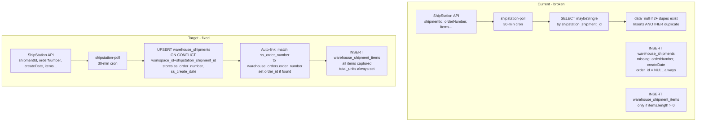

# Shipping Log Audit Report + Fix Plan

---

## Audit Findings

### Finding 1 — CRITICAL: Real duplicate rows in `warehouse_shipments`


| Field                 | Detail                                                                                            |
| --------------------- | ------------------------------------------------------------------------------------------------- |
| Symptom               | SS-131150298 appears ~12 times in the UI; each has a distinct `uuid` primary key                  |
| API boundary          | `getShipments` in `src/actions/shipping.ts` — no join multiplication; duplicates are real DB rows |
| Trigger touchpoint    | `shipstation-poll` (30-min cron, `shipstation` queue, concurrencyLimit:1)                         |
| Data touchpoint       | `warehouse_shipments.shipstation_shipment_id` — no UNIQUE constraint in any migration             |
| Root cause confidence | High                                                                                              |
| Fix                   | Dedup SQL + UNIQUE constraint + upsert in poll                                                    |


**Why duplicates accumulated:**

1. **No DB uniqueness** — `shipstation_shipment_id` is `text` with no UNIQUE constraint.
2. `**.maybeSingle()` self-perpetuating bug** — poll dedup at line 65-68 of `shipstation-poll.ts` ignores the `error` from `.maybeSingle()`. When 2+ duplicates already exist, PostgREST returns `PGRST116` with `data: null`. The code sees null, treats it as "not found", inserts **another** duplicate.
3. **30-day rolling window** — Every poll re-evaluates all shipments from the last 30 days, making the bug trigger every 30 minutes.

---

### Finding 2 — HIGH: Most shipment items show "No items recorded"


| Field                 | Detail                                                                                   |
| --------------------- | ---------------------------------------------------------------------------------------- |
| Symptom               | Expanded detail shows "No items recorded." for most shipments; list shows `⊙ 0`          |
| API boundary          | `getShipmentDetail` in `src/actions/shipping.ts` — queries `warehouse_shipment_items`    |
| Trigger touchpoint    | `shipstation-poll` — `ingestFromPoll` inserts items only when `shipmentItems.length > 0` |
| Data touchpoint       | `warehouse_shipment_items` table; `warehouse_shipments.total_units` column               |
| Root cause confidence | High                                                                                     |
| Fix                   | Re-fetch from ShipStation for 89 zero-item shipments; upsert fix for future              |


**Current state after backfill (2026-04-01):** 421 of 510 shipments have item rows — these show correctly when expanded. 89 shipments have no rows because ShipStation returned `shipmentItems: []` or `null` at ingest time (likely older shipments where the poll wasn't using `includeShipmentItems: true`, or the check happened mid-dedup-cascade).

**Also:** `getShipments` list query selects `warehouse_shipment_items(id)` (IDs only) but does **not** select `total_units`. The `⊙` item count badge in the list row currently reads `total_units` from the shipment row. The list select needs `total_units` added.

---

### Finding 3 — HIGH: Shipments not connected to orders


| Field                 | Detail                                                                                        |
| --------------------- | --------------------------------------------------------------------------------------------- |
| Symptom               | `warehouse_shipments.order_id` is always NULL for ShipStation-imported shipments              |
| API boundary          | `getOrders` / `getOrderDetail` in `src/actions/orders.ts` — loads shipments via `order_id` FK |
| Trigger touchpoint    | `shipstation-poll` `ingestFromPoll` — never sets `order_id`                                   |
| Data touchpoint       | `warehouse_orders.order_number`, `warehouse_shipments.order_id` FK                            |
| Root cause confidence | High                                                                                          |
| Fix                   | Auto-link during upsert using `orderNumber` → `warehouse_orders.order_number`                 |


**The linkage path:** ShipStation stores the original order number as `orderNumber` on each shipment. Bandcamp orders in `warehouse_orders` are stored with `order_number = "BC-{paymentId}"`. When ShipStation imports a Bandcamp order, it receives the Bandcamp order number — if the format matches, we can auto-link.

**Also missing:** `orderNumber` from the ShipStation API is **never stored**. The `SS-{shipmentId}` fallback in the UI fires even for shipments that DO have a real order number from ShipStation.

---

### Finding 4 — MEDIUM: Useful ShipStation fields not captured


| Missing Field    | API Name             | Value for System                                                                      |
| ---------------- | -------------------- | ------------------------------------------------------------------------------------- |
| `orderNumber`    | `orderNumber`        | Links shipment to `warehouse_orders`; shows real order reference instead of `SS-{id}` |
| Label created at | `createDate`         | Distinct from `ship_date`; useful for SLA / billing audits                            |
| Item unit price  | `unitPrice` on items | Billing reconciliation                                                                |


---

### Finding 5 — MEDIUM: No label source tracking — single source of truth not established

The shipping log shows ShipStation shipments only. When EasyPost labels are eventually created through the app, those shipments also insert rows into `warehouse_shipments` — but there is currently no field indicating *how* the label was made. A future Pirate Ship import would add a third source.

**The goal:** One `warehouse_shipments` table as the single source of truth for every shipment, with a `label_source` field (`shipstation` | `easypost` | `pirate_ship` | `manual`) so staff can see at a glance where the label came from and route any follow-up questions to the right system.

---

## Data Flow: Current vs Target




---

## Fix Plan

### Step 1 — Dedup SQL (run first in Supabase)

```sql
-- Preview duplicates
SELECT shipstation_shipment_id, workspace_id, COUNT(*) as cnt
FROM warehouse_shipments
WHERE shipstation_shipment_id IS NOT NULL
GROUP BY shipstation_shipment_id, workspace_id
HAVING COUNT(*) > 1
ORDER BY cnt DESC;

-- Delete duplicates, keeping the oldest row per (workspace_id, shipstation_shipment_id)
DELETE FROM warehouse_shipments
WHERE id IN (
  SELECT id FROM (
    SELECT id,
      ROW_NUMBER() OVER (
        PARTITION BY workspace_id, shipstation_shipment_id
        ORDER BY created_at ASC
      ) AS rn
    FROM warehouse_shipments
    WHERE shipstation_shipment_id IS NOT NULL
  ) ranked
  WHERE rn > 1
);
```

`warehouse_shipment_items` cascade-deletes automatically.

---

### Step 2 — Migration: UNIQUE constraint + new fields

New file: `supabase/migrations/20260402000001_shipments_hardening.sql`

```sql
-- 1. Prevent future duplicates
ALTER TABLE warehouse_shipments
  ADD CONSTRAINT uq_shipments_ss_id UNIQUE (workspace_id, shipstation_shipment_id);

-- 2. Store ShipStation order number (used for linking to warehouse_orders + display)
ALTER TABLE warehouse_shipments
  ADD COLUMN IF NOT EXISTS ss_order_number text;

-- 3. Store when the ShipStation label was created (different from ship_date)
ALTER TABLE warehouse_shipments
  ADD COLUMN IF NOT EXISTS ss_create_date timestamptz;

-- 4. Index for order linking queries
CREATE INDEX IF NOT EXISTS idx_shipments_ss_order_number
  ON warehouse_shipments(ss_order_number)
  WHERE ss_order_number IS NOT NULL;
```

Run AFTER Step 1.

---

### Step 3 — Patch `shipstation-poll.ts`: upsert + capture fields + auto-link

**In `src/lib/clients/shipstation.ts`** — extend `shipStationShipmentSchema` to parse `orderNumber` (already there) and pass it through. Also add `unitPrice` to item schema:

```typescript
// shipStationItemSchema — add unitPrice (already parsed, just confirm stored)
unitPrice: z.number().nullable().optional(),  // already in schema ✓
```

**In `src/trigger/tasks/shipstation-poll.ts`** — replace the entire `ingestFromPoll` function:

1. Remove the check-then-skip at lines 61-74 (replaced by upsert semantics)
2. Change the `warehouse_shipments` insert → **upsert** with `onConflict: 'workspace_id,shipstation_shipment_id'`:

```typescript
async function ingestFromPoll(supabase, shipment, workspaceId) {
  const shipstationShipmentId = String(shipment.shipmentId);
  const storeId = shipment.advancedOptions?.storeId ?? shipment.storeId;
  const itemsForCount = shipment.shipmentItems ?? [];
  const totalUnits = itemsForCount.reduce((sum, i) => sum + (i.quantity ?? 1), 0);

  // Org matching
  const itemSkus = itemsForCount.map(i => i.sku).filter(Boolean);
  const orgMatch = await matchShipmentOrg(supabase, storeId, itemSkus);
  if (!orgMatch) { /* review queue */ return; }

  // Upsert — ON CONFLICT updates mutable fields only
  const { data: upserted } = await supabase
    .from("warehouse_shipments")
    .upsert({
      workspace_id: workspaceId,
      shipstation_shipment_id: shipstationShipmentId,
      org_id: orgMatch.orgId,
      tracking_number: shipment.trackingNumber ?? null,
      carrier: shipment.carrierCode ?? null,
      service: shipment.serviceCode ?? null,
      ship_date: shipment.shipDate ?? null,
      delivery_date: shipment.deliveryDate ?? null,
      status: shipment.voided ? "voided" : "shipped",
      shipping_cost: shipment.shipmentCost ?? null,
      weight: shipment.weight?.value ?? null,
      dimensions: shipment.dimensions ?? null,
      label_data: shipment.shipTo ? { shipTo: shipment.shipTo } : null,
      voided: shipment.voided ?? false,
      billed: false,
      total_units: totalUnits,
      ss_order_number: shipment.orderNumber ?? null,  // NEW
      ss_create_date: shipment.createDate ?? null,    // NEW
    }, {
      onConflict: 'workspace_id,shipstation_shipment_id',
      ignoreDuplicates: false,  // update mutable fields on re-ingest
    })
    .select("id, order_id")
    .single();

  if (!upserted) return;

  // Auto-link to warehouse_orders if not already linked.
  // Uses a confidence-scored multi-field matching approach:
  //   Signal 1 (highest): orderNumber exact match
  //   Signal 2: recipient postal code match (from shipping_address jsonb)
  //   Signal 3: at least one shipment item SKU present in order line_items
  //   Signal 4: ship date within reasonable window after order created_at
  //   Signal 5: recipient name match (case-insensitive, partial)
  //
  // Only links when confidence is unambiguous (exactly one candidate above threshold).
  // Multiple candidates → review queue item for manual resolution.

  if (!upserted.order_id) {
    const linkedOrderId = await matchShipmentToOrder(supabase, workspaceId, shipment, upserted.id);
    if (linkedOrderId) {
      await supabase
        .from("warehouse_shipments")
        .update({ order_id: linkedOrderId })
        .eq("id", upserted.id);
    }
  }

  // Upsert items — insert new, skip existing (idempotent by shipment_id + sku)
  const items = shipment.shipmentItems ?? [];
  if (items.length > 0) {
    // Delete existing items for this shipment then re-insert (cleanest approach)
    await supabase.from("warehouse_shipment_items").delete().eq("shipment_id", upserted.id);
    await supabase.from("warehouse_shipment_items").insert(
      items.map(item => ({
        shipment_id: upserted.id,
        workspace_id: workspaceId,
        sku: item.sku ?? "UNKNOWN",
        quantity: item.quantity,
        product_title: item.name ?? null,
        variant_title: null,
      }))
    );
  }
}
```

Also remove the loop's check-then-skip pattern — the upsert handles idempotency:

```typescript
// REMOVE lines 61-74 (the existing check):
// for (const shipment of result.shipments) {
//   const { data: existing } = await supabase...maybeSingle();
//   if (existing) { totalSkipped++; continue; }
//   await ingestFromPoll(...)
// }

// REPLACE WITH (call ingestFromPoll directly, it handles upsert):
for (const shipment of result.shipments) {
  await ingestFromPoll(supabase, shipment, workspaceId);
  totalProcessed++;
}
```

**New helper function `matchShipmentToOrder`** — signal-based matching:

```typescript
async function matchShipmentToOrder(
  supabase: ReturnType<typeof createServiceRoleClient>,
  workspaceId: string,
  shipment: ShipStationShipment,
  shipmentDbId: string,
): Promise<string | null> {
  const itemSkus = (shipment.shipmentItems ?? []).map(i => i.sku).filter(Boolean);
  const postalCode = shipment.shipTo?.postalCode ?? null;
  const recipientName = (shipment.shipTo?.name ?? "").toLowerCase().trim();
  const shipDate = shipment.shipDate ? new Date(shipment.shipDate) : null;

  // --- Signal 1: Exact order number match (highest confidence, exit early) ---
  if (shipment.orderNumber) {
    const { data: exact } = await supabase
      .from("warehouse_orders")
      .select("id")
      .eq("workspace_id", workspaceId)
      .eq("order_number", shipment.orderNumber)
      .maybeSingle();
    if (exact) return exact.id;
  }

  // --- Multi-signal fallback: postal code + SKU + date window ---
  // Fetch candidate orders: created within 90 days before ship_date
  // and matching postal code (from shipping_address jsonb)
  const windowStart = shipDate
    ? new Date(shipDate.getTime() - 90 * 24 * 60 * 60 * 1000).toISOString()
    : undefined;

  let candidateQuery = supabase
    .from("warehouse_orders")
    .select("id, order_number, customer_name, shipping_address, line_items, created_at")
    .eq("workspace_id", workspaceId);

  if (windowStart && shipDate) {
    candidateQuery = candidateQuery
      .gte("created_at", windowStart)
      .lte("created_at", shipDate.toISOString());
  }

  // Filter by postal code via JSONB (quick pre-filter)
  if (postalCode) {
    candidateQuery = candidateQuery
      .eq("shipping_address->>postalCode", postalCode);
  }

  const { data: candidates } = await candidateQuery.limit(20);
  if (!candidates?.length) return null;

  // Score each candidate
  interface ScoredCandidate { id: string; score: number; signals: string[] }
  const scored: ScoredCandidate[] = [];

  for (const order of candidates) {
    let score = 0;
    const signals: string[] = [];

    // Signal: postal code (already filtered, but confirm)
    if (postalCode && (order.shipping_address as { postalCode?: string })?.postalCode === postalCode) {
      score += 30; signals.push("postal_code");
    }

    // Signal: at least one matching SKU in line_items
    const orderSkus = ((order.line_items ?? []) as Array<{ sku?: string }>)
      .map(li => li.sku).filter(Boolean);
    const skuMatches = itemSkus.filter(sku => orderSkus.includes(sku)).length;
    if (skuMatches > 0) {
      score += 40 + Math.min(skuMatches - 1, 3) * 5; // +5 per additional match, cap at 3
      signals.push(`sku_match(${skuMatches})`);
    }

    // Signal: recipient name match (case-insensitive partial)
    const orderName = (order.customer_name ?? "").toLowerCase().trim();
    if (recipientName && orderName && (
      orderName.includes(recipientName) || recipientName.includes(orderName)
    )) {
      score += 20; signals.push("name_match");
    }

    // Signal: date proximity (closer order date = more likely)
    if (shipDate && order.created_at) {
      const orderDate = new Date(order.created_at);
      const daysDiff = (shipDate.getTime() - orderDate.getTime()) / (1000 * 60 * 60 * 24);
      if (daysDiff >= 0 && daysDiff <= 14) { score += 10; signals.push("recent_date"); }
      else if (daysDiff > 14 && daysDiff <= 30) { score += 5; signals.push("date_ok"); }
    }

    if (score >= 50) { // minimum threshold: at least SKU + one other signal
      scored.push({ id: order.id, score, signals });
    }
  }

  // Sort by score descending
  scored.sort((a, b) => b.score - a.score);

  if (scored.length === 0) return null;

  // Unambiguous single match OR clear winner (top score > 2nd by 20+ points)
  if (
    scored.length === 1 ||
    (scored.length > 1 && scored[0].score - scored[1].score >= 20)
  ) {
    return scored[0].id;
  }

  // Ambiguous — log to review queue, don't link automatically
  await supabase.from("warehouse_review_queue").upsert({
    workspace_id: workspaceId,
    category: "shipment_order_match",
    severity: "low" as const,
    title: `Ambiguous order match for shipment ${shipmentDbId}`,
    description: `${scored.length} candidate orders found. Top scores: ${scored.slice(0,3).map(s => `${s.id}(${s.score})`).join(", ")}. Set order_id manually.`,
    metadata: { shipment_id: shipmentDbId, candidates: scored.slice(0, 5) },
    status: "open" as const,
    group_key: `shipment_order_ambiguous_${shipmentDbId}`,
    occurrence_count: 1,
  }, { onConflict: "group_key", ignoreDuplicates: true });

  return null;
}
```

**Confidence scoring:**


| Signal                              | Points | Rationale                        |
| ----------------------------------- | ------ | -------------------------------- |
| Postal code match                   | 30     | Strong geographic anchor         |
| 1 SKU match                         | 40     | Strong — SKUs are specific       |
| 2+ SKU matches                      | 45–55  | Even stronger                    |
| Recipient name match                | 20     | Names can repeat, partial credit |
| Order within 14 days before ship    | 10     | Temporal proximity               |
| Order within 15-30 days before ship | 5      | Wider window                     |


**Threshold:** 50 points minimum to consider a match (requires at least SKU + postal code, or SKU + name + date). Single unambiguous match above threshold → link. Multiple candidates within 20 points of each other → review queue.

---

### Step 4 — Re-fetch items for 89 zero-item shipments

One-time script: fetch those specific ShipStation shipment IDs, call the ShipStation API for each, and insert their items. This uses the existing `fetchShipments` with a `trackingNumber` filter or individual lookups.

The simplest approach: since the next poll run (after Step 3) will re-upsert ALL 30-day-window shipments and now re-inserts items every time, the 89 shipments will auto-heal within the next 30-minute poll cycle — as long as they're within the 30-day window.

For shipments older than 30 days: a separate one-time script fetching by `shipDateStart` over the historical range.

---

### Step 5 — UI: items count in list + order number display

**Patch `src/actions/shipping.ts` `getShipments`** — add `total_units` and `ss_order_number` to the select string:

```typescript
"id, org_id, shipstation_shipment_id, ss_order_number, order_id, tracking_number, carrier, service, ship_date, delivery_date, status, shipping_cost, weight, label_data, voided, billed, created_at, bandcamp_payment_id, bandcamp_synced_at, total_units, organizations!inner(name), warehouse_orders(order_number), warehouse_shipment_items(id)"
```

**Patch `src/app/admin/shipping/page.tsx`** — update the order number display logic to prefer `ss_order_number` over the `SS-{id}` fallback:

```typescript
// Current (line 305-309): falls back to SS-{shipstation_shipment_id}
const displayOrderRef =
  orderNumber ??
  (shipment.ss_order_number ? shipment.ss_order_number : null) ??  // NEW: real SS order number
  (shipment.shipstation_shipment_id ? `SS-${shipment.shipstation_shipment_id}` : null);
```

Also update the items count badge in the list row to read from `total_units` (already does, but the select needed to include it).

---

### Step 6 — Orders page: two-status display for Bandcamp orders

The expanded order detail currently conflates Bandcamp's platform status with our internal shipment tracking. These need to be two distinct UI sections.

**Patch `src/app/admin/orders/page.tsx` `OrderExpandedDetail`:**

Replace the current merged Shipments/isFulfilledExternally logic with two separate sections:

**Section A — Bandcamp Platform Status** (always shown for Bandcamp orders):

```tsx
{order.source === "bandcamp" && (
  <div>
    <h4 className="text-xs font-semibold uppercase tracking-wide text-muted-foreground mb-1">
      Bandcamp Status
    </h4>
    <div className="flex items-center gap-2">
      {order.fulfillment_status === "fulfilled" ? (
        <Badge variant="default" className="gap-1">
          <CheckCircle className="h-3 w-3" /> Fulfilled on Bandcamp
        </Badge>
      ) : (
        <Badge variant="outline">Unfulfilled on Bandcamp</Badge>
      )}
    </div>
  </div>
)}
```

**Section B — Shipment & Tracking** (from our system):

Four states based on `(fulfillment_status, detail.shipments.length)`:

```tsx
<div>
  <h4 className="text-xs font-semibold uppercase tracking-wide text-muted-foreground mb-2">
    Shipment & Tracking
  </h4>
  {detail.shipments.length > 0 ? (
    // State: Has linked shipment — show tracking + link to shipping log
    <div className="space-y-2">
      {detail.shipments.map((s) => (
        <div key={s.id} className="border rounded-lg p-3">
          <div className="flex items-center justify-between mb-2">
            <span className="text-xs text-muted-foreground font-mono">{s.tracking_number}</span>
            <a
              href={`/admin/shipping?search=${s.tracking_number}`}
              className="text-xs text-blue-600 hover:underline"
            >
              View in Shipping Log →
            </a>
          </div>
          <TrackingTimeline
            shipmentId={s.id}
            trackingNumber={s.tracking_number}
            carrier={s.carrier}
            fetchEvents={getTrackingEvents}
          />
        </div>
      ))}
      {/* Show note if Bandcamp doesn't know yet */}
      {order.fulfillment_status !== "fulfilled" && (
        <p className="text-xs text-muted-foreground">
          Shipped — Bandcamp not yet notified. Use "Mark Shipped on Bandcamp" to sync.
        </p>
      )}
    </div>
  ) : order.fulfillment_status === "fulfilled" ? (
    // State: Fulfilled on Bandcamp but no shipment in our system
    <p className="text-sm text-muted-foreground">
      Fulfilled externally — no label created in this system.
    </p>
  ) : (
    // State: Unfulfilled, no shipment yet
    <p className="text-sm text-muted-foreground">No shipments yet</p>
  )}
</div>

{/* Create Label — only when no shipment exists AND order is unfulfilled */}
{!detail.shipments.length && isUnfulfilled && orderId && (
  <CreateLabelPanel orderId={orderId} orderType="fulfillment" />
)}
```

**Visual outcome for each state:**


| State                     | Bandcamp Status section   | Shipment & Tracking section                                               | Create Label |
| ------------------------- | ------------------------- | ------------------------------------------------------------------------- | ------------ |
| Unfulfilled, no shipment  | "Unfulfilled on Bandcamp" | "No shipments yet"                                                        | Shown        |
| Unfulfilled, has shipment | "Unfulfilled on Bandcamp" | Tracking timeline + "Shipped — Bandcamp not notified" + shipping log link | Hidden       |
| Fulfilled, no shipment    | "Fulfilled on Bandcamp ✓" | "Fulfilled externally — no label in this system"                          | Hidden       |
| Fulfilled, has shipment   | "Fulfilled on Bandcamp ✓" | Tracking timeline + shipping log link                                     | Hidden       |


---

### Step 7 — Client portal: same transparency as admin

`**/portal/fulfillment` — patch `src/app/portal/fulfillment/page.tsx`:**

The `OrderExpandedDetail` section currently shows a merged Shipments section. Apply the same two-status pattern as the admin:

1. **Bandcamp Platform Status section** — same badge logic as admin Step 6 (uses `order.fulfillment_status` from `warehouse_orders`)
2. **Shipment & Tracking section** — shipments are already shown with `TrackingTimeline`; add:
  - A "View full shipping details →" link per shipment pointing to `/portal/shipping` filtered by tracking number
  - A small `label_source` badge on each shipment card (e.g. "ShipStation" or "EasyPost")
3. Status note when fulfilled on Bandcamp but no linked shipment ("Fulfilled externally")
4. Note when shipped but Bandcamp not yet notified

The portal already loads `detail.shipments` via `getOrderDetail` — these will auto-populate once the poll auto-linking is in place (no action query changes needed here; data appears automatically after Step 3).

`**/portal/shipping` — patch `src/app/portal/shipping/page.tsx`:**

1. **Security fix first** — `getClientShipments` in `src/actions/orders.ts` has no org_id filter. Patch to add explicit org scoping:

```typescript
// src/actions/orders.ts — getClientShipments
export async function getClientShipments(filters: { ... }) {
  const supabase = await createServerSupabaseClient();
  const { data: { user } } = await supabase.auth.getUser();
  // Resolve org_id from user record
  const { data: userRecord } = await createServiceRoleClient()
    .from("users").select("org_id").eq("auth_user_id", user!.id).single();
  if (!userRecord?.org_id) return { shipments: [], total: 0, page: 1, pageSize: 25 };

  let query = supabase
    .from("warehouse_shipments")
    .select("*, warehouse_orders(order_number)", { count: "exact" })  // ADD order join
    .eq("org_id", userRecord.org_id)  // ADD org filter
    .order("ship_date", { ascending: false })
    .range(offset, offset + pageSize - 1);
  // ... existing filters
}
```

1. **Add order reference column** to the table:


| Tracking | Order      | Carrier | Ship Date | Status  | Items | Weight  |
| -------- | ---------- | ------- | --------- | ------- | ----- | ------- |
| 9449...  | BC-12345 → | STAMPS  | 3/31      | Shipped | 1     | 12.8 oz |


The "BC-12345 →" link navigates to `/portal/fulfillment?search=BC-12345` to show the full order context.

1. **Add `label_source` badge** — small pill next to carrier: `SS` (ShipStation) or `EP` (EasyPost).
2. **Expanded row** already shows items and TrackingTimeline — no change needed there.

**Result:** A client opens `/portal/fulfillment`, sees their orders with fulfillment status from Bandcamp. They expand an order and see:

- "Fulfilled on Bandcamp ✓" or "Unfulfilled on Bandcamp"
- The specific shipment with tracking, a link to the full shipping detail
- The label source (ShipStation / EasyPost)

They can also go to `/portal/shipping` to see all their shipments, with a column linking back to the originating order.

---

### Step 8 (previously Step 7) — Add `label_source` to establish single source of truth

**Migration addition** (append to `20260402000001_shipments_hardening.sql`):

```sql
-- Track how the shipping label was created.
-- Values: 'shipstation' | 'easypost' | 'pirate_ship' | 'manual'
ALTER TABLE warehouse_shipments
  ADD COLUMN IF NOT EXISTS label_source text
  CHECK (label_source IN ('shipstation', 'easypost', 'pirate_ship', 'manual'));

-- Backfill existing ShipStation-imported rows
UPDATE warehouse_shipments
  SET label_source = 'shipstation'
  WHERE shipstation_shipment_id IS NOT NULL AND label_source IS NULL;

-- Index for filtering by source in the UI
CREATE INDEX IF NOT EXISTS idx_shipments_label_source
  ON warehouse_shipments(label_source);
```

**Patch `shipstation-poll.ts` `ingestFromPoll`** — add `label_source: 'shipstation'` to the upsert payload.

**Patch `create-shipping-label.ts`** — add `label_source: 'easypost'` when inserting the shipment row for a label created via EasyPost.

**Patch `src/actions/shipping.ts` `getShipments`** — include `label_source` in the select.

**Patch `src/app/admin/shipping/page.tsx`** — add a small badge in the list row showing where the label came from:

- `SS` badge → ShipStation  
- `EP` badge → EasyPost  
- `PS` badge → Pirate Ship

When EasyPost labels are eventually used, they'll appear in the same list automatically — correctly tagged, searchable by source, and with the same tracking/items/order-link capability.

---

## Execution Order

1. Step 1 SQL in Supabase (dedup — do first while still in plan mode)
2. Step 2 SQL in Supabase (UNIQUE constraint + columns)
3. Code Step 3 (poll upsert + fields) → deploy Trigger.dev
4. Wait one poll cycle (~30 min) — 89 missing-item shipments within 30-day window auto-heal
5. Code Step 5 (UI list improvements) → deploy Vercel
6. Code Step 6 (EasyPost detail) → deploy Vercel
7. For shipments outside 30-day window: Step 4 one-time script if needed

## Doc Sync Required

- `docs/system_map/TRIGGER_TASK_CATALOG.md` — update `shipstation-poll` to note upsert + order auto-linking
- `docs/system_map/API_CATALOG.md` — update `getShipments` and `getShipmentDetail` return shapes

