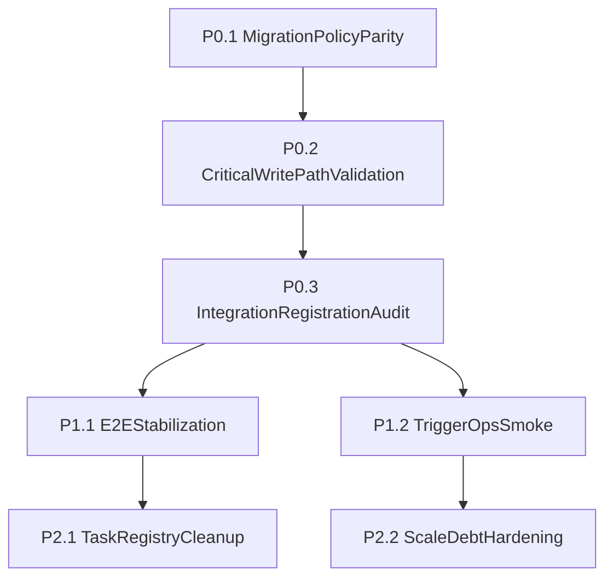

# Plan vs Current-State Gap Assessment

Date: 2026-03-20
Scope: Compare original planning docs with current `clandestine-fulfillment` implementation and identify remaining gaps before major upgrades.

Reference plans:
- `/Users/tomabbs/Downloads/files 26/CLANDESTINE_FULFILLMENT_PART1_FINAL.md`
- `/Users/tomabbs/Downloads/files 26/CLANDESTINE_FULFILLMENT_PART2_FINAL.md`

Primary code evidence:
- `src/app/admin`, `src/app/portal`
- `src/actions`
- `src/trigger/tasks`
- `src/app/api/webhooks`
- `supabase/migrations`
- `.github/workflows/ci.yml`

---

## Deliverable A: Current-State Assessment and Plan Deltas

### Executive state

- Platform is broadly implemented and usable across admin + portal surfaces.
- Core architecture from the plan is present: Next.js App Router, Supabase auth+DB, Trigger.dev, Redis, webhook handlers, queue/task model.
- Significant enhancements beyond initial plan exist (client hierarchy, org aliases, org merge flow, operational controls).
- Remaining risk is less about missing screens and more about reliability hardening and operational parity (RLS/write-path assumptions, integration registration discipline, Trigger runtime validation, E2E consistency).

### Feature parity matrix

Status legend:
- `Complete` = aligned with plan intent
- `Improved` = implemented and expanded beyond plan
- `Partial` = implemented but not fully meeting plan acceptance/operational intent
- `Missing` = not present
- `Drifted` = present but implemented in a meaningfully different way than planned

| Domain | Plan expectation | Current evidence | Status | Delta / gap note |
|---|---|---|---|---|
| App shell and IA | Separate staff + client experiences in one app | `src/app/admin/*`, `src/app/portal/*`, role-gated middleware | Complete | Major route surfaces are present for both personas |
| Auth model | Supabase-only auth (Google staff + magic-link clients) | `(auth)` routes + server auth context (`src/lib/server/auth-context.ts`) | Complete | Current behavior aligns with single-auth-system intent |
| Admin operations modules | Dashboard, inventory, inbound, orders, shipping, billing, review queue, support, settings | `src/app/admin/*` route inventory | Complete | Broad coverage shipped |
| Client portal modules | Dashboard, inventory, releases, inbound, orders, shipping, sales, billing, support, settings | `src/app/portal/*` route inventory | Complete | Broad coverage shipped |
| Query/cache architecture | React Query wrappers + cache tiers + invalidation model | `src/lib/hooks/use-app-query.ts`, `src/lib/shared/query-tiers.ts`, `src/lib/shared/invalidation-registry.ts` | Complete | Infrastructure exists and is actively used |
| Shopify integration | Sync + webhooks + order sync + inventory handling | `src/trigger/tasks/shopify-sync.ts`, `shopify-order-sync.ts`, `src/app/api/webhooks/shopify/route.ts`, `process-shopify-webhook.ts` | Complete | Hybrid webhook+poll model implemented |
| ShipStation integration | Webhook ingest + poll backup | `src/app/api/webhooks/shipstation/route.ts`, `src/trigger/tasks/shipstation-poll.ts`, `shipment-ingest.ts` | Complete | Matches planned resilience pattern |
| AfterShip integration | Webhook-driven tracking updates | `src/app/api/webhooks/aftership/route.ts`, `aftership-register.ts` | Complete | Present and wired |
| Stripe billing integration | Billing snapshots + webhook handling | `monthly-billing.ts`, `src/app/api/webhooks/stripe/route.ts`, billing actions/pages | Complete | Functional path present |
| Bandcamp integration | Sync + sale poll + inventory push + queue controls | `bandcamp-sync.ts`, `bandcamp-sale-poll.ts`, `bandcamp-inventory-push.ts` | Complete | Planned tasks exist |
| Multi-store sync | Client store connections, mapping, inventory/order fanout | `client_store_connections` migration, `store-connections` UI, `multi-store-inventory-push.ts`, `client-store-order-detect.ts` | Complete | End-to-end shape is present |
| Webhook architecture | Signature verify, dedup, async handoff | `src/app/api/webhooks/*`, `src/lib/server/webhook-body.ts`, `webhook_events` usage | Complete | Consistent pattern across handlers |
| Support system | Conversations + threading + email integration | `src/actions/support.ts`, portal/admin support pages, `webhooks/resend-inbound` | Complete | Shipped and iterative fixes underway |
| Inbound receiving lifecycle | Submit inbound, process/check-in flows, product creation handling | `src/actions/inbound.ts`, `portal/inbound/new`, tasks `inbound-product-create` + `inbound-checkin-complete` | Complete | Core flow exists; reliability hardening ongoing |
| Truth layer scope | 10 journeys + 42-50 sensors + project_state runtime artifacts | `scripts/truth-sensors/*` present, but `project_state` currently empty | Partial | Sensor scripts exist; full project_state + journey artifact lifecycle incomplete |
| CI quality gates | Automated lint/type/test/build/guards on push/PR | `.github/workflows/ci.yml` | Improved | Now present (earlier reports noted missing) |
| E2E confidence gate | Stable Playwright critical-flow pass as release confidence signal | `tests/e2e/*.spec.ts` exists; prior report flagged instability/hang | Partial | Tests exist but reliability gate still needs stabilization proof |
| Trigger operational readiness | Task code + cloud runtime validation | Task set exists; prior report flagged missing Trigger auth/env in run context | Partial | Code is ready; operational validation still environment-dependent |
| Plan task list parity | Planned task inventory | `src/trigger/tasks` has 26 files, index exports 24 | Improved | Expanded task surface, but one drift exists (`tag-cleanup-backfill.ts` not exported in registry) |
| RLS enforcement model | Strong RLS isolation with expected client write capabilities where needed | RLS migration + additional policy migration (`20260319000001_support_client_insert.sql`) | Drifted | Some portal writes now rely on service-role writes in actions for reliability vs strict client-RLS write path |
| Client/org management | Basic client controls | Advanced tooling in `src/app/admin/clients/[id]/page.tsx` + org alias/hierarchy/merge migrations | Improved | Meaningfully beyond original plan |

### Major improvements added beyond original plan

- Client hierarchy and merge management:
  - `supabase/migrations/20260319000002_org_hierarchy.sql`
  - `supabase/migrations/20260319000003_organization_aliases.sql`
  - admin client detail workflow enhancements
- Better CI automation than originally described at planning time:
  - `.github/workflows/ci.yml`
- Expanded operational docs and audit artifacts:
  - `TECHNICAL_HANDOFF_REPORT_2026-03-18.md`
  - `docs/CLAUDE_CODE_AUDIT_REPORT.md`

### Features still not fully realized

- Full “truth-layer-as-operating-system” artifact loop is incomplete without populated `project_state` execution files.
- Stable E2E “always green” gate is not yet demonstrated as consistently reliable in prior audits.
- Some reliability paths now depend on service-role action behavior (good for resilience), but this diverges from pure client-RLS-write assumptions and must be explicitly governed.

---

## Deliverable B: Prioritized Gap Board (P0/P1/P2)

### P0 (blockers before major upgrades)

1. **Production migration + policy parity verification**
   - Confirm deployed DB includes all post-base migrations (especially support/client policy and later org/role changes).
   - Validate production tables/policies match current code write paths.

2. **Critical write-path hardening validation**
   - Verify portal support and portal inbound submission flows under production auth context and RLS constraints.
   - Ensure user-friendly error surfacing for all mutation failures (no opaque server-component 500 paths).

3. **Integration registration completeness**
   - Ensure every implemented webhook has explicit provider-side registration, signature secret, and runbook ownership.
   - Distinguish “handler exists in code” from “provider is configured and healthy.”

### P1 (high-value confidence gains)

4. **E2E stabilization and release gate definition**
   - Lock stable e2e subset for critical journeys.
   - Define pass criteria + timeout/retry strategy + artifact capture.

5. **Trigger cloud operational validation**
   - Validate env + auth in deployment/runtime context.
   - Execute smoke runs for critical scheduled/event tasks and capture success telemetry.

### P2 (debt and scale hardening)

6. **Task registry consistency**
   - Align task files with exported registry (`tag-cleanup-backfill` drift).

7. **Performance and maintainability pass**
   - Evaluate high-volume sync hot paths and duplicated utility logic noted in audit docs.

---

## Deliverable C: Sprint-ready execution sequence

### Sprint 1: Reliability baseline (P0)

- Produce migration/policy parity checklist against current schema version set.
- Run targeted mutation tests for:
  - portal support create/reply
  - portal inbound submit
  - client invite flow
- Publish integration registration matrix (provider, endpoint, topic/event, secret owner, last validation date).

### Sprint 2: Confidence gates (P1)

- Stabilize e2e critical path set and wire into CI as required gate.
- Perform Trigger runtime smoke validation and document task health expectations.

### Sprint 3: Cleanup and scale (P2)

- Fix task export drift and remaining audit debt items.
- Benchmark and optimize high-volume sync paths where needed.

---

## Workstream detail: RLS / migration parity audit

### Findings

1. **Support conversation client-write policy was added post-base migration**
   - Base support migration: `supabase/migrations/20260316000010_support.sql`
   - Additional client insert/update policy migration: `supabase/migrations/20260319000001_support_client_insert.sql`
   - Risk: environments missing later migration may fail portal support writes.

2. **Inbound tables still have client `SELECT`-only policy in base RLS migration**
   - `supabase/migrations/20260316000009_rls.sql` has `client_select` on inbound tables, no client insert policy.
   - Current reliability approach uses server-side controlled writes (service-role path) for portal inbound submit.
   - This is workable but should be explicitly treated as an architectural decision (not accidental behavior).

3. **Codebase has grown beyond initial 10-migration plan baseline**
   - Current migration count: 21 files in `supabase/migrations`.
   - Risk: production and non-prod drift if deployment process still assumes original “001-010 only” mental model.

### Required parity controls

- Always record deployed migration head per environment.
- Add a deploy checklist step: “schema head matches repository head.”
- Add automated sanity checks for high-risk tables/policies (support + inbound + users + webhook_events).

---

## Workstream detail: Integration completeness audit

### Implemented in code

- Webhook handlers:
  - `src/app/api/webhooks/shopify/route.ts`
  - `src/app/api/webhooks/shipstation/route.ts`
  - `src/app/api/webhooks/aftership/route.ts`
  - `src/app/api/webhooks/stripe/route.ts`
  - `src/app/api/webhooks/resend-inbound/route.ts`
  - `src/app/api/webhooks/client-store/route.ts`
- Trigger tasks and scheduled syncs for core integrations are present.

### Operational registration model

- Registration is primarily external/manual (provider dashboards), documented in:
  - `docs/DEPLOYMENT.md` (“Webhook Endpoints”)
- Store-specific webhook URL/secret fields are tracked in:
  - `client_store_connections` (`webhook_url`, `webhook_secret`)
  - migration: `supabase/migrations/20260316000011_store_connections.sql`

### Gap

- Need one canonical “registration and ownership matrix” proving each provider webhook is actually registered, signed, and recently validated.

---

## Workstream detail: Quality gate roadmap

Current strengths:
- CI exists and runs lint/type/unit/build/guard scripts (`.github/workflows/ci.yml`)
- Broad unit and contract test coverage exists

Remaining confidence gaps:
- E2E reliability as hard release signal still needs explicit stabilization proof
- Trigger cloud smoke validation must be regularly executed and documented

### Recommended release gate sequence

1. **Static + unit/contract gate**
   - `pnpm check`
   - `pnpm typecheck`
   - `pnpm test`
   - `pnpm build`
   - guard scripts
2. **Critical e2e gate**
   - stable subset for login, portal inbound submit, support conversation flow, and one integration path
3. **Operational gate**
   - Trigger smoke run for one scheduled and one event task
   - webhook signature validation smoke for at least one provider

---

## Prioritized backlog with effort and dependencies

| Priority | Item | Effort | Depends on | Outcome |
|---|---:|---:|---|---|
| P0 | Migration/policy parity audit + environment checklist | 1-2 days | none | Prevents hidden environment drift failures |
| P0 | Portal write-path validation suite (support/inbound/invite) | 1-2 days | parity audit | Removes opaque 500 regressions |
| P0 | Integration registration matrix + verification runbook | 1 day | none | Distinguishes implemented vs operational |
| P1 | E2E critical flow stabilization | 2-4 days | portal write-path validation | Reliable regression safety net |
| P1 | Trigger runtime smoke automation/doc | 1-2 days | integration matrix | Better operational confidence |
| P2 | Task registry cleanup (`tag-cleanup-backfill` export alignment) | <0.5 day | none | Reduces task wiring drift risk |
| P2 | Performance/debt cleanups from audit report | 2-5 days | P0/P1 complete | Better maintainability and scale resilience |

---

## Bottom line

The project is no longer in “early build” shape; it is in “stabilize and harden” shape.  
You have most planned capabilities implemented, plus meaningful enhancements. The highest leverage next move is to close operational/reliability parity gaps so upcoming major upgrades happen on a verified baseline rather than a drifting one.
