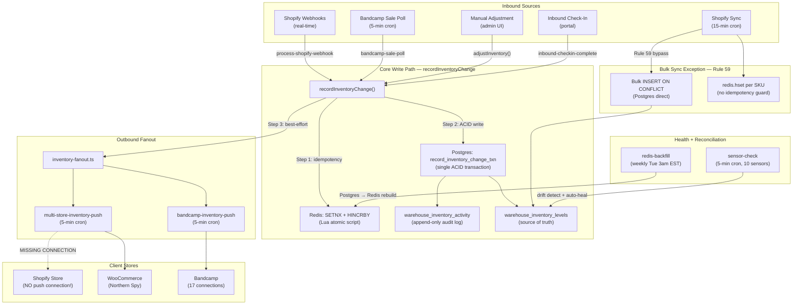

# Inventory System Integrity + Security Hardening

---

# Feature

Full-system audit remediation covering the inventory data pipeline, portal security, and initial inventory seeding. Addresses 6 CRITICAL data integrity issues, 2 HIGH security vulnerabilities, 12 MEDIUM operational gaps, and 5 LOW cleanup items. Includes a Bandcamp live-data seed plan to bootstrap real inventory numbers.

---

# Goal

Make the inventory system operationally reliable and the portal secure. After this work:

- Every variant in the catalog has an inventory level row (closing the 34.5% tracking gap)
- Redis and Postgres stay consistent (rollback compensation eliminates the drift window)
- Inventory changes flow bidirectionally between Shopify, Bandcamp, and the warehouse
- No portal action leaks data across organizations
- The system is seeded with real Bandcamp inventory numbers and ready for a physical warehouse count

---

# Context

## System Architecture

Three storage layers: Supabase Postgres (source of truth), Upstash Redis (fast-read cache), Shopify (upstream catalog). The warehouse database is the central hub — Shopify and Bandcamp sync through it, not directly with each other.



## Single Write Path Contract (Rule #20, #43)

ALL inventory mutations (except bulk Shopify sync) flow through `recordInventoryChange()`:

1. **Acquire correlationId** — passed in by caller
2. **Redis SETNX + HINCRBY** — Lua script atomically checks idempotency (24h TTL) and increments
3. **Postgres RPC** — `record_inventory_change_txn()` in single ACID transaction with floor enforcement
4. **Fanout** — non-blocking triggers to `multi-store-inventory-push` and `bandcamp-inventory-push`

## Live Database Snapshot (April 6, 2026)

| Metric | Count | Status |
|--------|-------|--------|
| Products | 3,764 | 1,582 active, 1,965 draft, 217 archived |
| Variants (SKUs) | 2,875 | |
| Inventory level rows | 1,046 | Only 36% of variants tracked |
| Variants with NO inventory tracking | ~992 (34.5%) | CRITICAL GAP |
| Organizations (labels) | 175 | |
| Bandcamp connections | 17 | |
| Client store connections | 1 | WooCommerce only — no Shopify push |
| Review queue (open > 24h) | 1,087 | Untriaged |

## Bandcamp Seed Data (April 9, 2026)

1,382 items across 16 accounts. 683 with stock > 0. 35,341 total units available.

---

# Requirements

## Functional:

1. **CRIT-NEW:** `recordInventoryChange()` must roll back Redis if Postgres fails — no drift window
2. **CRIT-1:** All variants must have `warehouse_inventory_levels` rows — close the 34.5% gap
3. **CRIT-2:** Shopify sync must use `shopify_inventory_item_id` for inventory lookups, not string replacement
4. **CRIT-3:** Inventory changes must push to Shopify (bidirectional sync)
5. **CRIT-4:** Inbound product creation must create inventory level rows
6. **CRIT-5:** `updateInventoryBuffer` and `getInventoryDetail` must scope by `workspace_id` and require `requireStaff()`
7. **HIGH-1:** `searchProductVariants` must filter by `org_id` for portal users
8. **HIGH-2:** `updateNotificationPreferences` must work for client users (switch to service role + explicit org filter)
9. **M1:** All portal actions must use `requireClient()` + explicit org filter
10. **M2:** All portal pages must render error states with `<h1>` in all states
11. **M4:** Redis backfill must detect and report drift before overwriting
12. **Seed:** Bootstrap inventory from Bandcamp live data with 3-tier SKU fallback and CSV conflict export

## Non-functional:

1. Release gate (`pnpm release:gate`) must pass after all changes
2. Unit test count must not regress (currently 669)
3. TypeScript must compile with zero errors
4. Full-site E2E audit must pass with 0 failures
5. No cross-org data leakage under any authentication state
6. Redis/Postgres drift must self-heal within 5 minutes (sensor) or immediately (rollback)

---

# Constraints

## Technical:

- Supabase service role bypasses RLS — explicit filters are the only protection when using it
- `warehouse_inventory_levels.org_id` is auto-derived by DB trigger (`derive_inventory_org_id`) — never set manually
- `record_inventory_change_txn` uses UPDATE not UPSERT — inventory level rows must exist before the RPC is called
- SKU uniqueness is scoped to workspace: `UNIQUE(workspace_id, sku)` — all lookups require workspace_id
- Redis `HINCRBY` is not idempotent — the Lua SETNX guard is the only protection against double-counting

## Product:

- Rule #20: ALL inventory changes through `recordInventoryChange()` (except Rule #59 bulk sync)
- Rule #43: Execution order is Redis → Postgres → fanout (never reorder)
- Rule #47: SETNX idempotency guard on every Redis inventory write
- Rule #59: Bulk Shopify sync bypasses `recordInventoryChange()` for performance
- Rule #65: Echo cancellation prevents infinite inventory loops on Shopify push

## External (Supabase, APIs, etc.):

- Shopify does NOT guarantee InventoryItem and ProductVariant GIDs share the same numeric ID
- Shopify retries webhooks for up to 3 days — Redis 24h TTL may not cover all retries
- Shopify `inventoryAdjustQuantities` requires a `locationId` — must verify single vs multi-location
- Bandcamp API uses OAuth with token refresh — all API calls serialized via `bandcamp-api` queue
- `shopify_inventory_item_id` column has no migration — may only exist from manual ALTER TABLE

---

# Affected files

## Inventory Core
- `src/lib/server/record-inventory-change.ts` — Redis rollback (CRIT-NEW)
- `src/lib/server/inventory-fanout.ts`
- `src/lib/clients/redis-inventory.ts`
- `src/actions/inventory.ts` — workspace scoping (CRIT-5), safety_stock (M5)

## Trigger Tasks
- `src/trigger/tasks/shopify-sync.ts` — InventoryItem ID fix (CRIT-2), org mapping (CRIT-1)
- `src/trigger/tasks/process-shopify-webhook.ts` — uses `shopify_inventory_item_id`
- `src/trigger/tasks/inbound-product-create.ts` — missing inventory level (CRIT-4)
- `src/trigger/tasks/inbound-checkin-complete.ts`
- `src/trigger/tasks/redis-backfill.ts` — drift counter (M4)
- `src/trigger/tasks/sensor-check.ts` — unmapped product sensor (CRIT-1)
- `src/trigger/tasks/bandcamp-sale-poll.ts`
- `src/trigger/tasks/bandcamp-inventory-push.ts`
- `src/trigger/tasks/multi-store-inventory-push.ts`
- `src/trigger/tasks/bundle-component-fanout.ts`
- `src/trigger/tasks/bundle-availability-sweep.ts`

## Security-Affected Actions
- `src/actions/catalog.ts` — cross-org search (HIGH-1)
- `src/actions/portal-settings.ts` — broken client write (HIGH-2)
- `src/actions/portal-dashboard.ts` — zero auth (M1 Tier A)
- `src/actions/portal-sales.ts` — already fixed in prior session
- `src/actions/mail-orders.ts`, `orders.ts`, `inbound.ts`, `billing.ts` — RLS-only (M1 Tier B)

## Auth System
- `src/lib/server/auth-context.ts`
- `src/lib/shared/constants.ts`

## Auth Drift
- `src/actions/bandcamp-shipping.ts`, `bandcamp.ts`, `catalog.ts`, `store-connections.ts`, `store-mapping.ts`

## Database Migrations
- `supabase/migrations/20260316000002_products.sql`
- `supabase/migrations/20260316000003_inventory.sql`
- `supabase/migrations/20260316000007_bandcamp.sql`
- `supabase/migrations/20260316000009_rls.sql`
- `supabase/migrations/20260401000001_inventory_hardening.sql`
- `supabase/migrations/20260401000002_bundle_components.sql`
- New migration needed for `shopify_inventory_item_id` UNIQUE + index
- New migration needed for `bandcamp_item_id` index

## Dead Code (to remove)
- `src/lib/clients/squarespace-token-refresh.ts`
- `src/lib/shared/invalidation-registry.ts`
- `src/lib/shared/utils.ts`
- `src/components/admin/store-connections-content.tsx`

## New Files
- `scripts/seed-bandcamp-inventory.ts`

---

# Proposed implementation

## Execution Order

| Step | Issues | Time Est. |
|------|--------|-----------|
| **0** | Add Redis rollback compensation to `recordInventoryChange` (CRIT-NEW) | 1 hour |
| 1 | Fix inbound product creation — add inventory level row (CRIT-4) | 30 min |
| 2 | Fix workspace_id scoping + cross-org search leak (CRIT-5 + HIGH-1) | 1 hour |
| 3 | Fix portal-settings + portal-dashboard auth (HIGH-2 + M1 Tier A) | 1 hour |
| 3.5 | Add vendor mapping fallback + unmapped product sensor + SLO (CRIT-1 prevention) | 1 hour |
| **4-pre** | Verify schema/migration parity against production (M9 elevated) | 1 hour |
| 4a-4d | Fix InventoryItem ID lookup — 4 substeps incl. migration (CRIT-2) | 2 hours |
| 5 | Backfill 992 untracked variants (CRIT-1) | 2 hours |
| 5.5 | Fix Redis backfill drift counter (M4 upgraded) | 30 min |
| 6 | Create Shopify push connection after echo verification (CRIT-3) | 30 min |
| 7 | Portal auth Tier B + error states + auth drift (M1-M3) | 4-6 hours |
| 8 | safety_stock query, operational cleanup (M5-M12) | 2-3 hours |
| 9 | Zod validation, cache invalidation, env cleanup (L1-L5) | 1 hour |
| 10 | Run Bandcamp inventory seed (Section 8 of prior doc) | 2 hours |

**Total: ~17-20 hours**

## Key Fix Details

**Step 0 — Redis rollback:**
```typescript
const redisResult = await adjustInventory(sku, "available", delta, correlationId);
if (redisResult === null) {
  return { success: true, newQuantity: null, alreadyProcessed: true };
}
try {
  const { error } = await supabase.rpc("record_inventory_change_txn", { ... });
  if (error) throw error;
} catch (err) {
  await adjustInventory(sku, "available", -delta, `${correlationId}:rollback`);
  console.error(`[recordInventoryChange] CRITICAL: Postgres failed, Redis rolled back. SKU=${sku} delta=${delta} correlationId=${correlationId}`, err);
  return { success: false, newQuantity: null, alreadyProcessed: false };
}
```

**Step 1 — Inbound inventory level creation:**
```typescript
// After variant creation in inbound-product-create.ts
await supabase.from("warehouse_inventory_levels").insert({
  variant_id: variantId,
  workspace_id: shipment.workspace_id,
  sku: item.sku,
  available: 0,
  committed: 0,
  incoming: item.expected_quantity ?? 0,
});
```

**Step 2 — updateInventoryBuffer fix:**
```typescript
export async function updateInventoryBuffer(sku: string, safetyStock: number | null) {
  const { workspaceId } = await requireStaff();
  const serviceClient = createServiceRoleClient();
  const { error } = await serviceClient
    .from("warehouse_inventory_levels")
    .update({ safety_stock: safetyStock, updated_at: new Date().toISOString() })
    .eq("sku", sku)
    .eq("workspace_id", workspaceId);
  if (error) throw new Error(`Failed to update buffer: ${error.message}`);
  return { success: true };
}
```

**Step 2 — searchProductVariants fix:**
```typescript
let orgId: string | undefined;
try {
  const ctx = await requireClient();
  orgId = ctx.orgId;
} catch {
  try { await requireAuth(); } catch { return []; }
}
// ... existing query ...
if (orgId) {
  variantQuery = variantQuery.eq("warehouse_products.org_id", orgId);
}
```

**Seed script:** Three-tier SKU fallback (Option SKU → Item SKU → Package ID), CSV conflict export, `--dry-run` / `--apply` / `--confirm-bootstrap` flags, seed timestamp guard. See full details in the Code Appendix companion doc.

---

# Assumptions

All triple-checked against real code on 2026-04-09:

| Assumption | Verified Against | Status |
|------------|-----------------|--------|
| Redis adjustInventory called before Postgres RPC | `record-inventory-change.ts:39-75` | CONFIRMED |
| No Redis rollback on Postgres failure | `record-inventory-change.ts:59-75` | CONFIRMED |
| Shopify sync skips products without org_id | `shopify-sync.ts:187-188` | CONFIRMED |
| InventoryItem ID string replacement used | `shopify-sync.ts:312-317` | CONFIRMED |
| shopify_inventory_item_id NOT populated during sync | `shopify-sync.ts:243-262` | CONFIRMED |
| shopify_inventory_item_id has no migration | All 42 migration files | CONFIRMED |
| Inbound creates product + variant but not inventory level | `inbound-product-create.ts:116-147` | CONFIRMED |
| RPC raises on missing inventory level row | `inventory_hardening.sql:37-50` | CONFIRMED |
| updateInventoryBuffer has no workspace_id filter | `inventory.ts:477-494` | CONFIRMED |
| searchProductVariants uses service role with no org filter | `catalog.ts:129-152` | CONFIRMED |
| portal_admin_settings has client_select only (no write) | `rls.sql:137-140` | CONFIRMED |
| getPortalDashboard has zero auth check | `portal-dashboard.ts:1-63` | CONFIRMED |
| bandcamp_item_id has no index | All migration files | CONFIRMED |
| SKU uniqueness requires workspace_id | `products.sql:44` | CONFIRMED |
| Only 1 workspace exists | Live DB (April 6), NOT provable from schema | ASSUMED |

---

# Risks

| Risk | Severity | Mitigation |
|------|----------|------------|
| Redis rollback fails (network error during compensation) | HIGH | Log as CRITICAL alert with full metadata. sensor-check auto-heals within 5 min. |
| Shopify InventoryItem/ProductVariant ID mismatch already corrupted data | HIGH | Step 4c backfill re-queries Shopify for authoritative mapping. |
| Enabling Shopify push creates feedback loop | HIGH | Echo cancellation verified at `process-shopify-webhook.ts:129`. Test with single SKU before full enable. |
| Redis idempotency key TTL (24h) shorter than Shopify retry window (3 days) | MEDIUM | Postgres `ON CONFLICT DO NOTHING` catches late retries. Redis may double-count but sensor heals. |
| Fanout tasks trigger full workspace scans on every SKU change | MEDIUM | Correct but inefficient. Future: pass SKU in payload. |
| sensor-check samples only 100 SKUs — backfill drift detection is slow | MEDIUM | Increase sample size during backfill operations. |
| Schema parity unknown — migrations may not match production | MEDIUM | Step 4-pre verifies before any data work. |
| Seed conflicts (existing inventory != Bandcamp) resolved by heuristic | LOW | Conflicts exported to CSV for manual staff review. |
| Live metrics from April 6 may be stale | LOW | Re-run queries before steps 5-6. |

---

# Validation plan

```bash
# After each phase
pnpm check && pnpm typecheck && pnpm test && pnpm build
pnpm release:gate

# CI guards
bash scripts/ci-inventory-guard.sh
bash scripts/ci-webhook-dedup-guard.sh
bash scripts/ci-action-test-guard.sh

# After all phases
pnpm test:e2e:full-audit  # requires dev server
```

### Monitoring metrics

| Metric | Current | Target |
|--------|---------|--------|
| Redis/Postgres drift incidents per week | Unknown | 0 |
| Unmapped product count (org_id = NULL) | ~992 | 0 |
| Variants without inventory level rows | ~992 | 0 |
| InventoryItem string-replace lookup failures | Unknown | 0 |
| Inbound checkin inventory failures | Unknown | 0 |
| Cross-org data access attempts (blocked) | Unknown | 0 |
| E2E audit failures | 4 (as of April 8) | 0 |
| Biome errors | 0 (fixed April 8) | 0 |
| Unit tests | 669 | 669+ |

---

# Rollback plan

Each step is designed to be independently reversible:

| Step | Rollback |
|------|----------|
| Step 0 (Redis rollback) | Revert `record-inventory-change.ts` to prior version. Sensor auto-heal covers drift. |
| Step 1 (Inbound fix) | Revert `inbound-product-create.ts`. Orphaned inventory level rows are harmless (just unused). |
| Step 2 (workspace scoping) | Revert `inventory.ts` and `catalog.ts`. Pre-existing behavior returns (no worse than current). |
| Step 3 (portal auth) | Revert `portal-settings.ts` and `portal-dashboard.ts`. Client prefs stay broken (current state). |
| Step 4 (InventoryItem ID) | Revert `shopify-sync.ts`. String replacement hack resumes (current behavior). Migration is additive (column + index). |
| Step 5 (Backfill) | New inventory level rows can be deleted: `DELETE FROM warehouse_inventory_levels WHERE created_at > '{backfill_timestamp}'`. |
| Step 6 (Shopify push) | Delete the `client_store_connections` row. Push stops immediately on next cron cycle. |
| Step 10 (Seed) | Inventory levels can be reset: the seed writes a `bandcamp_seed` sync state with timestamp. All seeded rows can be identified via `warehouse_inventory_activity` with `correlation_id LIKE 'bandcamp-seed:%'`. |

**Global rollback:** All code changes are on a single branch. `git revert` the merge commit to undo everything. Database migrations are additive (new columns, new indexes) — they don't break existing behavior if the code is reverted.

---

# Rejected alternatives

| Alternative | Reason Rejected |
|-------------|-----------------|
| **Redis two-phase pending state** | Adds complexity over the simpler rollback pattern. Requires client-side state management for pending vs committed. |
| **Change `record_inventory_change_txn` to UPSERT** | Would mask bugs where inventory level rows are expected to exist but don't. CRIT-4 is the correct fix (create rows explicitly). All 4 reviewers agreed. |
| **Automated heuristic for seed conflict resolution** | Arbitrary thresholds ("between 1 and 500") could mishandle real stock. CSV export for manual review is safer. |
| **RLS policy verification for service role** | Supabase service role always bypasses RLS by design. Explicit filters are the defense, not policy configuration. |
| **Grouping test files instead of 1:1 companion** | Violates Rule #6 literally. Individual files are clearer for CI guards. |

---

# Open questions

1. **Does `shopify_inventory_item_id` column exist in production?** No migration creates it. Webhook processing (`process-shopify-webhook.ts:100`) uses it. If the column doesn't exist, ALL Shopify webhooks are silently failing on variant lookup. Must verify against production schema before step 4.

2. **Which of the 42 migrations are applied to production?** No `schema_migrations` table exists. Must run `prod_parity_checks.sql` before any data work.

3. **Does the Shopify store use single-location or multi-location inventory?** The push code targets a specific location. Multi-location requires `locationId` in the push payload.

4. **Are the 999-stock values intentional or placeholder?** The top 20 SKUs all show `available = 999`. If intentional (e.g., digital products with unlimited stock), the seed should not overwrite them.

5. **What caused the 1,087 unresolved review queue items?** Are they noise from sensors, or real issues that were ignored? Triage needed before the queue becomes useful for new issues.

6. **Should the Redis idempotency TTL be extended from 24h to 7d?** Shopify retries for 3 days. Postgres dedup catches late retries but Redis can double-count. Trade-off: memory usage vs dedup coverage.

---

# Deferred items

| Item | Reason | Risk |
|------|--------|------|
| **Fanout SKU-scoped payloads** | Correct but inefficient. Single SKU change triggers full workspace push. Not a bug. | Scaling concern as catalog grows past 5,000+ mappings |
| **sensor-check sample size increase** | 100 SKUs per run means ~50 min for full drift scan. Not urgent with rollback compensation in place. | Slow detection during large backfills |
| **Redis TTL extension (24h → 7d)** | Postgres dedup catches late retries. Redis double-count is healed by sensor. | Theoretical double-count between 24h-72h on Shopify retries |
| **RPC UPSERT hardening** | CRIT-4 ensures rows exist. UPSERT would mask missing-row bugs. | Belt-and-suspenders only |
| **Auth drift cleanup in 5 files** | Local `requireAuth`/`requireStaffAuth` functions work correctly. Not a security issue, just maintenance debt. | Role list drift if `STAFF_ROLES` changes |
| **Dead code removal (4 files)** | Zero importers. No runtime impact. | Codebase clutter |
| **Portal error state standardization (12 pages)** | Only 2 of 14 pages handle errors. Others crash. Systematic fix needed. | User-facing errors on query failures |
| **Review queue triage (1,087 items)** | Operational, not code. Staff process needed. | New issues buried under noise |
| **Bandcamp backfill mismatches (3 connections)** | Northern Spy stuck in "running". Needs state reset. | Incomplete sales data for affected accounts |

---

# Revision history

| Date | Rev | Changes |
|------|-----|---------|
| 2026-04-08 | 1 | Initial audit findings (8 issues from release gate audit) |
| 2026-04-08 | 2 | Integrated feedback from 3 independent reviews. Added env var fail-fast, stack.pop guard, RLS audit. |
| 2026-04-08 | 3 | Post-implementation update for initial 8 issues. 669 tests passing, release gate green. |
| 2026-04-09 | 4 | Expanded audit: added 5 CRITICAL + 2 HIGH + 12 MEDIUM + 5 LOW issues. Full inventory system architecture map. |
| 2026-04-09 | 5 | Integrated review 1: Redis rollback, M4 upgrade, M1 action list, seed fallback chain, sensor list. |
| 2026-04-09 | 6 | Integrated review 2: CRIT-2 substeps, schema gap discovery, fanout inefficiency, TTL concern, Shopify location. |
| 2026-04-09 | 7 | Integrated reviews 3-4: Schema parity elevation, M1 tier split, Shopify feedback loop, seed scope enforcement, SLO. |
| 2026-04-09 | 8 | Bandcamp live inventory seed plan (35,341 units, 16 accounts). |
| 2026-04-09 | 9 | Triple-check verification pass — every CRITICAL/HIGH issue confirmed against real code with line numbers. Discovered missing `bandcamp_item_id` index. |
| 2026-04-09 | 10 | Restructured to standard plan format. Added Rollback plan, Open questions, Deferred items. |
