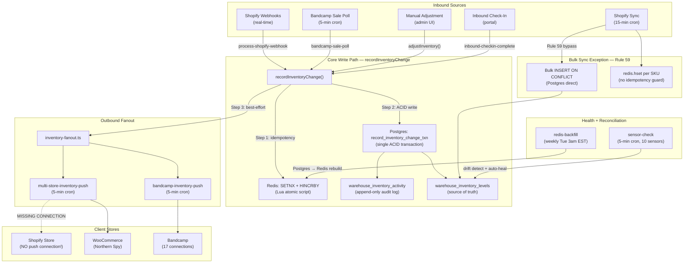

# Expanded Audit Fix Handoff — 2026-04-09

Integrates findings from: (1) the automated release gate audit (2026-04-08), (2) the expanded code + RLS + dead-code audit (2026-04-09), and (3) the live database inventory system audit (2026-04-06). All issues cross-referenced, de-duplicated, and prioritized.

---

## Table of Contents

1. [Inventory System Architecture Map](#1-inventory-system-architecture-map)
2. [CRITICAL Issues (Data Integrity + Security)](#2-critical-issues)
3. [HIGH Issues (Security)](#3-high-issues)
4. [MEDIUM Issues (Auth, RLS, Operational)](#4-medium-issues)
5. [LOW Issues (Cleanup, UX)](#5-low-issues)
6. [Complete File Reference](#6-complete-file-reference)
7. [Execution Order](#7-execution-order)

---

## 1. Inventory System Architecture Map

### 1.1 Three Storage Layers

| Layer | Technology | Role |
|-------|-----------|------|
| **Source of truth** | Supabase Postgres | All inventory tables, audit log, RLS-protected |
| **Fast-read cache** | Upstash Redis | Per-SKU hash (`inv:{sku}`) for instant lookups |
| **Upstream catalog** | Shopify | Product/variant/inventory source, synced every 15 min |

### 1.2 Data Flow Diagram



### 1.3 Single Write Path Contract (Rule #20, #43)

**File:** `src/lib/server/record-inventory-change.ts`

ALL inventory mutations (except bulk Shopify sync) flow through `recordInventoryChange()`:

1. **Acquire correlationId** — passed in by caller (webhook ID, sale ID, manual timestamp)
2. **Redis SETNX + HINCRBY** — Lua script checks if correlationId was already processed (24h TTL). If new, atomically increments `inv:{sku}.available`. If duplicate, returns null (skip).
3. **Postgres RPC** — `record_inventory_change_txn()` in single ACID transaction: UPDATE `warehouse_inventory_levels.available += delta`, INSERT into `warehouse_inventory_activity` with `ON CONFLICT (sku, correlation_id) DO NOTHING`. Raises `inventory_floor_violation` if stock would go negative on non-allowed SKUs.
4. **Fanout** — non-blocking: triggers `multi-store-inventory-push` and/or `bandcamp-inventory-push` for the affected SKU. Also checks if SKU is a bundle component and triggers parent bundle recalculation.

If step 3 fails after step 2, Redis has an over/under-count. The weekly `redis-backfill` and `sensor-check` `inv.redis_postgres_drift` catch this.

### 1.4 Idempotency (Dual Layer)

| Layer | Mechanism | Key Pattern |
|-------|-----------|-------------|
| Redis | Lua: `SETNX processed:{correlationId} 1 EX 86400` | `processed:shopify_wh:{eventId}`, `processed:bandcamp-sale:{bandId}:{pkgId}:{totalSold}`, `processed:manual:{userId}:{timestamp}` |
| Postgres | `UNIQUE(sku, correlation_id)` on `warehouse_inventory_activity` | Same correlationId values, `ON CONFLICT DO NOTHING` |

### 1.5 Core Inventory Files

| File | Purpose |
|------|---------|
| `src/lib/server/record-inventory-change.ts` | Canonical entry point. Redis + Postgres + fanout. |
| `src/lib/clients/redis-inventory.ts` | Redis `inv:{sku}` hash ops + Lua SETNX+HINCRBY (Rule #47) |
| `src/lib/server/inventory-fanout.ts` | Triggers downstream pushes after write |
| `src/actions/inventory.ts` | Server actions: `adjustInventory`, `getInventoryLevels`, `getClientInventoryLevels`, `updateInventoryBuffer` |
| `supabase/migrations/20260316000003_inventory.sql` | Tables: `warehouse_inventory_levels`, `warehouse_locations`, `warehouse_variant_locations`, `derive_inventory_org_id` trigger |
| `supabase/migrations/20260401000001_inventory_hardening.sql` | `safety_stock` column, `record_inventory_change_txn` RPC with floor enforcement |

### 1.6 Trigger Tasks (Inventory Domain)

| Task | Schedule | File | Role |
|------|----------|------|------|
| `shopify-sync` | `*/15 * * * *` | `src/trigger/tasks/shopify-sync.ts` | Delta sync from Shopify (bulk exception, Rule #59) |
| `process-shopify-webhook` | Event | `src/trigger/tasks/process-shopify-webhook.ts` | Real-time Shopify inventory webhooks → `recordInventoryChange` |
| `bandcamp-sale-poll` | `*/5 * * * *` | `src/trigger/tasks/bandcamp-sale-poll.ts` | Detect Bandcamp sales → `recordInventoryChange` |
| `bandcamp-inventory-push` | `*/5 * * * *` | `src/trigger/tasks/bandcamp-inventory-push.ts` | Push stock to Bandcamp (safety buffer + bundle MIN) |
| `multi-store-inventory-push` | `*/5 * * * *` | `src/trigger/tasks/multi-store-inventory-push.ts` | Push to WooCommerce/other stores (circuit breaker) |
| `redis-backfill` | `0 3 * * 2` | `src/trigger/tasks/redis-backfill.ts` | Weekly Postgres → Redis rebuild |
| `sensor-check` | `*/5 * * * *` | `src/trigger/tasks/sensor-check.ts` | 10 sensors: drift, propagation lag, sync staleness |
| `bundle-component-fanout` | Event | `src/trigger/tasks/bundle-component-fanout.ts` | Decrement components when bundle sells |
| `bundle-availability-sweep` | Daily 6am | `src/trigger/tasks/bundle-availability-sweep.ts` | Recompute bundle MIN availability |
| `inbound-checkin-complete` | Event | `src/trigger/tasks/inbound-checkin-complete.ts` | Record inventory on inbound check-in |
| `inbound-product-create` | Event | `src/trigger/tasks/inbound-product-create.ts` | Create Shopify + DB products for unknown SKUs |

### 1.7 Live Database Snapshot (April 6, 2026)

| Metric | Count | Status |
|--------|-------|--------|
| Products | 3,764 | 1,582 active, 1,965 draft, 217 archived |
| Variants (SKUs) | 2,875 | |
| Inventory level rows | 1,046 | **Only 36% of variants tracked** |
| Variants with positive stock | 479 | |
| Variants with NO inventory tracking | ~992 (34.5%) | **CRITICAL GAP** |
| Organizations (labels) | 175 | |
| Bandcamp connections | 17 | |
| Activity log entries | 2,164 | 98 in last 24h |
| Client store connections | 1 | WooCommerce only — **no Shopify push** |
| Review queue (open > 24h) | 1,087 | **Untriaged** |
| Bundle components | 0 | Not in use |
| Inbound shipments | 0 | Never used |

---

## 2. CRITICAL Issues

### CRIT-1: 34.5% of variants have no inventory tracking

**Source:** Inventory audit (April 6)
**Files:** `src/trigger/tasks/shopify-sync.ts` lines 187-188

992 of 2,875 variants have no `warehouse_inventory_levels` row. They exist in the catalog but are invisible to the inventory system.

**Root cause:** The Shopify sync skips products without an `org_id`:

```typescript
// src/trigger/tasks/shopify-sync.ts:187-188
const orgId = existingProduct?.org_id;
if (!orgId) continue; // Skip products not mapped to an org
```

Products synced before their org was mapped were added to `warehouse_products` but never had inventory levels fetched. Since the sync only processes products that ALREADY exist in the DB with an org_id, these orphaned products are permanently stuck.

**Fix:** Write a one-time backfill script that:
1. Queries all `warehouse_product_variants` that have NO matching `warehouse_inventory_levels` row
2. For each, fetches current stock from Shopify via the `inventoryItem.id`
3. Inserts a `warehouse_inventory_levels` row

Also fix `shopify-sync.ts` to handle the initial org assignment for new products (use vendor → org mapping, or create a review queue item for unmapped vendors).

### CRIT-2: InventoryItem-to-ProductVariant ID string replacement hack

**Source:** Inventory audit (April 6)
**File:** `src/trigger/tasks/shopify-sync.ts` lines 312-317

```typescript
.eq(
  "shopify_variant_id",
  level.inventoryItemId.replace(
    "gid://shopify/InventoryItem/",
    "gid://shopify/ProductVariant/",
  ),
)
```

This assumes InventoryItem and ProductVariant GIDs share the same numeric ID. **Shopify does NOT guarantee this.** Some inventory levels may be silently mapped to the wrong variant.

**Fix:** Store `shopify_inventory_item_id` on `warehouse_product_variants` during sync (Shopify provides it in the GraphQL response at `variant.inventoryItem.id`). Then query by that column directly instead of string-replacing.

The column already exists on the table (`shopify_inventory_item_id text`), but the sync doesn't populate it for all variants.

### CRIT-3: No Shopify push connection

**Source:** Inventory audit (April 6) — live database confirms 0 Shopify entries in `client_store_connections`

Inventory changes from Bandcamp sales, manual adjustments, and inbound receiving are NOT pushed back to Shopify. The system is Shopify-inbound only.

Example: item sells on Bandcamp → warehouse DB decremented → Bandcamp updated → Shopify still shows old stock → potential oversell.

**Fix:** Create a `client_store_connections` row for the main Shopify store. The `multi-store-inventory-push` task already supports Shopify via `store-sync-client.ts`. This is a configuration/data fix, not a code fix.

### CRIT-4: Inbound product creation doesn't create inventory level rows

**Source:** Inventory audit (April 6)
**Files:** `src/trigger/tasks/inbound-product-create.ts`, `src/trigger/tasks/inbound-checkin-complete.ts`

`inbound-product-create` creates `warehouse_products` and `warehouse_product_variants` rows but **never creates a `warehouse_inventory_levels` row**. The subsequent `inbound-checkin-complete` calls `recordInventoryChange()` which runs `record_inventory_change_txn` — this does `UPDATE warehouse_inventory_levels WHERE sku = p_sku`, which will match 0 rows and raise `inventory_floor_violation`.

The task has error handling that creates a review queue item, but the fundamental operation fails.

**Fix:** Add inventory level row creation in `inbound-product-create.ts` after variant creation:

```typescript
// After creating the variant, create the inventory level row
await supabase.from("warehouse_inventory_levels").insert({
  variant_id: variantId,
  workspace_id: shipment.workspace_id,
  sku: item.sku,
  available: 0,
  committed: 0,
  incoming: item.expected_quantity ?? 0,
});
```

Alternatively, change `record_inventory_change_txn` to use UPSERT semantics (INSERT ON CONFLICT UPDATE), but this changes the RPC contract and affects all callers.

### CRIT-5: Missing workspace_id scoping in server actions

**Source:** Inventory audit (April 6), expanded audit (April 9)
**File:** `src/actions/inventory.ts`

Two functions query by SKU without workspace_id, using service-role client (bypasses RLS):

**`getInventoryDetail(sku)`** — queries `warehouse_inventory_levels`, `warehouse_product_variants`, and `warehouse_inventory_activity` all by SKU alone. In a multi-workspace deployment, could return wrong data.

**`updateInventoryBuffer(sku, safetyStock)`** — updates `warehouse_inventory_levels` by SKU alone. No auth check beyond basic user validation. A client portal user could modify safety stock for any SKU in any workspace.

**Fix for `updateInventoryBuffer`:**

```typescript
export async function updateInventoryBuffer(sku: string, safetyStock: number | null) {
  const { workspaceId } = await requireStaff();
  const serviceClient = createServiceRoleClient();
  const { error } = await serviceClient
    .from("warehouse_inventory_levels")
    .update({ safety_stock: safetyStock, updated_at: new Date().toISOString() })
    .eq("sku", sku)
    .eq("workspace_id", workspaceId);
  if (error) throw new Error(`Failed to update buffer: ${error.message}`);
  return { success: true };
}
```

**Fix for `getInventoryDetail`:** Add workspace_id from auth context to all queries.

---

## 3. HIGH Issues

### HIGH-1: `searchProductVariants` — cross-org data leak

**Source:** Expanded audit (April 9)
**File:** `src/actions/catalog.ts` — `searchProductVariants()` function

Uses `createServiceRoleClient()` (bypasses RLS) with NO `org_id` filter. Client users can discover SKUs from other organizations via the portal inbound page autocomplete.

**Fix:** Add `requireClient()` for portal callers, scope query by `org_id`:

```typescript
export async function searchProductVariants(query: string) {
  let orgId: string | undefined;
  try {
    const ctx = await requireClient();
    orgId = ctx.orgId;
  } catch {
    try { await requireAuth(); } catch { return []; }
  }
  // ... existing code ...
  if (orgId) {
    variantQuery = variantQuery.eq("warehouse_products.org_id", orgId);
  }
```

### HIGH-2: `updateNotificationPreferences` — broken for clients

**Source:** Expanded audit (April 9)
**File:** `src/actions/portal-settings.ts`

RLS on `portal_admin_settings` has staff `FOR ALL` + `client_select` (read only). No client INSERT/UPDATE policy. This function silently fails for client users.

**Fix:** Switch to `requireClient()` + `createServiceRoleClient()` + explicit `org_id` filter (same pattern as other hardened portal actions). Also fix `getPortalSettings` in the same file.

---

## 4. MEDIUM Issues

### M1: Portal auth hardening (11 RLS-only actions)

**Source:** Expanded audit (April 9)

11 portal-facing actions rely on RLS alone without `requireClient()` or explicit `org_id` filter. See plan for full list.

### M2: Portal pages missing error states (12 pages)

**Source:** Expanded audit (April 9)

Only 2 of 14 portal pages handle query errors. 12 will crash if their server action throws. See plan for full list and pattern.

### M3: Auth pattern drift (5 files with local requireAuth)

**Source:** Expanded audit (April 9)

5 action files define their own `requireAuth()` or `requireStaffAuth()` instead of importing from `auth-context.ts`. The inline role lists may drift from `STAFF_ROLES` in `constants.ts`.

Files: `bandcamp-shipping.ts`, `bandcamp.ts`, `catalog.ts`, `store-connections.ts`, `store-mapping.ts`

### M4: Redis backfill drift counter hardcoded to 0

**Source:** Inventory audit (April 6)
**File:** `src/trigger/tasks/redis-backfill.ts` line 85

```typescript
mismatches: 0, // Future: compare Redis values before overwrite
```

The drift review queue logic (lines 100-111) will never fire. The backfill blindly overwrites Redis without checking if values differ.

**Fix:** Before overwriting, compare Redis vs Postgres values and count mismatches:

```typescript
const redis = await getInventory(level.sku);
const hasDrift = redis.available !== level.available ||
  redis.committed !== (level.committed ?? 0) ||
  redis.incoming !== (level.incoming ?? 0);
if (hasDrift) mismatches++;
```

### M5: `safety_stock` not in inventory list queries

**Source:** Inventory audit (April 6)
**File:** `src/actions/inventory.ts`

`getInventoryLevels()` and `getClientInventoryLevels()` don't include `safety_stock` in their Supabase select. The UI always shows the hardcoded default of 3 regardless of per-SKU overrides.

**Fix:** Add `safety_stock` to the select statement and the return type.

### M6: Top stock values are 999 (seed data)

**Source:** Inventory audit (April 6) — live database

Top 20 SKUs all show `available = 999` with zero committed and incoming. These are likely seed/placeholder values, not real warehouse counts.

**Fix:** Investigate and correct. Either run a physical count or reset to Shopify's actual levels via `shopify-full-backfill`.

### M7: ShipStation/Stripe/Resend webhooks never connected

**Source:** Inventory audit (April 6) — live database

Zero events from ShipStation, Stripe, and Resend in `webhook_events`. These integrations are coded but never had webhook URLs registered with the external services.

### M8: Bandcamp backfill mismatches

**Source:** Inventory audit (April 6) — live database

3 connections have mismatches. Northern Spy's backfill stuck in "running" state with error "Stale running detected by cron."

### M9: Migration parity unknown

**Source:** Inventory audit (April 6) — live database

42 local migration files exist but no `schema_migrations` table in the Supabase project. Unknown which migrations have been applied to production.

### M10: 1,087 unresolved review queue items

**Source:** Inventory audit (April 6) — live database

Review queue items open > 24h: 1,087. Nobody is triaging them. System generates alerts but they accumulate without action.

### M11: Trigger catalog cron drift

**Source:** Expanded audit (April 9)

`oauth-state-cleanup` catalog says `0 3 * * *` (daily) but code uses `*/15 * * * *` (every 15 min).

### M12: Dead code files

**Source:** Expanded audit (April 9)

4 files with zero importers: `squarespace-token-refresh.ts`, `invalidation-registry.ts`, `utils.ts` (empty), `store-connections-content.tsx`

---

## 5. LOW Issues

### L1: No Zod validation on `adjustInventory()` inputs

**Source:** Inventory audit (April 6)
**File:** `src/actions/inventory.ts`

`sku`, `delta`, `reason` are TypeScript-typed but not Zod-validated at the action boundary (Rule #5 violation).

### L2: Inline quantity edits bypass reason dialog

**Source:** Inventory audit (April 6)

Admin inventory page inline edit passes `"Inline quantity edit"` as the reason — less audit context.

### L3: Portal doesn't invalidate cache after buffer changes

**Source:** Inventory audit (April 6)

The safety buffer UI calls `updateInventoryBuffer()` but doesn't invalidate the React Query cache. Value won't update until navigation.

### L4: Shopify sync not truly bulk

**Source:** Inventory audit (April 6)
**File:** `src/trigger/tasks/shopify-sync.ts`

Despite function name `upsertProductsBulk`, it loops through products one at a time with individual `upsert()` calls.

### L5: .env.example duplicate entry

**Source:** Expanded audit (April 9)

`NEXT_PUBLIC_SENTRY_DSN` appears on lines 16 and 67.

---

## 6. Complete File Reference

### Inventory System Core
- `src/lib/server/record-inventory-change.ts`
- `src/lib/server/inventory-fanout.ts`
- `src/lib/clients/redis-inventory.ts`
- `src/actions/inventory.ts`
- `supabase/migrations/20260316000003_inventory.sql`
- `supabase/migrations/20260401000001_inventory_hardening.sql`
- `supabase/migrations/20260316000009_rls.sql`

### Trigger Tasks (Inventory)
- `src/trigger/tasks/shopify-sync.ts`
- `src/trigger/tasks/shopify-full-backfill.ts`
- `src/trigger/tasks/process-shopify-webhook.ts`
- `src/trigger/tasks/bandcamp-sale-poll.ts`
- `src/trigger/tasks/bandcamp-inventory-push.ts`
- `src/trigger/tasks/multi-store-inventory-push.ts`
- `src/trigger/tasks/redis-backfill.ts`
- `src/trigger/tasks/sensor-check.ts`
- `src/trigger/tasks/bundle-component-fanout.ts`
- `src/trigger/tasks/bundle-availability-sweep.ts`
- `src/trigger/tasks/inbound-checkin-complete.ts`
- `src/trigger/tasks/inbound-product-create.ts`

### Security-Affected Actions
- `src/actions/catalog.ts` (searchProductVariants cross-org leak)
- `src/actions/inventory.ts` (updateInventoryBuffer cross-org write, missing workspace_id)
- `src/actions/portal-settings.ts` (broken client write)
- `src/actions/portal-dashboard.ts` (no auth check)
- `src/actions/portal-sales.ts` (recently fixed)
- `src/actions/mail-orders.ts` (RLS-only)
- `src/actions/orders.ts` (RLS-only)
- `src/actions/inbound.ts` (RLS-only)
- `src/actions/billing.ts` (RLS-only)

### Auth System
- `src/lib/server/auth-context.ts`
- `src/lib/shared/constants.ts`
- `middleware.ts`

### Auth Drift Files
- `src/actions/bandcamp-shipping.ts`
- `src/actions/bandcamp.ts`
- `src/actions/catalog.ts`
- `src/actions/store-connections.ts`
- `src/actions/store-mapping.ts`

### Dead Code
- `src/lib/clients/squarespace-token-refresh.ts`
- `src/lib/shared/invalidation-registry.ts`
- `src/lib/shared/utils.ts`
- `src/components/admin/store-connections-content.tsx`

### Clients
- `src/lib/clients/shopify-client.ts`
- `src/lib/clients/bandcamp.ts`
- `src/lib/clients/store-sync-client.ts`

### Database Migrations (All Inventory-Related)
- `supabase/migrations/20260316000001_core.sql`
- `supabase/migrations/20260316000002_products.sql`
- `supabase/migrations/20260316000003_inventory.sql`
- `supabase/migrations/20260316000004_orders.sql`
- `supabase/migrations/20260316000005_supporting.sql`
- `supabase/migrations/20260316000009_rls.sql`
- `supabase/migrations/20260325000001_v72_schema_updates.sql`
- `supabase/migrations/20260401000001_inventory_hardening.sql`
- `supabase/migrations/20260401000002_bundle_components.sql`

---

## 7. Execution Order

| Step | Issues | Time Est. | Risk |
|------|--------|-----------|------|
| 1 | **CRIT-4:** Fix inbound product creation (add inventory level row) | 30 min | Prevents broken inbound flow |
| 2 | **CRIT-5 + HIGH-1:** Fix workspace_id scoping + searchProductVariants cross-org leak | 1 hour | Security: prevents cross-org data access |
| 3 | **HIGH-2:** Fix updateNotificationPreferences + getPortalSettings | 30 min | Unbreaks client portal settings |
| 4 | **CRIT-2:** Fix InventoryItem ID lookup in shopify-sync | 1 hour | Data integrity: prevents wrong-variant mapping |
| 5 | **CRIT-1:** Backfill script for 992 untracked variants | 2 hours | Data completeness: 34.5% gap |
| 6 | **CRIT-3:** Create Shopify push connection | 30 min | Ops: enables bidirectional inventory sync |
| 7 | **M1-M3:** Portal auth hardening + error states + auth drift | 4-6 hours | Defense-in-depth for portal |
| 8 | **M4-M12:** Redis backfill fix, safety_stock query, operational cleanup | 2-3 hours | Robustness |
| 9 | **L1-L5:** Zod validation, cache invalidation, env cleanup | 1 hour | Polish |

**Total estimated: ~13-15 hours**

### Verification After All Fixes

```bash
pnpm check && pnpm typecheck && pnpm test && pnpm build
pnpm release:gate
bash scripts/ci-inventory-guard.sh
bash scripts/ci-webhook-dedup-guard.sh
bash scripts/ci-action-test-guard.sh
# Then: pnpm test:e2e:full-audit (requires dev server)
```
