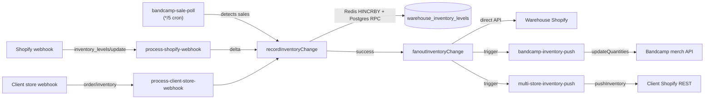

# Shopify Hardening — Code Reference 04: Bandcamp-Shopify Inventory Chain

Part 4 of 6. The complete Bandcamp → warehouse → Shopify inventory sync pipeline. Every inventory change flows through `recordInventoryChange` → `fanoutInventoryChange` → triggers `bandcamp-inventory-push` and `multi-store-inventory-push`.

Related: [01 OAuth & Webhooks](01-oauth-webhooks.md) · [02 Trigger Tasks](02-trigger-tasks-existing.md) · [03 Actions & UI](03-actions-and-ui.md) · [05 New Code](05-new-code-skeletons.md) · [06 Migrations & Config](06-migrations-config-tests.md)

---

## Flow Diagram



---

## Table of Contents

1. [`src/lib/server/record-inventory-change.ts`](#1-record-inventory-change-single-write-path) — 86 lines
2. [`src/trigger/tasks/bandcamp-sale-poll.ts`](#2-bandcamp-sale-poll) — 154 lines
3. [`src/trigger/tasks/bandcamp-inventory-push.ts`](#3-bandcamp-inventory-push) — 271 lines
4. [`src/trigger/lib/bandcamp-queue.ts`](#4-bandcamp-queue) — 5 lines
5. [`src/lib/clients/bandcamp.ts`](#5-bandcamp-api-client-key-functions) — 713 lines (key functions)

---

## 1. Record Inventory Change (Single Write Path)

### File: `src/lib/server/record-inventory-change.ts`

**Role**: Rule #20 — the ONE function that mutates inventory. Order: (1) correlationId, (2) Redis HINCRBY with SETNX guard, (3) Postgres RPC in single transaction, (4) fanout (non-blocking). On Postgres failure, Redis is rolled back.

```typescript
import { adjustInventory } from "@/lib/clients/redis-inventory";
import { createServiceRoleClient } from "@/lib/server/supabase-server";
import type { InventorySource } from "@/lib/shared/types";

interface RecordInventoryChangeParams {
  workspaceId: string;
  sku: string;
  delta: number;
  source: InventorySource;
  correlationId: string;
  metadata?: Record<string, unknown>;
}

interface RecordInventoryChangeResult {
  success: boolean;
  newQuantity: number | null;
  alreadyProcessed: boolean;
}

/**
 * Rule #20: Single inventory write path. ALL inventory changes flow through this function.
 * No code path may directly mutate warehouse_inventory_levels or Redis inv:* keys outside this function.
 *
 * Rule #43 execution order:
 * (1) acquire correlationId (passed in)
 * (2) Redis HINCRBY via adjustInventory with SETNX guard (Rule #47)
 * (3) Postgres RPC record_inventory_change_txn in single transaction (Rule #64)
 * (4) enqueue fanout (non-blocking)
 *
 * If step 3 fails after step 2, Redis is rolled back immediately via a compensating
 * adjustInventory call with a :rollback correlation ID. The sensor-check auto-heal
 * (every 5 min) is a secondary safety net, not the primary recovery mechanism.
 */
export async function recordInventoryChange(
  params: RecordInventoryChangeParams,
): Promise<RecordInventoryChangeResult> {
  const { workspaceId, sku, delta, source, correlationId, metadata } = params;

  const redisResult = await adjustInventory(sku, "available", delta, correlationId);

  if (redisResult === null) {
    return { success: true, newQuantity: null, alreadyProcessed: true };
  }

  try {
    const supabase = createServiceRoleClient();
    const { error } = await supabase.rpc("record_inventory_change_txn", {
      p_workspace_id: workspaceId,
      p_sku: sku,
      p_delta: delta,
      p_source: source,
      p_correlation_id: correlationId,
      p_metadata: metadata ?? {},
    });

    if (error) throw error;
  } catch (err) {
    try {
      await adjustInventory(sku, "available", -delta, `${correlationId}:rollback`);
    } catch (rollbackErr) {
      console.error(
        `[recordInventoryChange] CRITICAL: Redis rollback also failed. ` +
          `SKU=${sku} delta=${delta} correlationId=${correlationId}`,
        rollbackErr,
      );
    }
    console.error(
      `[recordInventoryChange] Postgres failed, Redis rolled back. ` +
        `SKU=${sku} delta=${delta} correlationId=${correlationId}`,
      err,
    );
    return { success: false, newQuantity: null, alreadyProcessed: false };
  }

  try {
    const { fanoutInventoryChange } = await import("@/lib/server/inventory-fanout");
    fanoutInventoryChange(workspaceId, sku, redisResult, delta, correlationId).catch((err) => {
      console.error(`[recordInventoryChange] Fanout failed for SKU=${sku}:`, err);
    });
  } catch {
    // Fanout is non-critical — cron jobs will pick up changes
  }

  return { success: true, newQuantity: redisResult, alreadyProcessed: false };
}
```

**Plan note**: This file is NOT modified by the Shopify hardening plan. It's included as reference because every inventory change (including from Shopify webhooks) flows through it.

---

## 2. Bandcamp Sale Poll

### File: `src/trigger/tasks/bandcamp-sale-poll.ts` (154 lines)

**Role**: Every 5 min, polls Bandcamp for sales. When `quantity_sold` increases, records negative delta inventory change and triggers fanout to Shopify + other channels.

```typescript
/**
 * Bandcamp sale poll — cron every 5 minutes.
 *
 * Rule #9: Uses bandcampQueue (serialized with all other Bandcamp API tasks).
 * Rule #20: Inventory changes go through recordInventoryChange().
 * Rule #7: Uses createServiceRoleClient().
 */

import { schedules, tasks } from "@trigger.dev/sdk";
import { getMerchDetails, refreshBandcampToken } from "@/lib/clients/bandcamp";
import { getAllWorkspaceIds } from "@/lib/server/auth-context";
import { triggerBundleFanout } from "@/lib/server/bundles";
import { recordInventoryChange } from "@/lib/server/record-inventory-change";
import { createServiceRoleClient } from "@/lib/server/supabase-server";
import { bandcampQueue } from "@/trigger/lib/bandcamp-queue";

export const bandcampSalePollTask = schedules.task({
  id: "bandcamp-sale-poll",
  cron: "*/5 * * * *",
  queue: bandcampQueue,
  maxDuration: 120,
  run: async (_payload, { ctx }) => {
    const supabase = createServiceRoleClient();
    const workspaceIds = await getAllWorkspaceIds(supabase);
    const startedAt = new Date().toISOString();
    let salesDetected = 0;
    let errors = 0;

    for (const workspaceId of workspaceIds) {
      const { data: connections } = await supabase
        .from("bandcamp_connections")
        .select("id, org_id, band_id")
        .eq("workspace_id", workspaceId)
        .eq("is_active", true);

      if (!connections || connections.length === 0) continue;

      const accessToken = await refreshBandcampToken(workspaceId);

      for (const connection of connections) {
        try {
          const merchItems = await getMerchDetails(connection.band_id, accessToken);

          for (const item of merchItems) {
            if (!item.sku || item.quantity_sold == null) continue;

            const { data: mapping } = await supabase
              .from("bandcamp_product_mappings")
              .select("id, variant_id, last_quantity_sold")
              .eq("workspace_id", workspaceId)
              .eq("bandcamp_item_id", item.package_id)
              .single();

            if (!mapping) continue;

            const lastSold = mapping.last_quantity_sold ?? 0;
            const newSold = item.quantity_sold;

            if (newSold > lastSold) {
              const delta = -(newSold - lastSold);

              const { data: variant } = await supabase
                .from("warehouse_product_variants")
                .select("sku")
                .eq("id", mapping.variant_id)
                .single();

              if (variant) {
                const correlationId = `bandcamp-sale:${connection.band_id}:${item.package_id}:${newSold}`;

                const result = await recordInventoryChange({
                  workspaceId,
                  sku: variant.sku,
                  delta,
                  source: "bandcamp",
                  correlationId,
                  metadata: {
                    band_id: connection.band_id,
                    bandcamp_item_id: item.package_id,
                    previous_quantity_sold: lastSold,
                    new_quantity_sold: newSold,
                    run_id: ctx.run.id,
                  },
                });

                // Trigger immediate push to all channels after a sale
                if (result.success && !result.alreadyProcessed) {
                  await Promise.allSettled([
                    tasks.trigger("bandcamp-inventory-push", {}),
                    tasks.trigger("multi-store-inventory-push", {}),
                  ]).catch(() => {
                    /* non-critical — cron covers it */
                  });

                  await triggerBundleFanout({
                    variantId: mapping.variant_id,
                    soldQuantity: Math.abs(delta),
                    workspaceId,
                    correlationBase: correlationId,
                  });
                }

                salesDetected++;
              }

              await supabase
                .from("bandcamp_product_mappings")
                .update({
                  last_quantity_sold: newSold,
                  last_synced_at: new Date().toISOString(),
                  updated_at: new Date().toISOString(),
                })
                .eq("id", mapping.id);
            }
          }

          await supabase
            .from("bandcamp_connections")
            .update({
              last_synced_at: new Date().toISOString(),
              updated_at: new Date().toISOString(),
            })
            .eq("id", connection.id);
        } catch (error) {
          errors++;
          console.error(
            `[bandcamp-sale-poll] Failed for band ${connection.band_id}:`,
            error instanceof Error ? error.message : error,
          );
        }
      }

      await supabase.from("channel_sync_log").insert({
        workspace_id: workspaceId,
        channel: "bandcamp",
        sync_type: "sale_poll",
        status: errors > 0 ? "partial" : "completed",
        items_processed: salesDetected,
        items_failed: errors,
        started_at: startedAt,
        completed_at: new Date().toISOString(),
      });
    }

    return { salesDetected, errors };
  },
});
```

---

## 3. Bandcamp Inventory Push

### File: `src/trigger/tasks/bandcamp-inventory-push.ts` (271 lines)

**Role**: Every 5 min, pushes latest warehouse inventory to Bandcamp. Handles both package-level and option-level items (sized apparel, color variants). Recently fixed to detect option-level items via `getMerchDetails`.

```typescript
/**
 * Bandcamp inventory push — cron every 5 minutes (was 15).
 *
 * Applies safety buffer at push time: pushed_qty = MAX(0, available - effective_safety_stock)
 * effective_safety_stock = COALESCE(per_sku.safety_stock, workspace.default_safety_stock, 3)
 */

import { schedules } from "@trigger.dev/sdk";
import {
  refreshBandcampToken,
  updateQuantities,
  getMerchDetails,
} from "@/lib/clients/bandcamp";
import { getAllWorkspaceIds } from "@/lib/server/auth-context";
import { createServiceRoleClient } from "@/lib/server/supabase-server";
import { bandcampQueue } from "@/trigger/lib/bandcamp-queue";

export const bandcampInventoryPushTask = schedules.task({
  id: "bandcamp-inventory-push",
  cron: "*/5 * * * *",
  queue: bandcampQueue,
  maxDuration: 120,
  run: async (_payload, { ctx }) => {
    const supabase = createServiceRoleClient();
    const workspaceIds = await getAllWorkspaceIds(supabase);

    const allResults: Array<{
      workspaceId: string;
      itemsPushed: number;
      itemsFailed: number;
    }> = [];

    for (const workspaceId of workspaceIds) {
      const startedAt = new Date().toISOString();
      let itemsPushed = 0;
      let itemsFailed = 0;

      const { data: connections } = await supabase
        .from("bandcamp_connections")
        .select("id, org_id, band_id, band_name")
        .eq("workspace_id", workspaceId)
        .eq("is_active", true);

      if (!connections || connections.length === 0) {
        allResults.push({ workspaceId, itemsPushed: 0, itemsFailed: 0 });
        continue;
      }

      const { data: ws } = await supabase
        .from("workspaces")
        .select("default_safety_stock, bundles_enabled, inventory_sync_paused")
        .eq("id", workspaceId)
        .single();

      if (ws?.inventory_sync_paused) {
        const { data: lastLog } = await supabase
          .from("channel_sync_log")
          .select("status")
          .eq("workspace_id", workspaceId)
          .eq("channel", "bandcamp")
          .eq("sync_type", "inventory_push")
          .order("completed_at", { ascending: false })
          .limit(1)
          .single();

        if (lastLog?.status !== "paused") {
          const now = new Date().toISOString();
          await supabase.from("channel_sync_log").insert({
            workspace_id: workspaceId,
            channel: "bandcamp",
            sync_type: "inventory_push",
            status: "paused",
            items_processed: 0,
            items_failed: 0,
            started_at: now,
            completed_at: now,
            metadata: { reason: "inventory_sync_paused", run_id: ctx.run.id },
          });
        }
        allResults.push({ workspaceId, itemsPushed: 0, itemsFailed: 0 });
        continue;
      }

      const workspaceSafetyStock = ws?.default_safety_stock ?? 3;
      const bundlesEnabled = ws?.bundles_enabled ?? false;

      type BundleComponent = {
        bundle_variant_id: string;
        component_variant_id: string;
        quantity: number;
      };
      const bundleMap = new Map<string, BundleComponent[]>();
      if (bundlesEnabled) {
        const { data: allComponents } = await supabase
          .from("bundle_components")
          .select("bundle_variant_id, component_variant_id, quantity")
          .eq("workspace_id", workspaceId);

        for (const bc of allComponents ?? []) {
          const arr = bundleMap.get(bc.bundle_variant_id) ?? [];
          arr.push(bc);
          bundleMap.set(bc.bundle_variant_id, arr);
        }
      }

      const accessToken = await refreshBandcampToken(workspaceId);

      for (const connection of connections) {
        try {
          const { data: mappings } = await supabase
            .from("bandcamp_product_mappings")
            .select("id, variant_id, bandcamp_item_id, bandcamp_item_type, last_quantity_sold")
            .eq("workspace_id", workspaceId)
            .not("bandcamp_item_id", "is", null);

          if (!mappings || mappings.length === 0) continue;

          const variantIds = mappings.map((m) => m.variant_id);
          const componentVariantIds = bundlesEnabled
            ? Array.from(
                new Set(
                  Array.from(bundleMap.values())
                    .flat()
                    .map((c) => c.component_variant_id),
                ),
              )
            : [];
          const allVariantIds = Array.from(new Set([...variantIds, ...componentVariantIds]));

          const { data: inventoryLevels } = await supabase
            .from("warehouse_inventory_levels")
            .select("variant_id, available, safety_stock")
            .in("variant_id", allVariantIds);

          const inventoryByVariant = new Map(
            (inventoryLevels ?? []).map((l) => [
              l.variant_id,
              { available: l.available, safetyStock: l.safety_stock as number | null },
            ]),
          );

          // Fetch merch details to identify option-level items
          const merchDetails = await getMerchDetails(connection.band_id, accessToken);
          const optionsByPackageId = new Map<
            number,
            Array<{ option_id: number; quantity_sold: number }>
          >();
          for (const item of merchDetails) {
            if (item.options && item.options.length > 0) {
              optionsByPackageId.set(
                item.package_id,
                item.options.map((o) => ({
                  option_id: o.option_id,
                  quantity_sold: o.quantity_sold ?? 0,
                })),
              );
            }
          }

          const packageItems: Array<{
            item_id: number;
            item_type: string;
            quantity_available: number;
            quantity_sold: number;
          }> = [];
          const optionItems: Array<{
            item_id: number;
            item_type: string;
            quantity_available: number;
            quantity_sold: number;
          }> = [];

          for (const mapping of mappings) {
            if (!mapping.bandcamp_item_id || !mapping.bandcamp_item_type) continue;

            const inv = inventoryByVariant.get(mapping.variant_id);
            const rawAvailable = inv?.available ?? 0;
            const effectiveSafety = inv?.safetyStock ?? workspaceSafetyStock;

            let effectiveAvailable = rawAvailable;
            if (bundlesEnabled) {
              const components = bundleMap.get(mapping.variant_id);
              if (components?.length) {
                const componentMin = Math.min(
                  ...components.map((c) => {
                    const compInv = inventoryByVariant.get(c.component_variant_id);
                    return Math.floor((compInv?.available ?? 0) / c.quantity);
                  }),
                );
                effectiveAvailable = Math.min(rawAvailable, Math.max(0, componentMin));
              }
            }

            const pushedQuantity = Math.max(0, effectiveAvailable - effectiveSafety);
            const options = optionsByPackageId.get(mapping.bandcamp_item_id);

            if (options) {
              // Option-level: push each option with the same quantity
              for (const opt of options) {
                optionItems.push({
                  item_id: opt.option_id,
                  item_type: "o",
                  quantity_available: pushedQuantity,
                  quantity_sold: opt.quantity_sold,
                });
              }
            } else {
              packageItems.push({
                item_id: mapping.bandcamp_item_id,
                item_type: mapping.bandcamp_item_type,
                quantity_available: pushedQuantity,
                quantity_sold: mapping.last_quantity_sold ?? 0,
              });
            }
          }

          if (packageItems.length > 0) {
            await updateQuantities(packageItems, accessToken);
            itemsPushed += packageItems.length;
          }
          if (optionItems.length > 0) {
            await updateQuantities(optionItems, accessToken);
            itemsPushed += optionItems.length;
          }
        } catch (error) {
          itemsFailed++;
          console.error(
            `[bandcamp-inventory-push] Failed for band ${connection.band_id}:`,
            error instanceof Error ? error.message : error,
          );
        }
      }

      await supabase.from("channel_sync_log").insert({
        workspace_id: workspaceId,
        channel: "bandcamp",
        sync_type: "inventory_push",
        status: itemsFailed > 0 ? "partial" : "completed",
        items_processed: itemsPushed,
        items_failed: itemsFailed,
        started_at: startedAt,
        completed_at: new Date().toISOString(),
        metadata: {
          run_id: ctx.run.id,
          band_count: connections.length,
        },
      });

      allResults.push({ workspaceId, itemsPushed, itemsFailed });
    }

    return { results: allResults, runId: ctx.run.id };
  },
});
```

---

## 4. Bandcamp Queue

### File: `src/trigger/lib/bandcamp-queue.ts`

```typescript
import { queue } from "@trigger.dev/sdk";

// Rule #9: ALL Bandcamp OAuth API tasks share this queue (concurrencyLimit: 1)
export const bandcampQueue = queue({ name: "bandcamp-api", concurrencyLimit: 1 });
```

---

## 5. Bandcamp API Client (Key Functions)

### File: `src/lib/clients/bandcamp.ts` (713 lines total)

Full file preserved in repo. Key functions relevant to inventory sync:

### `getMerchDetails` (lines 220-246)

```typescript
export async function getMerchDetails(
  bandId: number,
  accessToken: string,
): Promise<BandcampMerchItem[]> {
  const response = await fetch("https://bandcamp.com/api/merchorders/1/get_merch_details", {
    method: "POST",
    headers: {
      Authorization: `Bearer ${accessToken}`,
      "Content-Type": "application/json",
    },
    body: JSON.stringify({ band_id: bandId, start_time: "2000-01-01 00:00:00" }),
  });

  if (!response.ok) {
    throw new Error(`getMerchDetails failed for band ${bandId}: ${response.status}`);
  }

  const json = await response.json();
  if (json.error) {
    throw new Error(
      `getMerchDetails API error for band ${bandId}: ${json.error_message ?? "unknown"}`,
    );
  }

  const data = merchDetailsResponseSchema.parse(json);
  return data.items;
}
```

### `updateQuantities` (lines 384-419)

Recently fixed in this session to use Bandcamp's actual API parameter names (`id`/`id_type` instead of `item_id`/`item_type`).

```typescript
export async function updateQuantities(
  items: Array<{
    item_id: number;
    item_type: string;
    quantity_available: number;
    quantity_sold: number;
  }>,
  accessToken: string,
): Promise<void> {
  // Bandcamp API uses `id` and `id_type` (not `item_id`/`item_type`).
  // `id_type` must be "p" (package) or "o" (option), not the full word.
  const apiItems = items.map((i) => ({
    id: i.item_id,
    id_type: i.item_type === "package" ? "p" : i.item_type,
    quantity_available: i.quantity_available,
    quantity_sold: i.quantity_sold,
  }));

  const response = await fetch("https://bandcamp.com/api/merchorders/1/update_quantities", {
    method: "POST",
    headers: {
      Authorization: `Bearer ${accessToken}`,
      "Content-Type": "application/json",
    },
    body: JSON.stringify({ items: apiItems }),
  });

  if (!response.ok) {
    throw new Error(`updateQuantities failed: ${response.status}`);
  }

  const json = await response.json();
  if (json.error) {
    throw new Error(`updateQuantities API error: ${json.error_message ?? "unknown"}`);
  }
}
```

**Plan note**: This chain is NOT directly modified by Shopify hardening. Included as reference because:
1. Every inventory change goes through `recordInventoryChange` and fans out to Bandcamp AND Shopify simultaneously
2. The `match_status = 'confirmed'` filter added in Phase 2.5 affects both `bandcamp-inventory-push` and `multi-store-inventory-push` downstream paths
3. The inventory drift reconciler in Phase 4.1 should also check Bandcamp drift for full coverage (deferred — current scope is Shopify client stores)

---

## Why This Matters for Shopify Hardening

The `recordInventoryChange → fanoutInventoryChange` pipeline is the **only** path that inventory changes flow through. This means:

- When a customer buys on Bandcamp, the sale poll detects it → `recordInventoryChange` → fanout triggers Shopify push
- When a customer buys on a client Shopify store, webhook → `process-shopify-webhook` → `recordInventoryChange` → fanout triggers Bandcamp push (if mapped)
- When staff manually adjusts inventory in admin, same path
- When `shopify-sync` bulk imports (Rule #59 exception), it bypasses this path for performance — sensor auto-heals drift

The Shopify hardening plan relies on this single-write-path invariant. The new `store-inventory-reconcile` task in Phase 4.1 closes the loop by periodically verifying remote Shopify matches warehouse truth.

---

**Next**: [05 New Code Skeletons](05-new-code-skeletons.md) for all new files proposed by the plan.
